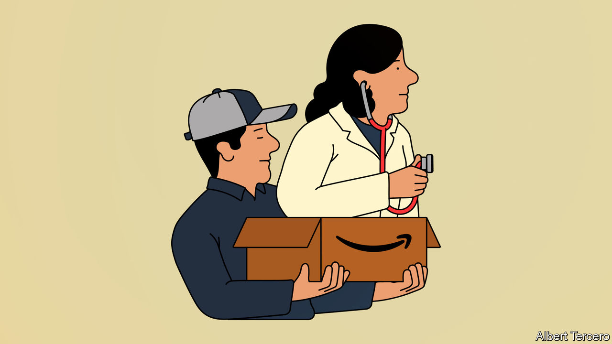
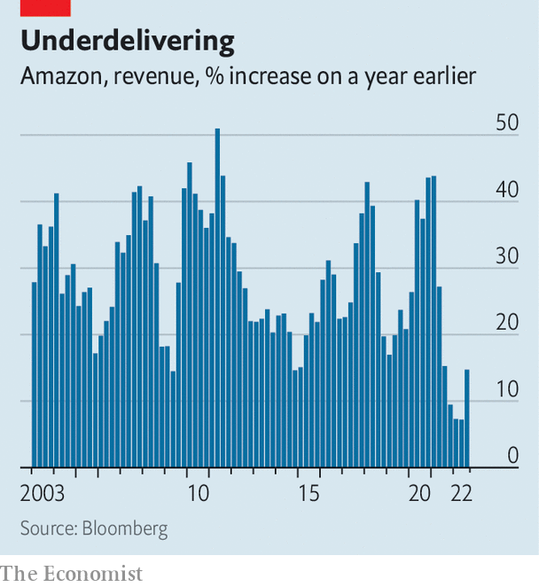

###### Prime of life

# Amazon makes a new push into health care 

##### It might be its riskiest business venture yet 

 

> Nov 20th 2022 

AS BIG TECH firms face a  the hunt is on for new areas of expansion. , which is now America’s second-biggest business by revenue, is a case in point. In the final quarter of 2022 its sales are expected to expand by just 6.7% year-on-year. On November 17th Andy Jassy, its chief executive, confirmed that the firm had begun laying off workers and would fire more next year. He said it was the hardest decision he had made since becoming boss. But he also noted that “big opportunities” lie ahead. One is the largest, most lucrative and hellishly difficult business in America: health care.

Many tech firms have health-care ambitions. Apple tracks well-being  Microsoft offers cloud-computing services to health firms. Alphabet sells wearable devices and is  into biotech research. But Amazon is now creating the most ambitious offering of all. Two days before Mr Jassy’s statement it launched “Amazon Clinic”, an online service operating in 32 states that offers virtual health care for over 20 conditions, from acne to allergies. Amazon describes the service as a virtual storefront that connects users with third-party health providers.

 


The Amazon Clinic launch follows a $3.9bn takeover, announced in July, of One Medical, a primary-care provider with 790,000 members that offers telehealth services online and bricks-and-mortar clinics (the deal is yet to close). The deal was led by Neil Lindsay, formerly responsible for Prime, Amazon’s subscription service. He has said health care “is high on the list of experiences that need reinvention”.

These latest moves complement Amazon’s existing assets. Its Halo band, a wearable device that went on sale in 2020, monitors the health status of users. In 2018 it bought PillPack, a digital pharmacy that is now part of Amazon Pharmacy, for $753m. Amazon Web Services launched specific cloud services for health-care and life-science companies in 2021.

The move into primary care, jargon for the role of the family doctor, is a big step but a logical one. Walgreens, a pharmacy chain, reckons the industry is worth $1trn a year. Around half of Generation z and millennial Americans do not have a primary-care doctor and One Medical’s membership has almost doubled since 2019. Amazon Clinic will accept cash for its services, rather than relying on America’s nightmarish insurance system to recoup costs.

The firm is betting that primary care will become more digital. It is likely that it will seek to integrate these services with other parts of its health-care offering. Amazon Clinic’s new users can buy drugs from Amazon Pharmacy. The firm could add a feature to the Halo band reminding users to take medicine. It might set up clinics in branches of Whole Foods, the supermarket chain it acquired in 2017. And it may wrap health care into Prime, which now has some 200m members worldwide. “The low-hanging fruit is offering discounts on membership to Prime members,” says Daniel Grosslight of Citigroup, a bank.

Amazon’s health push comes with several risks. One is that its own record is not flawless. It is closing Amazon Care, which it launched to provide health services for its employees and which expanded to offer some services to outside customers. Haven—a collaboration with Berkshire Hathaway, Warren Buffett’s investment firm, and JPMorgan Chase, a bank—was set up in 2018 to procure lower-cost health care for employees. It died nearly three years later.

Another danger is competition. In September cvs, an American retail pharmacy, reportedly outbid Amazon for Signify Health, a large primary-care provider. In October, Walgreens increased its stake in Villagemd with a $5.2bn investment. JPMorgan recently opened primary-care centres. The likes of Ro and Hims &amp; Hers, tech startups dedicated to providing virtual health care, are also rivals.

Finally, Amazon will have to grapple with regulators. The Federal Trade Commission, a trust-busting agency, is examining the One Medical deal. The takeover, and the launch of Amazon Clinic, will raise questions about who should be allowed to hold sensitive health-care data. Amazon has said “we remain focused on the important mission of protecting customers’ health information”. The firm may need to set up hefty firewalls to separate customer information held by clinics from that gathered through other products and services. But satisfying data-privacy concerns could wipe out many of the data-sharing opportunities that Amazon deftly deploys across the rest of its business.

Amazon’s attempts at disrupting health care will be subject to intense scrutiny. Nonetheless it should have a positive effect on health care in America. Its experience at keeping customers happy while generating razor-thin margins could improve primary care and force rivals to up their game. It may also prompt other tech giants to do more to disrupt health care. All this may be just the medicine that America’s heath-care system—and Mr Jassy’s tenure as Amazon’s boss—badly need.■


