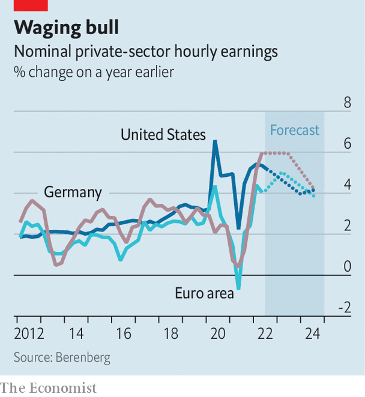

###### Wages and inflation

# Germany’s biggest trade union strikes a deal on pay 

##### But trouble could still lie ahead 

 

> Nov 24th 2022 

“On the whole we are pretty happy with the deal,” says Stefan Wolf, boss of Gesamtmetall, the metal-engineering industry’s employers’ association, about an agreement on pay struck on November 18th for workers in the state of Baden-Wurttemberg. IG Metall, Germany’s mightiest trade union, had asked for a hefty annual pay increase of 8%. Bosses managed to buy time by granting them an increase of 8.5% spread over two years. That deal was mirrored by Volkswagen and IG Metall when they struck a deal on November 23rd.

The agreement is likely to be adopted by most if not all 3.9m workers and their employers in the country’s metal-bending companies and influence wage deals in other industries in Germany and neighbouring countries. Pay rises are now set until September 2024, giving employers much-needed certainty about at least one important aspect of their input costs.

 


 “It’s on the high side, but bearable,” states Holger Schmieding, chief economist of Berenberg, a German private bank. Workers will receive a 5.2% pay increase in June next year and a 3.3% raise in May 2024 and two tax-free bonus payments of €1,500 ($1,550). This is hardly keeping pace with inflation, which reached an annual rate of 11.6% in October in Germany, but looks generous considering the numerous other headwinds faced by businesses including an energy crisis, supply-chain bottlenecks and a looming recession. 

The deal offers reassurance that Germany’s social partnership between bosses and workers is alive and well. It comes at a time when the country’s economic model is being called into question by sky-high energy prices and an increasingly testy relationship with China, Germany’s biggest trading partner. Collective “tariff” agreements (the periodic deals that set wage levels for each industry) help to keep relations between bosses and workers harmonious. It came as a surprise to some pundits, who had previously also forecast a “hot autumn” of violent strikes and walkouts, but with a few isolated exceptions workers haven’t downed tools.

The cost of keeping workers happy is nonetheless being borne elsewhere. “The model is working so well because the government is spending tens of billions to ease the burden of sky-high inflation for workers,” says Philippa Sigl-Glöckner, head of Dezernat Zukunft, a think-tank. Germany is about to introduce a brake on gas prices that will subsidise energy bills for households. In July families received a one-off payment of €100 for each child eligible for benefits. In September all German employees who pay income tax received a €300 lump sum to help with meeting the rising price of energy. The government even helped to broker the IG Metall pay deal by allowing the two bonus payments to come tax free.

Mr Schmieding expects the pattern set by the IG Metall and VW deal and a similar agreement struck recently by bosses and workers in the chemical industry to influence wage talks across the euro zone: front-loaded wage increases in 2023 followed by much smaller pay rises in 2024. If that sounds relatively rosy, there will still be ill-effects.

Over the next two years an increase in corporate bankruptcies in which higher wage bills play a role are on the way, according to Allianz Research. The research arm of Germany’s biggest insurer expects corporate insolvencies to rise by 29% in France in 2023 compared with this year, by 36% in Italy and by 17% in Germany as energy costs and higher interest rates and pay take their toll.

And the calm may come before another storm. In the next rounds of wage talks in January the government will be at some of the negotiating tables. Ver.di, Germany’s second-biggest union, which represents workers in service industries, wants an annual 10.5% raise for 2.5m public-sector employees. For the 160,000 employees of the formerly state-owned postal servcie, Deutsche Post, Ver.di is demanding a 15% increase—and threatening to call strikes if these demands are not met. Germany might suffer crippling industrial action at the start of next year, unless its tradition of social peace prevails, with lashings of government subsidies thrown in. ■


