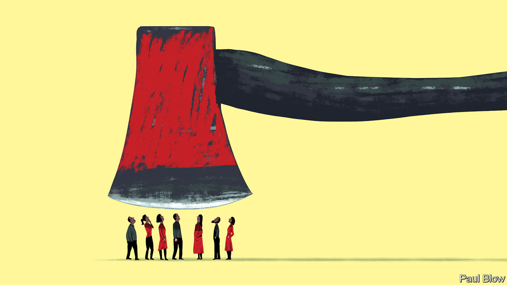

###### Bartleby

# How to do lay-offs right 

##### That means thinking primarily about the people who are left behind 

 

> Nov 24th 2022 

It’s not just Twitter. The pink slips are piling up at some of the biggest names in tech. Mark Zuckerberg, the founder of Meta, is eliminating more than 11,000 roles, around 13% of the social-media company’s workforce. On November 22nd HP announced up to 6,000 job losses, which would be around 10% of the IT firm’s staff. Amazon’s boss, Andy Jassy, has warned of more cuts next year, on top of those already unveiled in the retailer’s devices and books businesses. Stripe revealed that 14% of the staff at the digital-payments firm were being let go. Snap and Shopify announced their own rounds of lay-offs earlier in the summer. 

Jobs are disappearing in other industries, too. Investment banks have started paring staff in anticipation of a slowdown in dealmaking. Property firms are laying people off as housing markets cool. Beyond Meat, which makes plant-based products, cut almost 20% of its workforce in October. 

The people who suffer most from lay-offs are those who lose their jobs. But the colleagues who are left behind also endure lasting consequences; and for managers, this group is the one that determines success. Some suffer a form of survivors’ guilt, asking themselves why they kept their jobs and colleagues did not. (Only at Twitter do the people leaving feel guilty about those who are left behind.) Others must grapple with the practicalities of replacing departed workers and with the stress of heightened job insecurity: if the axe has fallen once, it may do so again. 

The results can be depressed morale, lower productivity and unexpected costs. Research conducted in 2008 by two academics at the University of Wisconsin-Madison found that, for an average company, downsizing the workforce by 1% was associated with a 31% increase in voluntary turnover rates. That means more disruption as well as additional money spent on filling open positions. 

To keep survivors motivated, managers need to get three things right. The first imperative is to appear fair. This is a capacious concept. Fairness involves treating departing colleagues well: one particular wrinkle with the current tech lay-offs is that they affect lots of immigrant workers, whose eligibility to remain in America is now in doubt. It means showing sensitivity about executive compensation: saying that downsizing is the hardest thing you’ve ever done is less credible when profit-related bonuses end up paying for another weekend house. 

Fairness also means sharing the rationale for why individual people have gone, whether because they sat in sputtering businesses or because their own performance was questionable. “Stacked-ranking” systems, in which employees are forced into a ranking of highest to lowest performers, are increasingly out of favour. But in theory at least, they do provide a merit-based measure for decisions on where to make cuts. According to , a news site, Google is going to increase the proportion of employees it identifies as low performers. 

If decision-making about who gets the chop appears capricious, then managers will also fail to achieve their second goal: to assure survivors that they don’t need to start looking for a new role, too. It matters that lay-offs do not become regular events. Research conducted at a large manufacturer in 2003 found that workers who had been exposed to repeated rounds of cuts felt less secure in their jobs and had greater intention to quit. In his memo in August, Evan Spiegel, Snap’s boss, made a point of saying that a 20% reduction in the social-media firm’s workforce should substantially reduce the risk of more axings.

The third area of focus is workload. Cutting headcount and asking the survivors to do more might seem like a marvellous idea in head office. Some bosses say so outright: Elon Musk, chopper-in-chief at Twitter, is open about his belief in long hours by small teams. But it is a risky approach, as likely to reduce job satisfaction as yield leaps in productivity. Downsizing has a greater chance of succeeding if the burden on remaining employees does not spike. 

None of this is easy territory. Lay-offs are bound to leave scars. But managing the fallout is simpler if the employees who are left behind still trust their bosses to get the big things right. Many of the memos being fired off by tech leaders contain apologetic admissions that they expanded their workforces too fast as a result of the pandemic. The honesty is necessary but it can plant another doubt in survivors’ minds: if they can foul up once, why not again? 


