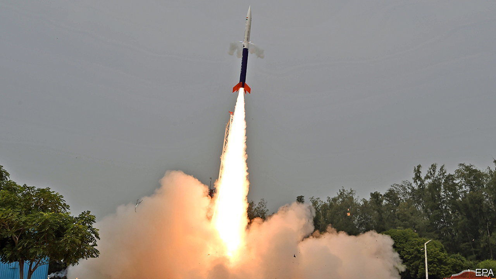

###### Countdown to lift-off

# Indian startups join the space race 

##### Private rocketeers reach for the sky 

 

> Nov 24th 2022 

The flight, a 90km sub-orbital jaunt, was over in minutes. But for India the rocket launched by Skyroot Aerospace on November 18th, the first by a private company in the country, was a moonshot. Numerous other flights in the coming months will signal an industry ready for take-off.

Satellites built by two Indian companies are set to be sent into space on November 26th, carried on a rocket launched by India’s space agency. The one made by Pixxel, a Bangalore-based startup, is intended to be the first of dozens that will provide detailed images of Earth. Two manufactured by Dhruva Space from Hyderabad will serve to demonstrate to potential customers that it can make, deploy and operate satellites successfully. A second private rocket launch by Agnikul Cosmos is set for December.

India’s involvement in space is not new. Rockets were first sent up in the early 1960s, satellite launches began in 1975 and a probe went to the moon in 2008 . A reputation for low-cost space research was cemented in 2013 when another probe was dispatched to Mars for less than the budget of a Hollywood film about a doomed space mission released around the same time. But India is no superpower. Revenues from the space economy are currently estimated to be nearly $10bn a year, only around 2% of the global total.

The surge in activity will push India up the rankings. It is a consequence of a change in government policy in 2020. Before then private firms could only operate as suppliers to the government-run Indian Space Research Organisation (isro). That body will now provide research, technology, facilities and even experienced former employees to private companies (half a dozen worked on the Skyroot launch). A new agency, in-space, has been created to orchestrate the transition.

This has resulted in a cascade of applications from eager participants; 68 firms hope to manufacture payloads, another 30 intend to make rockets and components, and 57 more want to develop ground stations or exploit space-derived data, from monitoring steel production to locating shoals of fish at sea .

It is not only Indian firms that hope to benefit. Some of the world’s largest companies, including well-known names in big tech, are poised to take advantage of Indian expertise in software and data analysis along with low costs. Skyroot believes it will be able to deliver basic payloads at the same price as the likes of SpaceX and for custom jobs at half the going rate charged elsewhere by using new manufacturing processes. Agnikul hopes to dispense with conventional launch sites, replacing them with cheaper mobile pads.

Investors seem convinced. While most Indian startups are suffering the same waning of enthusiasm and funding hitting the rest of the world, space ventures are the exception. In November gic, Singapore’s sovereign-wealth fund, invested $50m in Skyroot; Agnikul raised $20m and Dhruva says it recently doubled its pre-existing investment. More money and new entrants are on the way, says Pawan Goenka, who retired in 2021 from the leadership of Mahindra &amp; Mahindra, an industrial conglomerate, and now leads in-space. India was late to the space-business party, but now it seems ready to blast into orbit.■


