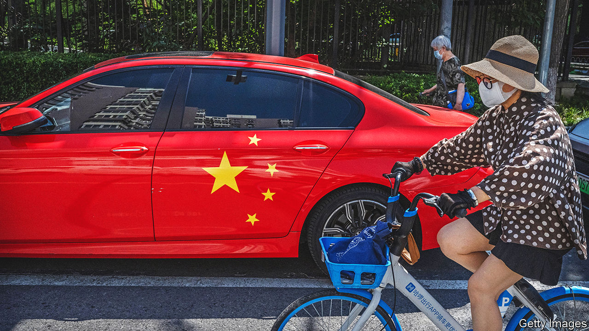
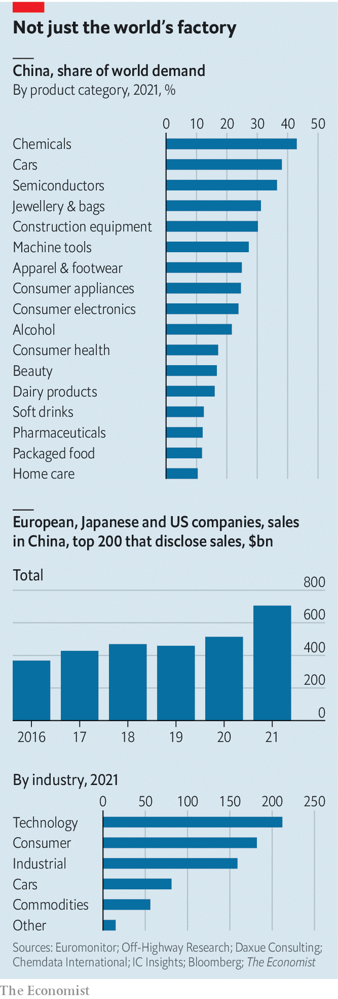

###### The China Dilemma

# Multinational firms are finding it hard to let go of China 

##### Should companies divest, decouple—or double-down? 

 

> Nov 24th 2022 

Few jobs are guaranteed to turn hair grey faster than running operations for a multinational business in China. Diplomatic spats and consumer boycotts are hazards of the job. A zero-covid policy that causes intermittent local lockdowns, such as the one that recently began in the southern city of Guangzhou, has disrupted supply chains and made the country inhospitable to foreign managers. A fractious workforce is adding to the woes. On November 23rd a riot erupted over pay and working conditions at the main factory that makes Apple’s iPhones in China. In a survey by the European Chamber of Commerce in China, 60% of members reported that the business environment has become more challenging.

One solution for international firms is to rely less on China for manufacturing. Some have been diversifying supply chains away from the country. Companies including Apple and Hasbro, a toymaker, have spread production to Vietnam and India, where wages are lower and the operating environment is less likely to induce a migraine. Bangladesh and Malaysia are becoming more attractive to clothes-makers. But for many multinationals China is more than just a cheap place to make things, and therein lies a less tractable problem. 

 


China’s increasingly affluent 1.4bn inhabitants now account for a quarter of global sales of clothes, nearly a third of jewellery and handbags, and around two-fifths of cars, plus a sizeable share of packaged food, beauty products, pharmaceuticals, electronics and more (see chart). Its gigantic manufacturing base makes it the world’s largest market for machine tools and chemicals, and its construction industry has been the largest buyer of building equipment for years.

Although 2,800 exhibitors from 145 countries recently turned up to flog their wares at the China International Import Expo in Shanghai, in aggregate global business’s exposure to China looks modest. For all listed American companies, China accounts for just 4% of sales, according to Morgan Stanley, an investment bank. For Japanese and European firms the figures are 6% and 8% respectively. 

Yet there is a cohort of firms for whom China has been far more important.  has analysed multinational firms from America, Europe and Japan that disclose sales in the Middle Kingdom, using data from Bloomberg. The 200 biggest of these earned $700bn there last year, or 13% of their global sales, up from $368bn, or 9% of sales, five years ago. Of the $700bn, 30% was generated by technology-hardware firms, 26% by consumer-facing businesses, and 22% by industrial companies, with carmakers and commodity businesses also important. Some 13 multinationals report over $10bn of revenue a year in China including Apple, bmw, Intel, Siemens, Tesla and Walmart.

An unlucky subset of multinationals operating in China has already found itself caught in the geopolitical crossfire. On our list 22 companies are in the semiconductor business. Many will find their sales pummelled by America’s ban on selling advanced chips and chipmaking equipment to China. When on average 30% of revenues come from China that will be a painful adjustment.

With relations between China and the West on shaky grounds, notably over the issue of Taiwan, even multinationals that operate outside so-called strategic sectors are hatching contingency plans for a world without access to the country. For many their situation is worsened by growing competition from local firms.

Premium carmakers such as bmw and Mercedes-Benz continue to grow robustly in China, but sales from mid-range ones like Volkswagen (vw) and General Motors are shrinking as homegrown rivals including Chery and byd expand rapidly. Sales for Nike, a sportswear brand, are also stalling as Li-Ning and Anta, two local competitors, gain ground. Sales have similarly stalled for AmorePacific, a Korean beauty firm, as competition stiffens from mid-range Chinese brands such as Winona. Foreign makers of construction equipment including Caterpillar and Hitachi have been losing sales thanks to a combination of increased competition and a construction downturn. In ’s analysis of 20 industries with a sizeable multinational presence, foreign companies have lost share in 14 over the past three years.

Two forces are at work. The first, especially important for consumer goods, is that foreign brands are losing their cachet. Knowing how to design products and build demand has given an important competitive edge to multinational consumer-goods firms, notes Wern-Yuen Tan, head of the Asia-Pacific region for PepsiCo, a food and drink firm. By watching and learning, not to mention poaching talent, local businesses have begun to bridge that gap.

The Chinese consumer has been changing, too. Many now prefer products that incorporate distinctive Chinese cultural imagery, a phenomenon known as  (literally “national trend”). What started with a China-themed lineup by Li-Ning at New York Fashion Week in 2018 has spread to everything from make-up to soup. 

Foreign brands have had mixed success incorporating Chinese culture into their products. Osmanthus-flavoured Pepsi was a hit. Less popular was a sneaker range from Nike displaying two Chinese characters that individually translated as “becoming wealthy” and “fortune” but when put together meant “getting fat”. Nike and other foreign firms have also dented their positions by expressing concern over the country’s brutal treatment of its Uyghur minority in Xinjiang.

The second reason for the troubles of multinationals, particularly in heavy industries, has been a shrinking technological advantage. The typical strategy for Chinese firms has been first to disrupt the inexpensive, commoditised end of a market and gradually move up into more sophisticated offerings as expertise builds, notes Weiwen Han, China head of Bain, a consultancy. That helps explain why carmakers like vw are struggling, and why foreign firms in industries from construction equipment to machine tools are being pushed into the premium market.

This should come as no surprise. When foreign firms first sought access to China, beginning in the 1980s, entering joint ventures with Chinese firms was a condition in industries like carmaking and machinery. It was a Faustian bargain, with domestic firms gradually absorbing foreign engineering expertise. The fact that China is now loosening joint-venture requirements shows that it no longer fears the technological edge of outsiders.

The growing challenge from locals is putting many multinationals in a sticky situation: maintaining competitiveness in China demands increased investment even as the geopolitical risks are mounting. For now most multinationals have time on their hands. Of the list of 200 companies we examined, 144 have still grown in China over the past three years.

Movers and makers

Over time the situation will become more vexing. China has lacked the expertise to manufacture its own large commercial jets, with Boeing and Airbus controlling the industry. At an airshow on November 8th comac, a local manufacturer, debuted its long-awaited c919, a short-haul passenger aircraft, and will soon start deliveries to Chinese carriers. Western firms like lvmh and Hermès have for years dominated the flashiest end of fashion in China, but homegrown competitors like Shang Xia are gaining momentum. Such rivalries will force foreign firms to confront the awkward question of their long-term future in the country. They will need to choose one of three paths—divest, decouple or double-down.

Divestment is an option for some. Carrefour, a French supermarket chain, sold 80% of its China business to Suning.com, a local retailer, in 2019 after more than two decades in the country. Gap, an American clothing retailer, announced on November 8th that it would offload its Chinese business to Baozun, a local e-commerce company. Throwing in the towel while the business is still worth something will probably be the favoured option for firms that have lost their edge over domestic rivals and can afford to live without China.

Decoupling is a second possibility. Yum! Brands, the owner of kfc and other fast-food franchises, split out its China business in 2016 to allow the unit to adapt more easily to local conditions. The following year McDonald’s did the same. The strategy comes with the added advantage of simplifying any divorce proceedings initiated by geopolitical souring while for now allowing the local business access to parent company brands and other intellectual property. This route however will only be viable in cases where China can be operated as a self-contained unit; it is off the cards for firms like Boeing or lvmh that rely on manufacturing abroad.

Third, consider doubling-down. Siemens, a German industrial conglomerate, recently revealed that it is ramping up investment and shifting a significant share of research and development to China in order to “beat the local champions”, according to Roland Busch, the company’s boss. On October 13th vw announced it would invest €2.4bn ($2.5bn) to establish an autonomous-driving joint venture with Horizon Robotics, a Chinese firm.

Such hard-to-reverse commitments will be most common in industries where keeping a strong position in China is critical for global competitiveness. Carmakers fear that giving ground to local champions, many of whom are already at the cutting edge of electric vehicles and software, would give them a launch pad to enter other big markets. If relations between China and the West remain cordial, doubling-down may pay-off. If they worsen, things may quickly unravel for the geopolitical gamblers of global business.■


