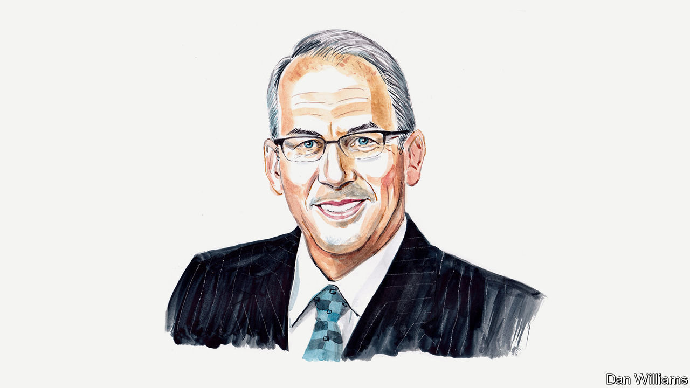

###### American politics

# A Republican mayor from South Dakota decries the “Trump effect” on his party 

##### Steve Allender wants traditional Republicans to take charge once more 

 

> Nov 19th 2022 

I JOINED THE Republican Party in 1979. Jimmy Carter was president, and I first started hearing about Ronald Reagan. Being a first-time voter, I was intrigued by him. As the campaign began in 1980, I remember Reagan talking about the ills of big government and my dad favouring him.

I was a proud first-time voter. My candidate won, which made me feel like I somehow helped him. I’ve remained a Republican in the decades since, and I have never questioned my party until the past few years.

In 2016, as the new mayor of Rapid City in South Dakota, I was drafting an article about the increasingly negative impacts of the partisan divide on our country. The conclusion of my brief research was that the middle ground was being vacated for the more extreme ends of the political spectrum. This seemed to match my own observations as I sensed a philosophical divide among our own city-council members and even the general public. But this change in the Republican Party late in 2016 was nothing compared with the change that would begin in 2020.

The pandemic certainly awakened and motivated many traditional Republican conservatives. Our city council’s public comment period, in which citizens attending a council meeting can speak for a limited period of time, was overrun by people warning of the tyranny about to be unleashed as we discussed the effectiveness of wearing a mask during the pandemic. Donald Trump won both our county and our state in 2020. It was the mixture of covid-19 and the last presidential election that changed the Republican Party, possibly for ever.

Our elected city government is officially non-partisan, but the fallout from the pandemic and the Trump presidency infused our local government with partisan practices and candidates.

Mr Trump was a ball-busting caricature of the businessman he once was. His harsh but plain talk was an anthem for the born-again party extremists. Mr Trump cultivated even more of them as his term progressed.

The “Trump effect”, fuelled initially by the pandemic but sustained by those current politicians who ride his coat-tails, has changed the party for the worse. It invited thoughts and speech that usually would have been contained by a person’s normal inhibitions. It validated and encouraged angry and abusive talk and interaction, all the while categorising them as patriotic. It made a home for people whose inner thoughts were not before viewed as socially palatable. It taught followers that opposing views are evidence of treason, or at the very least, socialism. One of the more damaging and long-lasting remnants of the Trump era? A dangerous mantra: if you lose an election, it was rigged.

The Trump effect capitalised on the stress and uncertainty of the pandemic era and set public discourse on a shocking path. This phenomenon had a chilling effect on the productivity of policymakers because it drove wedges into communities and even families. Mr Trump and his soldiers also deepened division in the Republican Party.

As I see it, the party is largely divided into three parts: moderates, who include business figures and collaborators; conservatives, who resemble Reagan-era Republicans; and ultra-conservatives who not only hold extreme party views, but who also tend to blindly follow Mr Trump regardless of his behaviour or failings. The sizes of the three divisions are not known to me, but in my estimation the ultra-conservatives remain the minority. Rather the conservatives and moderates are more representative of the party I once joined.

The surge of party extremism effectively silenced those two parts of the party. They have been mostly quiet since 2020, but there is hope that their voices will soon return.

During the Trump administration, on average 46% of moderate and liberal Republicans and 41% of conservative Republicans believed their party was doing such a poor job that a third party was needed according to polling conducted by Gallup. During the Biden administration, these percentages rose to 60% and 45% on average respectively.

Those registered as independent voters have long believed a third party was needed, with 73% on average favouring the idea under Mr Trump and 74% under Joe Biden according to Gallup. I believe from my own observations and from hearing from constituents, this polling information indicates dissatisfaction with the Trump-influenced Republican Party and the Democrats under Mr Biden’s leadership.

I believe the country already has a third political party—it is just embedded at present within the Republican Party. Traditional Republicans, including moderates and conservatives, have the power to take back control of their party. Whether they have the will, is a different question. But if they succeed, they can offer voters a less vitriolic type of politics than is offered by a Republican party in thrall to Mr Trump. ■


