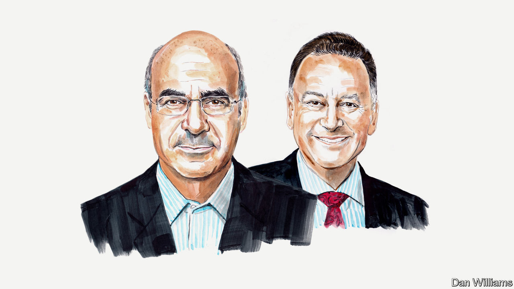

###### Russia, Ukraine and South Africa

# Bill Browder and Tony Leon argue that money, not morality, dictates South Africa’s support for Vladimir Putin 

##### The anti-cronyism activist and the South African politician explain why 

 

> Nov 24th 2022 

KING CHARLES III has conferred a signal honour on South Africa’s president, Cyril Ramaphosa. He has invited him on a state visit to Britain this month, the first by a foreign leader since the king came to the throne. That is in spite of South Africa’s refusal to condemn Russia’s merciless war in Ukraine. In October the country abstained in a UN vote on a resolution demanding Russia reverse course on its illegal annexations of occupied areas of eastern and southern Ukraine. Just 34 other countries abstained and five voted against the resolution; 143 countries voted in its favour. The youth league of Mr Ramaphosa’s party, the African National Congress (ANC) even sent a delegation to observe the rigged referendums on annexation. It described them as “a beautiful, wonderful process”.

Mr Ramaphosa’s approach to the largest land war in Europe in 70 years is despicable. The war, through surging energy and food costs, has only further impoverished African countries as they import 44% of their wheat from Russia and Ukraine, according to the UN. Yet Mr Ramaphosa has refused to criticise Russian aggression and continued to cosy up to the Kremlin. This is entirely inconsistent with South Africa’s proclaimed respect for an international rules-based system, as well as Nelson Mandela’s 1993 promise that human rights will be “the light that guides our foreign affairs”.

Recent statements, events and UN votes by South Africa suggest the flame of Mandela has been snuffed out. Of course, South Africa has a history of aligning with Russia. But Mr Ramphosa’s displays of flagrant anti-Western bias go well beyond nostalgia for past Soviet support. His warm phone calls with Mr Putin contrast with his one desultory exchange with Volodymyr Zelensky, Ukraine’s president. Mr Ramaphosa offered him South Africa’s services in achieving “a negotiated settlement”. Worse still, his decision to label Russia and Ukraine as co-belligerents seems to confirm the view that South Africa supports Russia in the conflict.

Mr Ramaphosa’s stance must infuriate his party’s supporters. In a survey published this month by a South African think-tank, The Brenthurst Foundation, 74% of ANC voters agreed that the Russian invasion was “an act of aggression which must be condemned”. Only 14% of ANC voters said that it was “an acceptable use of force.” And fawning on Russia is not just bad politics, it is bad business. It will only hamper South Africa—ravaged by unemployment of 34.6% and GDP growth of just 2.1%—in its quest for greater foreign investment. Britain, the Netherlands and Belgium alone provided more than half of all such direct investment into the country in 2021.

South Africa is also out of sync with its neighbours. Botswana, Zambia, and continental powerhouse Kenya, have voted to condemn Russia at the UN. The difference in approach matters hugely given that Mr Ramaphosa has been at the forefront of championing African solidarity in international engagements and in conflict resolution. That he cannot denounce the flagrant invasion of Ukraine will harm South Africa’s clout in African forums. 

So why are Mr Ramaphosa and his party supporting tyranny? Although their stance mirrors that of India and China, it is at odds with Mr Ramaphosa’s own policies and support for citizens’ rights. For example, he never misses an opportunity to denounce Israel for human-rights violations in the occupied territories. Yet when it comes to Ukraine Mr Ramaphosa has lost his moral compass. We believe money may be the reason why. 

Consider that Viktor Vekselberg, a Russian oligarch first sanctioned by the Trump administration in 2018 over election interference, co-owns a manganese mine in the Kalahari. The other shareholder is Chancellor House, the ANC’s investment arm. It was recently revealed that this mining company was—to the tune of R10m ($579,000)—the largest single donor to the cash-strapped ANC between January and March of this year.

It is also notable that South Africa’s navy recently conducted joint maritime exercises with Russia off the coast of Durban. Just last month the minister of defence refused either to confirm or deny that the country’s state-owned armaments company, Armscor, had sold arms, ammunition, propellant powder or explosives to Russia. The leader of South Africa’s opposition, John Steenhuisen, who was in Ukraine in May, maintains that there is a view in the country that South Africa had done so. If confirmed, it would directly contradict the oft-repeated claims that South Africa is a neutral party in the war. 

It is to be hoped that beyond famed British politeness during his state visit, Mr Ramaphosa’s stance on Ukraine will be subject to scrutiny, interrogation and frank criticism. Mr Ramaphosa has reminded his hosts that Britain stood with South Africa “to free Mandela and end apartheid”. True enough, but now as Ukraine resists tyranny, it is not impolite or impolitic to ask the president to remember this history and apply it anew. He must acknowledge that just as sanctions and isolation helped end apartheid, an ostensible “neutrality” in the Ukraine war does nothing to combat violation of the international order that he claims to champion in other contexts. He wants aid to combat climate change, and thinks Britain and other rich countries should provide it in recompense for past harm. But for every quid there should be at least a few quos. And asking South Africa, in return, to adhere to its own constitutional promises internationally could be one of them. ■

_______________


