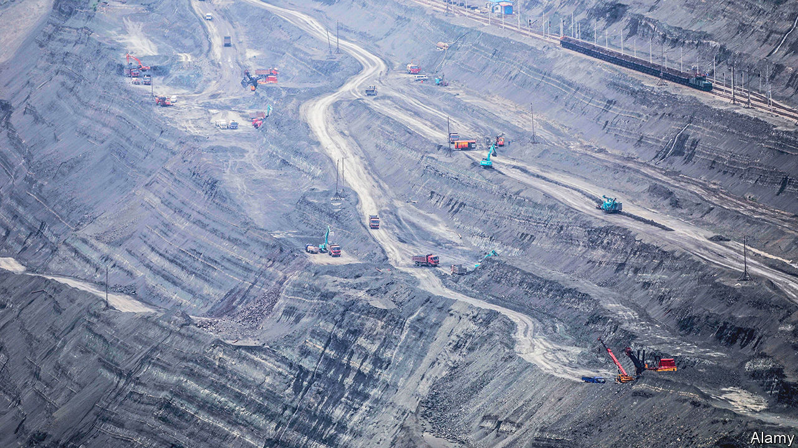

###### Climate for conversation

# America and China are talking again about climate change 

##### Political tensions will hamper dialogue, but could their rivalry have benefits? 

 

> Nov 24th 2022 

Consensus is rare in UN climate negotiations, but most parties agree on one point. China and America—the two biggest carbon emitters—must talk. So there was understandable relief when, midway through this year’s conference in an Egyptian resort, the two countries agreed to resume a climate-change dialogue that had been frozen since August. Three days later America’s climate envoy, John Kerry, invited his Chinese counterpart, Xie Zhenhua, to gatecrash a meeting with the European Union on methane, welcoming him on stage as “a friend of mine”. The 70 or so ministers in the room burst into applause.

The climate dialogue’s revival, agreed upon at a meeting in Bali on November 14th between President Joe Biden and his Chinese counterpart, Xi Jinping, came too late for their teams to issue a joint statement at the talks in Egypt, known as COP27. Nor did they have time to jointly engineer a more ambitious outcome. The UN conclave ended on November 20th with a deal to start a climate-compensation fund for poorer countries, but without big new commitments to curb global emissions. 

Nonetheless, many participants hope that renewed co-operation between China and America will invigorate climate negotiations. There is little doubt that Mr Kerry and Mr Xie are personally committed to the cause (they seem genuinely close and were talking informally even before the Xi-Biden meeting). The question is whether they can now pick up where they left off in August and overcome fresh obstacles, including friction over Taiwan and new American restrictions on technology trade.

Not so long ago, when Barack Obama was America’s president, climate change was a rare bright spot in China-America relations. Despite friction elsewhere, they worked closely on climate issues, signing several bilateral deals that paved the way in 2015 for the Paris agreement (in which most countries pledged to keep the rise in average global temperature to well below 2°C). Co-operation then stalled under President Donald Trump, a climate sceptic who launched a trade war with China.

President Biden has tried to revive climate collaboration, but a further worsening of bilateral relations has hampered progress. China and America reached a surprise agreement at last year’s climate conference in Glasgow, committing themselves among other things to form a working group of officials and experts to discuss co-operation in more detail. But before it could hold its first meeting, China froze all high-level dialogue with America in response to a visit to Taiwan in August by Nancy Pelosi, the speaker of America’s House of Representatives.

Whether the two sides will now revive that working group (which includes several subgroups covering areas such as coal, methane and forestry), or use a different format, remains unclear. “We are back at the table,” Mr Kerry said on November 20th. He pledged they would build on commitments they made in Glasgow, such as those by China to reduce coal use, illegal deforestation and methane emissions. A State Department spokesperson says the two sides discussed plans to “meet in the coming months”. America’s account of the Xi-Biden encounter said they had agreed to “empower key senior officials” to co-operate on climate change. China’s version said only that they had agreed to “jointly work for the success” of COP27. 

Mr Xie said formal consultations would continue after COP27. But some observers think China will agree to more detailed talks only if it secures concessions in other areas during an expected visit to China in January by Antony Blinken, America’s secretary of state. “Maintaining some ambiguity may be part of the intention,” says Li Shuo of Greenpeace East Asia, an NGO.

Progress could be complicated by developments since August. With Republicans about to control the House, and a presidential poll due in 2024, Mr Biden could face more pressure at home to win concessions from China, especially since America will be expected to pay into the new “loss and damage” fund for poor countries. China, meanwhile, wants Mr. Biden to ease restrictions introduced in October on exports to China of semiconductor technology critical for making electric cars (among many other things). And if a new Republican speaker visits Taiwan, China may suspend the dialogue again. 

One area where progress might be possible is methane, says Jennifer Turner of the Wilson Centre, an American think-tank. China’s coal mines produce a lot of it. Cutting those emissions is less complex than curbing fossil-fuel use, as methane can be captured relatively cheaply and easily. That may explain Mr Xie’s appearance at the COP27 event where America and the EU said more than 150 countries had signed a pledge to cut methane emissions by 30% by 2030. China was not among them, but Mr Xie said his government had drafted an action plan and would soon approve it. 

There may be another reason for qualified optimism. As climate change becomes a bigger area of competition between China and America, both are channelling billions of dollars into developing green technology at home and financing green development abroad, especially in poorer countries. “This competitive environment could help countries who are able to articulate their needs,” says Bernice Lee of Chatham House, a think-tank in London. 

China is refocusing its global Belt and Road infrastructure programme on greener projects. In June America and other members of the G7 launched a rival scheme, the Partnership for Global Infrastructure and Investment. It aims to mobilise $600bn of investment in eco-friendly infrastructure in poorer countries by 2027. One project, unveiled on November 15th, is a $20bn package to help wean Indonesia off coal. 

Co-operation between America and China would help drive down the cost of green technology by integrating supply chains, and allow more efficient financing of climate-related projects in developing countries. For now, though, climate competition—not co-operation—may offer a more realistic path for progress. ■


