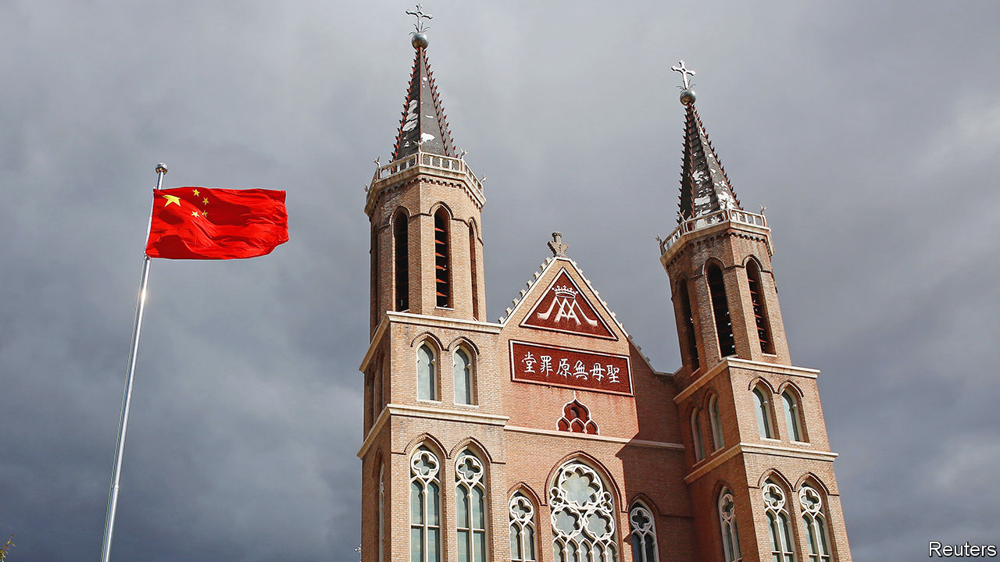

###### Blessed are the meek

# China wants to “sinicise” its Catholics 

##### The campaign is spreading to Hong Kong 

 

> Nov 22nd 2022 

When the Vatican signed a deal with China in 2018 on the appointment of bishops, the pact was  by a former leader of the Catholic church in Hong Kong, Cardinal Joseph Zen. He said it would legitimise the Communist Party’s control over Chinese Catholics, and be like “giving the flock into the mouths of the wolves”. The flock has not yet been devoured, but the grip of the government’s jaw has been tightening. The authorities have accelerated a campaign to “sinicise” the church by making its buildings, art and rituals look more Chinese and, crucially, its followers more loyal to the party. Catholics in Hong Kong are in their sights, too. 

China’s leader, Xi Jinping, launched the campaign in 2015 with all of the country’s officially recognised faiths in mind (there are four others: Buddhism, Islam,  and Taoism). The party has been particularly tough on Muslims, claiming that radical ideas from abroad are fomenting religious extremism and separatism among China’s Muslim ethnic groups, especially the Uyghurs. The government has locked up many Uyghurs in “re-education” camps, removed Arab-looking domes and minarets from mosques and banned the use of Arabic script on buildings. 

Pressure has also grown on China’s 12m Catholics. In 2018 the Chinese Catholic Patriotic Association, which oversees the state-approved Catholic church, launched a “five-year work plan” to promote sinicisation. Like similar plans involving the other faiths, this one aims to ensure that the party’s doctrine is given prominence. The clergy are required to attend study sessions to learn about the party’s history and Mr Xi’s ideology and accomplishments. Officials stress that this knowledge must be imparted to parishioners. 

The Vatican hopes its pact with China will help unify the Chinese Catholic church, whose members have long been split between congregations that register with the authorities and submit to regulations and those that do not, which are commonly labelled “underground”. But Cardinal Zen fears the agreement will simply help subject the unregistered churches to the same sort of interference seen in officially approved ones. The deal’s contents remain secret, but they are said to allow the Chinese government to nominate bishops while giving the Vatican a veto. 

China has been intensifying pressure on underground clergy to submit to government controls. Some objectors have reportedly been arrested. “The party goes around and tells underground priests: the pope has negotiated with us. They use the Vatican as an excuse to force underground priests to register,” says a priest from Hong Kong. He calls the pact “a slap in the face of the persecuted”.

Pope Francis insists the deal is “working well”. In October he renewed it for a second time. Yet the actions of the Vatican’s unofficial envoys in Hong Kong suggest they know that all is not well (the Vatican does not have formal diplomatic relations with China). Earlier this year their chief reportedly held private meetings with Catholic missionaries in the city to warn that mainland-style restrictions on religion were coming soon. The diplomats shipped to Rome half a tonne of archives containing details of missionary and underground activity on the mainland. 

There are already signs that the sinicisation campaign is spreading into the territory, which has hundreds of thousands of Catholics. A year ago the office of the mainland government in Hong Kong organised an online meeting between Chinese bishops and Hong Kong’s Catholic leaders. They discussed sinicisation but kept the meeting private. This month 50 scholars and clergy from all over China, including Hong Kong, held a conference on sinicising Catholicism. This one was publicly announced. At it the chairman of the mainland’s Chinese Catholic Bishops’ Council, Shen Bin, praised the party and its sinicisation efforts. Another participant, Cardinal John Tong Hon, a former bishop of Hong Kong, quoted Mr Xi as saying that Hong Kong’s youth should “find a suitable path”. That is a euphemism for avoiding protests.

Unlike on the mainland, where few people could name any Chinese Catholics, Hong Kong has several well-known ones. They include John Lee, the territory’s chief executive, and two of his predecessors. But among its famous Catholics are also fierce critics of the party, such as Jimmy Lai, a publisher, and Martin Lee, a lawyer. 

Mr Lee was given a suspended 11-month sentence last year for organising a pro-democracy protest. Mr Lai is in jail for similar offences. On November 25th a local court is expected to deliver a verdict in a case against Cardinal Zen: he has been accused of failing to register a fund to help pro-democracy protesters. Unlike many of those he supported, he is likely to get off with a fine. In 2021 mainland researchers published a “blue book” on the state of religion in Hong Kong and southern China. It concluded that a “radical minority” of Christians in Hong Kong backed the unrest that swept the territory in 2019 and should be removed from positions of influence. 

Hong Kong’s Catholic church has already begun to self-censor. In 2020 Cardinal Tong reportedly warned priests to avoid political sermons and removed from a statement a reference to an underground bishop. This year the diocese stopped holding its annual mass for victims of the massacre of demonstrators around Tiananmen Square in 1989. The priest from Hong Kong says churches there will remain open, but only meek believers will remain. ■


