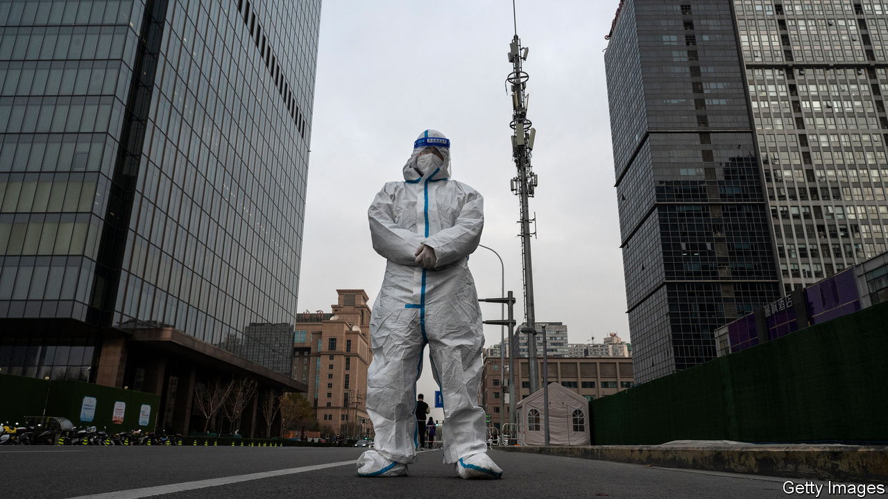
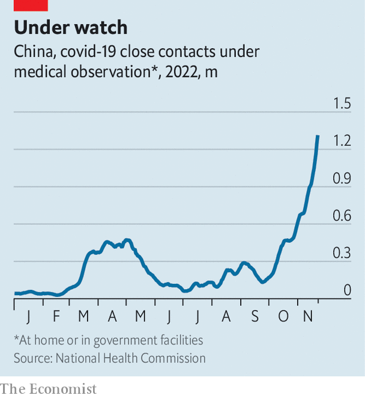

###### Covid confusion

# China’s response to a surge in covid-19 cases is muddled 

##### It is too early to predict how its “zero-covid” policy will evolve 

 

> Nov 24th 2022 

At the end of the 19th century, bold officials and a young emperor tried to reform China’s last imperial dynasty. They made sweeping changes in education, the armed forces and the economy to help the creaky Qing empire catch up with Japan and Western powers. They failed. The “hundred-day reforms”, as they became known, were scrapped by the emperor’s conservative aunt, the Empress Dowager. 

China’s recent attempts to ease its draconian “zero-covid” controls were so ill-fated that some have dubbed them the “seven-day reforms”. They began on November 11th, when the government banned excessive mass testing, “arbitrary” lockdowns and other intrusive measures. Officials demanded more precise controls in order to limit the impact on people’s lives and livelihoods. Shijiazhuang, a northern city of about 11m people, stopped requiring that those entering public venues show a recent negative test result for covid-19. Some other cities also relaxed controls and removed covid-testing booths. Financial markets perked up. Some analysts saw Shijiazhuang’s approach as a possible precursor to a full opening of the country, following nearly three years of restrictions. 

In theory the new guidelines are still in place. But on the ground little has changed. Shijiazhuang is now under lockdown, and is testing most of its population for the virus. Several cities have recently announced mass-testing campaigns, and have reopened testing booths. Some other cities are abiding by the letter of the new guidelines but not the spirit. Police have ordered bars in central Beijing to close, without any public notice being issued. In all, areas producing a fifth of China’s GDP are now under some form of lockdown, reckons Nomura, a bank. 

The flip-flop is not surprising. There was already an uptick in covid cases when the easing was announced. It has since accelerated. On November 23rd China logged over 30,000 cases, the highest official record for a single day. And for the first time in six months, officials reported deaths from covid: several elderly people with pre-existing conditions.

More puzzling is why the central authorities felt they could ask local officials to ease restrictions while at the same time expecting them to keep cases down. These contradictory goals caused “chaos and confusion”, says Huang Yanzhong of the Council on Foreign Relations, an American think-tank. It may also have contributed to the rise in cases. 

Many Chinese are worried. “This world is inexplicably messed up and I don’t know what to do,” said a commenter on Weibo, a Twitter-like service. Some are terrified that the virus may run rampant. On November 22nd riots erupted in the central city of Zhengzhou at the world’s biggest iPhone factory, partly over fears of infection. But others, sick of lockdowns, would prefer more easing. One widely shared article noted that World Cup fans in Qatar are not even wearing masks. “Do we live on a different planet?” it asked.

As cases rise, health officials are preparing for a big outbreak. On November 17th they announced plans to convert 10% of hospital beds into intensive-care unit (ICU) beds. They also promised to unveil a plan to increase vaccination rates among the elderly (just 40% of China’s 80-plus group have had a third booster shot, which would substantially reduce the risk of severe disease or death). But such projects will take time and resources. Currently China has fewer than four ICU beds per 100,000 people. That compares with more than 30 per 100,000 in America. 

 


China is still pursuing its strategy of isolating those infected and their close contacts. This is getting harder as cases rise. Over 1.3m people are under medical observation, far more than during previous outbreaks (see chart). Quarantine facilities are being built quickly but are coming under strain. More people are being asked to stay at home, to be monitored by exhausted community workers. 

Mr Huang believes the next few weeks will be critical. China may manage to crush its outbreaks through its tried-and-tested method of long lockdowns and mass testing. But if cases rise too fast, attempts to isolate close contacts will fail and officials “may find the existing playbook no longer works”, he says. Whatever happens, efforts to make life more comfortable while maintaining a zero-covid policy seem futile. ■


