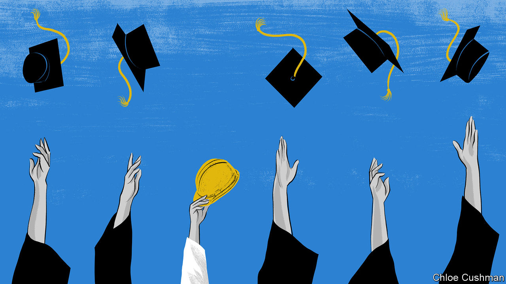

###### Chaguan

# China’s slowdown is hurting the young 

##### The woes of vocational-college graduates are revealing 

 

> Nov 24th 2022 

CHINA’s economy is in grim shape. Much of the pain is being felt by the young. Unemployment among Chinese aged 16-24 is running at 18%. That number is an undercount: it misses rural youngsters and those out of work for more than three months. The crisis is hurting even relatively privileged youths, including nearly 3.5m who earned undergraduate university degrees this year.

Pandemic-induced lockdowns are hurting the whole economy. Some industries that formerly employed millions of graduates have shrunk, after Communist Party chiefs declared them threats to economic and social stability. Specifically, leaders squeezed giant property developers in the name of curbing debt-fuelled speculation. They slapped fines on internet companies deemed over-mighty. Almost overnight, they crushed an after-school tutoring industry accused of provoking cut-throat competition between families. Many youngsters are fleeing the business world for safer havens. Almost 2.6m signed up to sit national civil-service examinations, a big jump since last year. A still larger number have applied to pursue postgraduate studies. In the long term, the dashed ambitions of university graduates pose political risks. Middle-class parents, a vocal bunch, have grown used to the notion that their children will have bright prospects in a rising China. Less is heard about another group trying to enter the labour market: millions of students in vocational and technical colleges.

Vocational students might be thought well-equipped in this downturn. After all, they study real-world skills rather than abstract academic notions. China’s manufacturing sector has fared better than many others during the pandemic, in part because of “closed-loop” policies, a euphemism for sealing workers in a factory and having them sleep on site, for weeks on end. Many manufacturing firms report that they lack skilled technicians and generally struggle to recruit young staff. The rural-to-urban migrant workers who built modern China (some of them the parents of today’s vocational students) are ageing. In 2021 there were still 292m rural migrants who worked in cities far from home, but their average age had risen to nearly 42. The proportion of such people who are in their teens or their 20s has halved over the past decade or so.

Alas, many employers look down on vocational colleges. These institutions are at the end of an education track down which roughly 40% of pupils are sent. A big dividing point is the  exam. It sorts teenagers into two kinds of high school: academic for those with good grades, and vocational for the rest. Later, vocational colleges also take lots of academic high-schoolers who flunk the , a fearsome university entrance test. Despite attempts at reform, the vocational sector remains unloved and half-forgotten, though it teaches more youngsters than universities do. A new law declares vocational colleges to be as important as universities and calls on firms to play a big role in technical education. That is a bid to rebuild bridges with the working world that crumbled in the late 1990s when many state-owned firms went bust or were sold off, and stopped sponsoring vocational colleges. A veteran professor says China should learn from apprenticeships in places like Germany. He also growls that today’s young “are afraid of hardship”.

On a damp, grey autumn day, Chaguan travelled to Jiujiang, a port city on the Yangzi river in Jiangxi, a poor inland province. There he spoke to students from the Jiujiang Technical and Vocational College, founded in 1960 as a shipbuilding school. Some nodded to the happy theory that vocational colleges teach how things work in practice, while universities teach why things work in theory, making them complementary. Then they described hard-to-change social and even cultural forces that keep them down. A shipping student joked about Peking University, the country’s most famous academy. “You know what they say, computer-science majors from Peking University can’t fix a computer.” In reality, she said, vocational degrees are not respected. “Even we think university is better than vocational school.” Like several Jiujiang students, she was gloomy about using her studies to land a job. The shipping industry dislikes women, she said. Her own teachers warn of “flagrant” gender discrimination in hiring.

Families have different hopes for sons and daughters, suggested a teenage boy and girl eating lunch at a bustling restaurant. A son faces pressure to buy a home and support a family, so his salary matters, said the girl. A daughter may be pressed to seek a stable though low-paid job in her hometown, perhaps as a nurse or at a state-owned firm, so she can look after her parents. Asked why they both study information-technology hardware, the pair answered: “Because we didn’t get good scores.”

All about the grades

In China many students are assigned courses on the basis of exam grades. A 19-year-old learning to repair electric cars is one of them. He confessed that he dislikes the work, is confused about what job to do and mostly wants to live near his family. Other students reported widespread interest in taking the , an exam that lets vocational students transfer to regular universities.

That exam’s very existence undercuts official claims to treat vocational and academic studies as equal. Indeed, as the economy slows, Jiangxi’s government has hugely increased its quota for students allowed to make vocational-to-university transfers. The province granted 2,770 students transfer places in 2019, before the pandemic. It is offering 42,000 places this year. As your columnist talked to students, a salesman from a private education company set up a roadside stall promoting weekend and night classes that prepare youngsters for the . Vocational degrees are not worth much, ventured the salesman: just try applying to be a teacher or civil servant with one. Business is booming, he added. Jiujiang’s vocational students are on the wrong end of an unequal, exam-obsessed system. In a bad economy, the gaps grow wider.■


