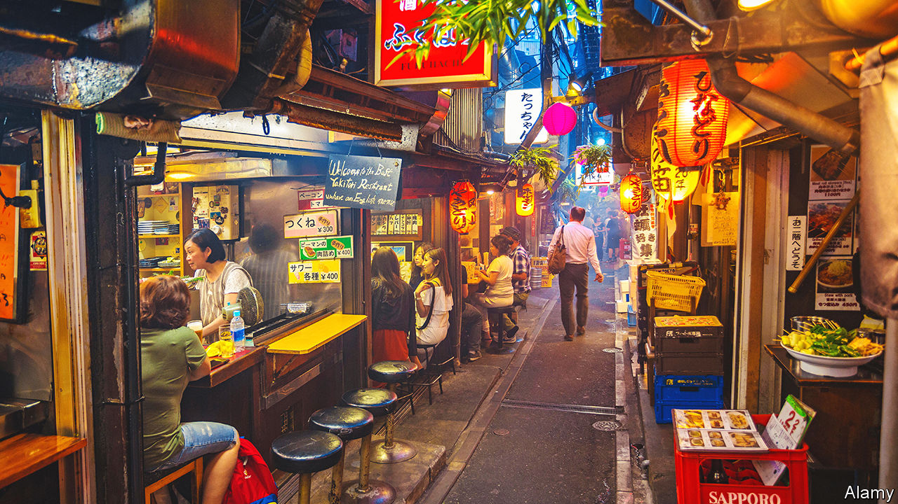

###### Tales of the megacity

# Can Tokyo’s charms be replicated elsewhere? 

##### Outsiders once disparaged Japan’s capital. Now it has lessons to offer 

 

> Nov 24th 2022 

The real Tokyo, as any denizen of the world’s most populous metropolis knows, is found in the smallest of spaces. Japan’s capital is not a city of grand arterial boulevards. Its lifeblood flows instead through tangles of narrow alleys, up the stairs of slim buildings and into tiny shops and cramped eateries.

Take Nonbei Yokocho, or Drunkard’s Alley, a charmingly defiant cluster of watering holes in the shadow of Shibuya railway station. The average size of the 38 establishments is just under five square metres, notes “Emergent Tokyo”, a new book by Jorge Almazán, an architect, and his colleagues at Keio University. They nominate Tokyo as a  and explore its workings—and in so doing show how perceptions of it have evolved.

For much of its modern history, it was “the world city that everyone loved to knock”, observes Paul Waley, author of several books on it. Tokyo did not conform to traditional notions, Western or Chinese, of how a city should look, feel and function. In place of neat street grids that signal order and authority, it had a patchwork of meandering neighbourhoods. Disasters left little in the way of visible heritage. There is no overarching style or sense of monumentality. Visitors have often been baffled and underwhelmed: in the late 19th century Isabella Bird, a British traveller, dismissed Tokyo as “a city of ‘magnificent distances’ without magnificence”. 

Edo, as Tokyo was first known, grew only when the Tokugawa shoguns chose it as their seat of power after consolidating control of Japan at the start of the 17th century. Some areas expanded along Chinese-style grids and others according to the topography of the land. They interlocked with one another in a kind of calculated incoherence, much like “a patchwork quilt”, writes Timon Screech in “Tokyo Before Tokyo”, published in 2020.

Though Kyoto remained home to the imperial family, and was thus the official capital, Edo soon became pre-eminent. By the early 1720s it had a million inhabitants and was the world’s largest city. Culture flourished, despite the earthquakes and fires that periodically struck. After the Meiji restoration brought an end to the Tokugawa shogunate and opened Japan to the world in 1868, the emperor moved to Edo. It was renamed Tokyo—literally, “The Eastern Capital”. 

Industrialisation and Western influence began to transform it. Grand Haussmann-esque plans for reconstruction were discussed but never realised, not even after the Great Kanto Earthquake of 1923 flattened the city. After the second world war, when American firebombing razed Tokyo again, planners tried to impose order, erecting hulking concrete expressways over the canals that had earned Edo comparisons to Venice. Yet the planners’ reach was limited, and much of the rebuilding happened haphazardly, from the bottom up.

As Tokyo thrived in the , so did interest in its past, producing a boom in so-called , or Edo-Tokyo Studies. In “Tokyo: A Spatial Anthropology”, a seminal book published in 1985, Jinnai Hidenobu, an urban historian, argued that the rhythms of the Edo era had endured, even if the individual buildings had vanished. “There was no clear logical system in Edo that would bring a variety of elements together into a single whole as in a European city,” he wrote. Rather, “like a mosaic or a kaleidoscope”, the metropolis “sparkled with myriad different images created by the particularity of individual locales, their terrain and their histories”.

The virtues of disorder

As, across the world, Modernist ideals of unity and clarity gave way to a post-modern embrace of disorder, Tokyo’s kaleidoscope came to be regarded differently. Its hectic neon streets began to look like a vision of the future. All the same, its admirers often fell back on a kind of cultural essentialism, attributing  to uniquely Japanese conditions. There might be plenty in the city to envy, but it seemed there was little point in trying to emulate it.

In the 21st century the city has become a source of insights for urbanists and architects elsewhere. Tokyo today is —safe, clean, functional and vibrant—for a megacity of its size: 37m in its greater metropolitan area, including 14m people in the central wards. World-class infrastructure stitches together neighbourhoods that retain the intimate qualities of smaller communities.

Contemporary observers tend to focus on the advantages of Japan’s relatively permissive zoning laws. Those support the theories of Jane Jacobs, a mid-20th-century American writer who challenged the orthodoxy that cities should be organised by function. As André Sorenson notes in “The Making of Urban Japan”, Tokyo shows how dense, mixed-use neighbourhoods can enliven a city. Many of its best bits were the least planned.

“Emergent Tokyo” is a valuable addition to what it calls “Tokyology”. Mr Almazán and his team use a mix of number-crunching, shoe-leather reporting and lush images to explain how and why the city works. Municipal data help illuminate recurring features, from the teeming  alleyways to the neon-signed buildings known as . The authors attribute Tokyo’s success to prosaic policy choices rather than an abstract national essence. The eclectic façades of the , for example, result not from a Japanese disregard for exteriors, as commentators once argued, but the fact that ordinances apply to each building independently. Owners are not required to blend in with other buildings, as is often the case in Western cities.

Within this looser framework, says Mr Almazán, Tokyo’s most characteristic elements generally “emerge” organically rather than being imposed from above, as owners and designers respond to the decisions of their neighbours, much as a flock of birds finds its shape. , for example, grew out of the black-market street stalls that proliferated immediately after the war. After being granted land rights, owners banded together to protect themselves as developers encroached.

In Nonbei Yokocho the valuable land under the bars is held collectively and managed through a trust. The fragmented ownership and low overhead costs help facilitate economies not of scale, but of agglomeration, with rows of idiosyncratic spaces that feel personal, informal and intimate. Despite their small size, the bars offer plenty to drink—and plenty for other cities to ponder. ■


