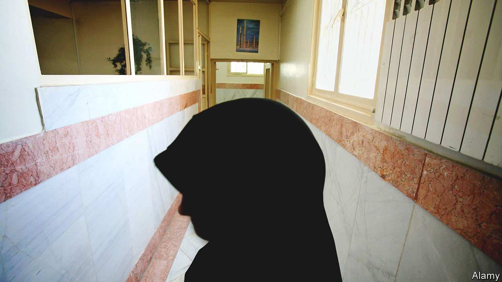

###### House of horrors

# Iran’s women prisoners face down their inquisitors 

##### Narges Mohammadi collects their testimonies in “White Torture” 

 

> Nov 24th 2022 

 By Narges Mohammadi. Translated by Amir Rezanezhad. 

The solitary cell in which the shah’s torturers incarcerated Iran’s future supreme leader, Ali Khamenei, for eight months in 1974 was 2.4 metres long by 1.6 metres wide. A thin strip of sunlight pierced his confines for a few minutes a day. The interrogation room lined with hooks for whips was along the corridor. “There were loud shouts, without exception,” he once recalled. Sometimes they were his. The experience might have induced a revulsion of torture. Sadly, too often, the abused become abusers.

The testimonies of 14 women collected in “White Torture” read like a charge sheet against the Islamic Republic of Iran. They were recorded by one of the victims, Narges Mohammadi, in Ward 209, the block in the huge  in Tehran where the Ministry of Intelligence interrogates women. Nazanin Zaghari-Ratcliffe, a dual-national former inmate who returned to Britain in March, is among the contributors.

Compared with them, Mr Khamenei had it rather good. His victims have no sunlight. Naked bulbs shine round the clock, obliterating night and day. Toilets double as wash basins in cells that are smaller than his. Several are blocked. The stench induces asthma. Mahvash Shahrirari, a leader of the Bahai faith, says hers was full of beetles, dead and alive.

The women miss inconsequential things the most: falling autumn leaves, the feeling of a breeze. When a butterfly settles on the floor, “I talked to it as if it were a dear friend,” says Sedigheh Moradi, who was repeatedly flogged on the soles of her feet. 

Some were beaten during their arrests or awaiting transfer at other prisons. But it is the dark art of “white”, or psychological, torture in which the Ministry of Intelligence excels. Interrogators crush subjects by suspending their sensory perceptions. After weeks, months or a year in solitary confinement, in a cell like a “sealed tin”, even talking to an interrogator can be welcome. Then the inquisition begins—sometimes lasting 17 hours a day for a month.

The power of the interrogators is absolute. They determine not just whether their subjects and their relatives live or die, but how. Conditions are minutely calibrated according to the extent of co-operation. The subjects may be questioned while blindfolded, facing a wall or beneath a dangling rope. Interrogators can withhold family visits, newspapers, books, pens and soap—or, if they choose, facilitate them.

They invent sentences of execution and drop them. They mention in passing that husbands are tired of waiting and are having affairs. They give dolls to children when they visit. He—and it is always a he—“insinuates that he is the only one who can save you”, says Marzieh Amiri, a journalist sentenced to a decade of imprisonment and 148 lashes for lesbianism. And yet “he is the one who can lead you to the abyss of destruction.” There is no access to lawyers. 

The inquisitors pry into sex lives “over and over again”. One puts the Iranian equivalent of dollar bills on his subject’s breasts. Another professes his love, stroking her chador-covered head. Many women fear their interrogators will use the footage from the cameras in the bathrooms. Peering into a mirror for the first time in months, an inmate turns to see who is standing next to her, before realising she is looking at herself.

Much of the testimony smacks of the Spanish Inquisition. The interrogators wield Islam like a weapon. They accuse the women of deviant beliefs or sex lives. Some are charged with , the capital offence of waging war on God, others with “insulting the sacred”.

Despite it all, the women are indomitable. “In solitary confinement it’s only your mind that works,” says Atena Daemi, a children’s rights activist. As a result it goes into overdrive. The prisoners instil order in their days. They read voraciously—the Koran or the scrawls on the walls if nothing else is available. And they exercise: one woman estimates she walks 7km round her two-metre cell every day. For many incarceration becomes a deeply spiritual experience. “I felt like I was in a monastery,” says another Bahai leader. “These moments were inexpressibly magnificent.” Another woman quotes Nietzsche: “What doesn’t kill you makes you stronger.”

Their resolve helps explain the  against Iran’s clerical-led patriarchy. As well as their testimonies, the women have shared survival techniques and a programme of action. Alumnae speak of Evin as a university. Inside, they staged sit-ins and withstood electrocution by cattle-prods. Prevented from making phone calls, they went on hunger strike. Ms Mohammadi compiled the book on home leave despite knowing that would mean a fresh sentence of six years and 74 lashes. “I don’t know why it’s so hard to interrogate girls,” says a captor, “and why they constantly quarrel with their interrogators.” 

Fortunately for future prosecutors, this book is full of inquisitors’ names. Should the ayatollahs and their bully-boys , it will surely form part of the case against them. And, as it did for Mr Khamenei, the torment of Iran’s prisons might yet . ■


