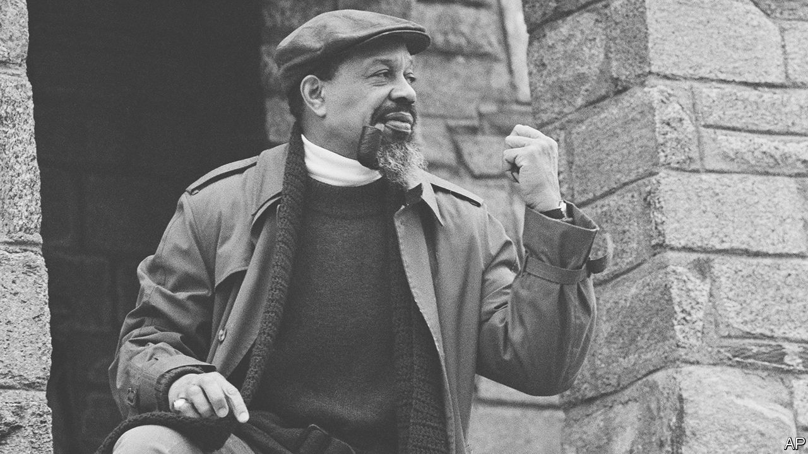

###### A siege in the capital

# The forgotten tale of a hostage-taking in Washington in 1977 

##### “American Caliph” recounts the saga of race and religion in thrilling detail 

 

> Nov 24th 2022 

 By Shahan Mufti. 

This book packs a lot into its fast-turning pages. A family is massacred. Two giants of American sport,  and Kareem Abdul-Jabbar, find themselves on opposite sides of a religious battle. Racial and global politics swirl. A future mayor of Washington is shot—and nearly 150 people are held hostage. Shahan Mufti pulls out all the stops to tell the extraordinary but largely forgotten tale of a man deranged by grief and ambition.

“American Caliph” focuses on Hamaas Abdul Khaalis, leader of the Hanafis, a black Muslim group that took its name from an old strand of the faith—and became caught in a vicious rivalry with the Nation of Islam (noi), the movement led by Elijah Muhammad that for several years included . Khaalis’s story climaxes in a bloody siege. On March 9th 1977 he and his men took over three buildings in Washington: B’nai B’rith International, a venerable Jewish community organisation, the Islamic Centre of Washington, America’s biggest mosque, and the District Building, which houses the offices of the municipal government. The terrifying stand-off lasted almost two days. 

This part of the narrative reads more like a thriller than political history. But the book begins with Khaalis’s troubled past. On one reading, he had been a young man tormented by schizophrenia. On another, he was a con artist who had dodged military service in the second world war—and the criminal-justice system—by feigning mental illness. Born Ernest McGhee in Gary, Indiana, in 1922, he became a Muslim and a devotee of the NOI, which combined a version of Islam with a belief in black supremacy. As its leader Elijah Muhammad was also, to his acolytes, the leader of all America’s Muslims: the American caliph.

Khaalis soon grew dissatisfied with the NOI. He wanted to turn it away from black supremacism and towards a more traditional version of Islam; his movement was backed by Mr Abdul-Jabbar, a basketball star. And Khaalis coveted the title of American caliph. The ideological battle became violent: in a horrific massacre in 1973, seven people, including five of Khaalis’s own children and grandchildren, were drowned or shot to death in Washington. He sank into a depression—until he spied a new cause, and a chance to be avenged, in the release of a controversial film.

No image of the prophet was actually shown in “Mohammad: Messenger of God”, directed by Moustapha Akkad, a Syrian-American who later produced some of the “Halloween” horror films (and died in a terrorist attack in Jordan). But that did not placate those Muslims who considered the movie to be sacrilegious. Several prominent figures, including Saudi Arabia’s then crown prince, tried to shut it down. But the film-makers prevailed, largely due to the support of Muammar Qaddafi, the Libyan despot. In 1977 a premiere was scheduled in New York.

In a final bid to prevent the screening, Khaalis and his followers seized the three buildings in Washington and demanded that the film be banned in America altogether. Khaalis also requested visits from Elijah Muhammad’s son, who had assumed the noi’s leadership after his father’s death, and from Muhammad Ali, for some years a follower of the noi. And he wanted the men convicted of murdering his family to be delivered to him, presumably so they could be executed.

Two people in the occupied buildings lost their lives. Marion Barry, later the capital’s mayor, was wounded. Khaalis died in prison in 2003.

Mr Mufti artfully weaves wider historical events into his story, such as Malcolm X’s assassination, new laws that facilitated Muslim immigration to America, even the seizure of the Suez canal by Gamal Abdel Nasser, Egypt’s leader. These elements supply the rich context of a saga that builds in tension until the last gripping moments. The reader is left wondering how this extraordinary tale could ever have been so neglected. ■


