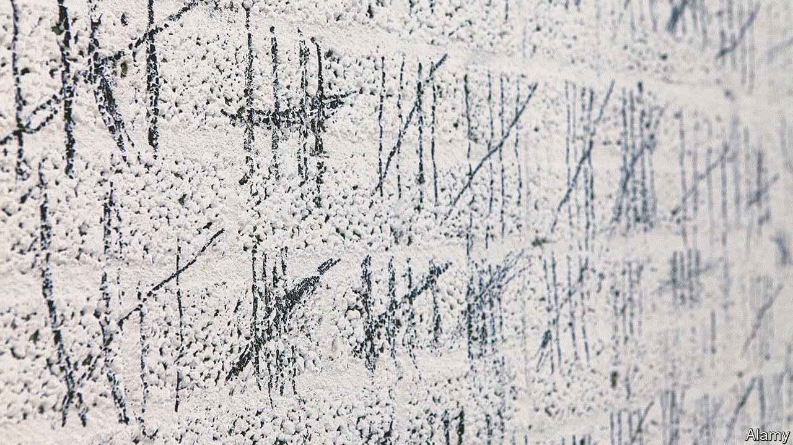

###### Metre made

# The heights and depths of humanity’s yearning to quantify 

##### James Vincent outlines the forces and foibles behind the history of measurement 

 

> Nov 23rd 2022 

By James Vincent

Imagine a prisoner in a cell, tabulating time served. Those groups of four lines crossed with a diagonal fifth have a long history. It stretches back to the Wolf Bone, found in what is now the Czech Republic and dating to 33,000 years ago. Forever lost is what its notches, grouped in fives, actually marked. But it is an early example of an artefact from nature, abstracted from experience, whose only value was as an etched tally. In other words, it is a measurement.

This interplay between measuring, nature and abstraction is part of the human story. For centuries bodies themselves gave birth to units: thumb-joint inches, arm-span fathoms and foot-long feet. But units could sometimes be fluid. The area of a piece of land might be delineated by how many mouths it could feed. Among the northern European Saami people, a  marked how far a reindeer travelled before urinating. 

Such measures changed with the landscape, and might seem far removed from notched bones. But this deeply researched history by James Vincent clarifies the connection. To begin with, humans are list-makers. From Aristotle’s “Categories” to the Linnaean  of biology, people are splitters, not lumpers, forever seeking to parse and quantify the world. 

Medieval monks punctuated the day with prayers, leading them to fashion the first mechanical clocks. To  is to measure time, and measurement, Mr Vincent says, is a cornerstone of cognition. Yet it is a political phenomenon, too. Honest weights and measures crop up frequently in ancient history as guarantors of social order, from Hammurabi’s code in Babylon to the Talmud and the Bible, which mentions measurement more than charity. 

The leaders of the French revolution were so taken by the social power of measurement that they undertook an almighty project: metrification. They wrangled the quarter-million known units into one fixed, decimalised system, “for all times and for all peoples”, embodying the ideals of the Enlightenment in scales and tape-measures. Naturally, they turned first to nature, defining a metre as one ten-millionth of the length of the meridian running through Paris.

The years-long surveying project was another bold abstraction from human experience. But the resulting metre-long lump of platinum reflected a truth Mr Vincent says is fundamental: humanity’s measures contain biases and follies. Because the Earth is not quite a perfect sphere, estimates of the meridian’s span can vary by latitude. And one of the surveyors’ instruments had a tiny, wilfully ignored error. 

No matter, as long as all agree on a standard. Yet standards do not serve everyone equally, and can impose social control as much as aid order. Early continental-scale surveys of America, conducted using 66-foot-long chains, produced maps with rail-straight lines. They were handy for tax-men but glossed over mountains, canyons and other wild variations in terrain, not to mention the native peoples whose territory was erased. 

Then there is a human tendency stronger than that of measuring: habit. France’s decimalisers flopped with their ten-hour clocks; workers despised their ten-day weeks. Mr Vincent traces the enduring resistance to metrification, meeting an activist in Britain who pastes imperial units over metric signs. Quantification, moreover, sometimes goes too far. The eugenicists who, addled by bogus statistics, advocated forced sterilisations are the grisliest example. Others are comical. Charles Piazzi Smyth, a 19th-century Scottish astronomer, wrote a three-book opus on how measuring the Great Pyramid of Giza using a “royal cubit” could divine the future. 

It is easy to revile the eugenicists or mock the pyramidologists. But today’s “” movement, which imbues data spilling from personal gizmos with predictive power, may also be over-promising. Measurements only encompass so much wisdom. Like the hunter-gatherers, though, the smartwatch-wearers will doubtless measure on. ■


