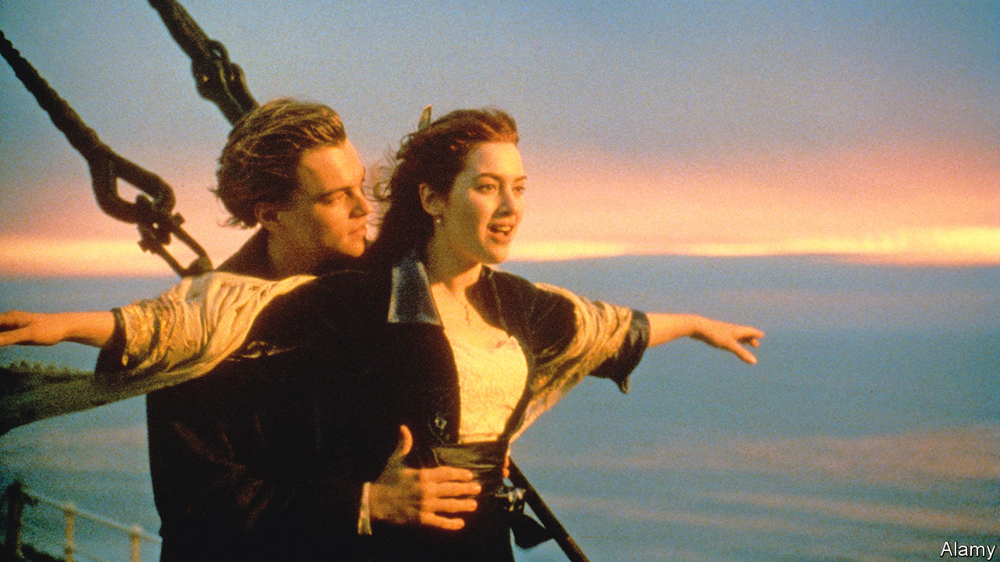

###### Back Story

# Twenty-five years on, “Titanic” feels like a prophecy 

##### We are all Rose and Jack now 

 

> Nov 23rd 2022 

He was king of the world. The late 1990s were an age of hubris, and James Cameron, the director of “Titanic”, earned his. Launched 25 years ago, his film was the —beset, before its release, by doubts about its minor stars and the glum storyline. Effortless sinking-themed headlines awaited. It became the first movie to earn $1bn and won 11 Oscars. At the awards ceremony, which in those days people still watched, Mr Cameron crowned himself world king in an exultant line from the screenplay.

There have been many adaptations of the  story, before and after this one. A silent short came out a month after the disaster in 1912, starring a real-life survivor. A lunatic Nazi propaganda version was shot during the war on Joseph Goebbels’s orders. “A Night to Remember”, a poignant effort of 1958, overlaps with “Titanic” in scenes and motifs—the heavy-handed ironies, a game of ice football on deck, a child gazing at distress flares as if they were fireworks. In both, the band’s musicians play on, say their farewells, then play on again. 

Yet for all the competition and its clichés, “Titanic” rules the waves. A quarter of a century on, people are still arguing on the internet over whether, in the finale, Jack could have squeezed onto that bit of debris with Rose. The appeal is not just the lavish sets and special effects or Leonardo DiCaprio’s cheekbones. Crucially, Mr Cameron sneaked two films into one three-hour movie, which hinges in the middle as the ship’s hull does in his telling. Without the first half, “Titanic” would never have circumnavigated the globe in the late 1990s. With its vision of a flooding, flailing world, the second half makes it wrenching today.

The first part magnifies a banal experience to a grand scale, one of cinema’s favourite tricks. Facing a stifling future, the posh, slightly annoying teenage heroine, played by , meets a boy from the wrong side of the tracks. For all his rough edges, he is an artist, and is soon drawing her “like one of [his] French girls”. Their first (and last) clinch is on the back seat of a car, only Rose reaches this rite of passage on a death-bound ocean liner and in the arms of Mr DiCaprio. 

The Earth moves. The iceberg scrapes along the bow. As the lower decks flood, the romance is submerged in an action movie. The computer-generated imagery that was cutting-edge in 1997 already looks old-fashioned. Still, the story feels like a prophecy. All disaster flicks prefigure the end of the world, but “Titanic” eerily reflects the contours and countdown of the climate emergency.

The warnings about sea ice were ignored. Now the water is rising and the catastrophe unfolding. But there are still choices to be made. Amid a pageant of morality—guts and cowardice, egotism and devotion—there is time, just, to act.

Confronting the unthinkable, some people turn away for as long as possible. Some abjure the daunting unknowns of action and drown in their tailcoats or beds. The rest must decide who to save—themselves, their loved ones or strangers—and how. After a kind of aqueous “Indiana Jones”, involving handcuffs, axe swings, locked grills and a shoot-up in a deluxe dining room, Jack and Rose selflessly rescue a small boy. 

Much as it is today, the big challenge is to keep working together across classes and nationalities. Played by Billy Zane and his villainous eyebrows, Cal, the baddie, tries to pay his way onto a lifeboat: there are, after all, too few of them. The first-class rich fare better than the poor in steerage, in the movie as on the ship in 1912. As Mr Cameron has noted, the  parallels the unequal impacts of climate change.

In the metabolism of Hollywood, tragedy leads to rebirth, and so, inspired by her fling with Jack, Rose swims off into a liberated future. The uncouth has set her free. As in other tales of love in adversity, like “Dr Zhivago” or “The English Patient”, the audience must weigh the feelings of an attractive young couple who barely know each other against a historic calamity. The heritage smooching aside, though, one of the film’s most important tweaks to the factual record lies in something it leaves out. 

On the night the  sank, another ship, the , was anchored close by, its wireless operator asleep. The film glosses over this agonising detail in order to concentrate the drama on the doomed liner. From an allegorical point of view, too, the omission is apt. In the real, warming world, no outside help is possible; the heroes and villains are all on board. We are all Rose and Jack now.


