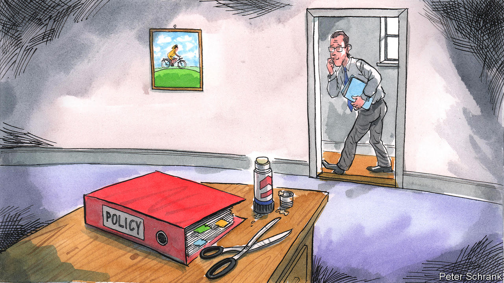

###### Charlemagne

# European politicians should steal more of their neighbours’ best ideas 

##### Here are some to start with 

 

> Nov 24th 2022 

Politicians love to claim credit for new ideas. But originality in policymaking is overrated. Devising laws from scratch is hard. Figuring out how a new policy will work in practice is even more so. Observing how a scheme has worked elsewhere, by contrast, is quite easy. And Europe, with 40-odd countries, most of them quite similar by global standards, offers many examples to learn from. If something works well in Spain, it may work in Bulgaria, too. Why innovate when you can cut-and-paste?

Some good ideas have indeed crossed borders. Short-time work schemes are one example. Instead of laying workers off when covid-19 crushed demand for their labour, many European employers cut their hours (sometimes to zero), and states made up part of their lost wages. Thus, workers remained attached to employers, and quickly returned to work when demand picked up again. Germany had shown the idea worked after the financial crisis of 2008. But too often politicians think pilfering is beneath them. They should put their pride aside. For starters, here are six policies that have worked well in one country and might usefully be filched.

Start with Portugal’s approach to . In 2001 the government decriminalised the possession of cannabis, heroin and other narcotics. The idea is to treat addiction as a crisis of public health, not of public order. Rather than punishing users, which is pointless and cruel, the system concentrates police resources on catching dealers. Drugs are not legal, but people caught with small amounts in their pockets are dealt with by commissions that include social workers and medical professionals, not just cops. Addicts are treated. Potential addicts are identified early. The result is one of the lowest drug-induced death rates in Europe. Other countries now tolerate cannabis, but few have been as ambitious as Portugal for harder drugs.

Next, consider the Dutch approach to . Dollops of funding on bike-friendly infrastructure makes pedalling safer in the Netherlands. So does an inventive rule, codified in 1994: in a collision between a car and a cyclist, motorists are assumed to be at fault unless they can prove otherwise. Only truly reckless cyclists are made to share the blame. Dutch drivers thus treat bike-riders as if they were carrying an infectious disease, giving them the required wide berth. Better yet, whereas motorists in other countries furiously object to new cycle lanes, Dutch ones welcome them, since segregating two-wheelers reduces the chance of a costly accident. Rates of cycling in the Netherlands have increased sharply—and deaths-per-mile-pedalled have plummeted.

Belgium is seldom seen as a paragon of good governance; for a while a decade ago it had no national government at all. But last month it agreed on a thoughtful way to tackle the crisis. In normal times, landlords are allowed to raise rent in multi-year tenancies in line with inflation. As energy prices have soared, this could have been a double-whammy for tenants, clobbered by high gas bills and the secondary inflation these have caused. So Belgium will allow landlords to jack up the rent only for properties that meet energy-efficiency standards. In the short term this protects tenants. Looking further out it is a nudge for landlords to invest in greenery. France does something superficially similar, but as part of a plan to ban the rental of poorly insulated homes, which could push the worst housing into the black market.

Finland has all but eliminated by simply providing housing to those who need it, with no conditions. In other countries rough sleepers have to tackle their demons—drug addiction, say—before getting a permanent home. But it is hard to sort out a chaotic life while bouncing between friends’ sofas, hostels and the street. Thus the cycle of bad to worse is never broken. Finland’s strategy is “Housing First”: get people into homes, and then help them grapple with their other problems. Old shelters and hostels have been turned into flats that the previously homeless can call their own (having a large stock of state-owned housing helps). It turns out to cost less to provide housing than to deal with the consequences of homelessness.

Europe can learn from Britain, too, and not just about the folly of leaving the European Union. In 2018 Britain introduced unexplained orders, whereby a court can demand that when suspicious types buy yachts or penthouses in Knightsbridge, they must reveal where the money came from. (Australia has a similar scheme.) Oligarchs, drug bosses and their relatives may lose their assets if they cannot satisfactorily explain how they were paid for. Enforcing this rule has been a challenge, and has enriched many London lawyers. But reversing the burden of proof on dodgy money makes spending it much harder. 

Finally, a cheer for Ukraine. In many countries the owned by the public sector are used inefficiently. Many public buildings sit wastefully empty for years, for example. But selling such assets is tricky: suitable buyers must be found, corruption must be discouraged. Ukraine’s Prozorro.Sale has won plaudits for helping all tiers of government monetise stuff it does not need. The digital platform, managed by the Ministry of Economy, helped generate 60bn hryvnia (around $2bn before the war) in the five years to 2021. Everything from the assets of state-owned banks to rusty pipes no longer needed by local authorities has been flogged. The project is part of a broader initiative put in place in recent years to ensure every kopiyok of public procurement can be tracked in one place.

Steal yourself

One would think that the EU would be a good environment for each member’s best ideas to spread. Yet often when a problem is identified, the bloc devises a new one-size-fits-all policy that can be applied across the union. This is cumbersome, and can mean imposing untested policies on everyone. Far better to plagiarise. As Tom Lehrer noted, it’s “why the good Lord made your eyes”. ■


