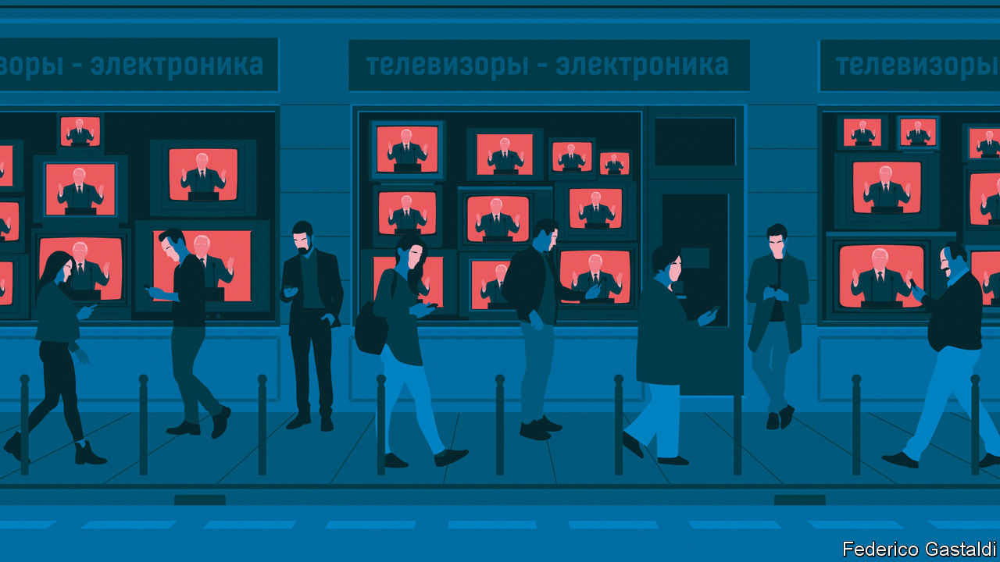

###### The pen and the sword

# How “offshore journalists” challenge Vladimir Putin’s empire of lies 

##### Russians who want real news turn to reporters in exile 

 

> Nov 22nd 2022 

The Kremlin banned them, branded them “foreign agents”, criminalised them and chased them out of the country. It cut off their finances and tried to isolate them from their audiences. But they have regrouped, rebuilt and come back stronger. Never in the past 30 years have Russian journalists been under such assault, and never have they fought back with such vigour, calling out the Kremlin’s lies, exposing its corruption and unearthing evidence of its war crimes.

Vladimir Putin’s dictatorship does not leave much scope for street protests, but independent reporters have formed a virtual resistance movement, lobbing explosive stories at his war machine and supplying news and opinions to those who look for them. Most are doing so from outside Russia, something they call “offshore journalism”. At least 500 journalists have left Russia since the invasion, according to Proekt Media, an investigative outlet. 

Scattered across Europe, in cities such as Riga, Tbilisi, Vilnius, Berlin and Amsterdam, such journalists reach a large audience, most of them under the age of 40. “Our job today is to survive and not let our readers suffocate,” says Ivan Kolpakov, the editor-in-chief of Meduza, a news website.

Meduza has reported on the massacre of Ukrainian civilians in Bucha, and the extraordinary number of convicts being pressed to join Wagner, a mercenary group run by a crony of Mr Putin. Mediazona, an online outlet founded by two members of Pussy Riot, a punk band, is trying to count the true number of Russian casualties. It has also found an ingenious way to work out how many Russians have been conscripted, by analysing open-source data on the unusually high number of marriages since mobilisation began. (Draftees are allowed to register their marriage on the same day as they are enlisted, and often do, since they don’t know when they will see their partners again.) Mediazona estimates that half a million people have already been drafted—far more than the 300,000 the Kremlin said would be.

For the Kremlin, suppressing real news is an important part of its war effort. Some outlets remain in Russia that are not propaganda organs, such as , a private newspaper. But they are highly constrained—they cannot call the war a war, for example. Since Mr Putin invaded Ukraine he has muzzled most independent voices, lest they sow doubt among citizens or induce a split within the elite. 

TV Rain, Russia’s best known independent television channel, went dark eight days after the war started. Echo of Moscow, a radio station with 5m listeners, went silent on the same day. Soon after that , the most outspoken newspaper, stopped printing. Alexei Venediktov, the editor of Echo, and Dmitry Muratov, the Nobel prize-winning editor of, stayed in Russia while some of their former colleagues set up operations offshore. TV Rain is back on air, now based in Latvia and broadcasting via YouTube to 20m viewers a month, most of them inside Russia. Echo is in Berlin, streaming news and talk shows live via a new smartphone app, which the Kremlin tried but failed to block, and on YouTube.

A dozen new digital outlets, most of them set up since Mr Putin first started grabbing chunks of Ukraine in 2014, are publishing investigative journalism. A recent probe by Insider, an online outlet, working with Bellingcat, an open-source intelligence group, unmasked dozens of engineers and programmers who have been directing Russian missile strikes on Ukrainian cities. “Investigative journalism, which is declining in many countries, is flourishing in Russia,” says Roman Dobrokhotov, who runs Insider. “There is plenty of demand for it, there are people who know how to do it and there is no shortage of subjects to investigate.” 

Russians find real news via apps and virtual private network (VPN) services, which can help them bypass censorship. Before the war Russia was the 40th-largest user of vpns; now it is the largest in the world. Nearly half of young Russians use one, according to GWI, a market-research firm. Most of the users are well-educated urbanites. But even in rural areas, a fifth of people use VPNs. 

Remote working during covid was a good preparation for offshore journalism. “I am physically located in Berlin, but I live in the Russian information field,” says Maxim Kurnikov, the editor of Echo. Many of its talk-show guests and even some of his co-hosts are still in Russia. Finding the right tone so as not to alienate listeners is hard, says Tikhon Dziadko, the editor-in-chief of Rain TV. “We need to give voice to the people who cannot speak freely in Russia—not to blame or hector them.” 

Money is a problem for offshore outlets. No Russian firm would dare advertise with them. And wary of sanctions and public opinion, YouTube bars the monetisation of content in Russia. Even raising cash via crowdfunding and subscriptions is hard, since Visa and MasterCard block Russian transactions outside Russia. So offshore Russian media look for grants from foreign charities. 

Getting news from inside Russia is often hazardous. Sources are terrified. “You have to be extremely resourceful and fit to survive...You either die or you get stronger,” says Mr Dobrokhotov of Insider, who has many anonymous sources in Russia. 

Offshore journalists always have an eye on Russia’s political future. Russia has a long tradition of influential exiles: Vladimir Lenin once edited a paper called (the Spark) from London. In the late 1980s journalists helped Mikhail Gorbachev come up with his ideas for (reform)If and when Mr Putin wobbles, exiled scribblers will have ideas for how Russia might recover from his misrule. 

Many of these journalists, such as Mr Dobrokhotov, were previously also political activists. Some now help people they write about. Ilya Krasilshchik, for example, a former editor of Meduza, has started Helpdesk Media, a cross-over between a helpline for people affected by war, whether in Ukraine, in Russia or in exile, and a way to record their stories. It is staffed both by Russians and by Ukrainians. ■


