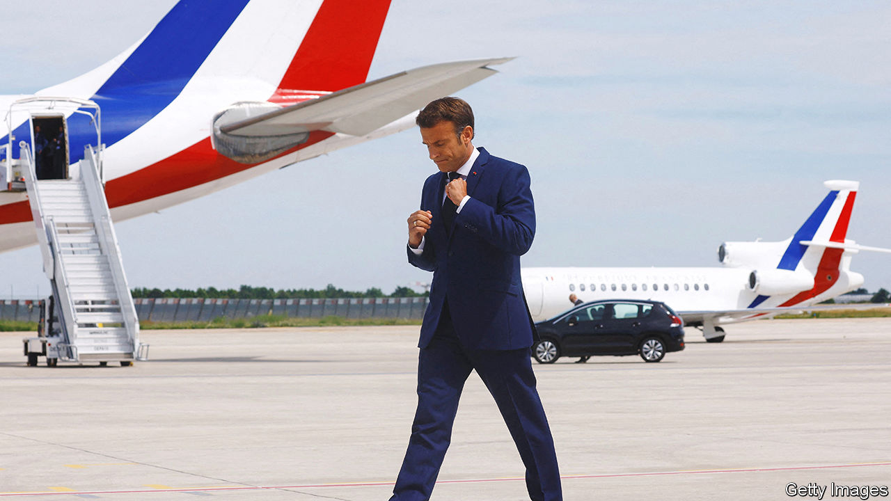

###### Mr Macron goes to Washington

# On a visit to America, France’s president will confront new problems 

##### The two countries largely agree on Ukraine, but not about subsidies 

 

> Nov 24th 2022 

In 1960, at the height of the cold war, Charles de Gaulle made a speech before the American Congress that won him a standing ovation. “Nothing counts more for France”, declared the general, “than the wisdom, resolution and friendship of the great people of the United States.” 

On November 29th today’s French president, Emmanuel Macron, arrives in America for his own state visit, and will doubtless echo de Gaulle’s warm words. France and America, with their shared revolutionary history, like to say that they are each other’s . They also share decades of prickly relations that they must manage at a time of war in Ukraine and broader geopolitical change.

For Mr Macron the trip is an unusual favour. It is the first full state visit that President Joe Biden has hosted. His guest will become the only French president under the Fifth Republic, founded by de Gaulle in 1958, to have been treated to two state visits to America (Mr Macron made his first in 2018, when Donald Trump was his host). 

Barely a year ago France was reeling from the unveiling of aukus, a military technology-sharing arrangement between America, Britain and Australia which torpedoed an existing French submarine contract and undermined France’s Indo-Pacific strategy. It is a measure of how hard America has worked to patch up relations that Mr Macron is being honoured with a four-day visit, complete with a state banquet at the White House. American officials speak of “exceptional co-operation” on all big geopolitical issues. “This is a celebration of the fact that this relationship is on a very strong footing,” says one.

America’s priority is to keep Europe united over Ukraine. Now that Ukraine has pushed Russian forces out of , the allies will want to calibrate their assistance so as to help Ukraine gain ground, avoid escalation with Russia and discuss future diplomacy to end the war. 

Just as important, America wants European support in its effort to constrain China in the Indo-Pacific region, not least because France has territories in both the Indian and Pacific oceans. “If you’re going to deal with Russia and China at the same time as adversaries, you need Europe in general and France in particular. You need France’s strategic clarity,” says Daniel Fried of the Atlantic Council in Washington.

Britain may be strategically closer to America, and Germany stronger economically. But post-Brexit, France is the EU’s military heavyweight. To some, Mr Macron is the “dean” of allies. France can be a headstrong partner, which treasures its independence and irks its allies. Yet its global reach and expeditionary military culture make it a useful interlocutor.

Many Americans remain wary of Mr Macron’s freelance diplomacy. “This administration wants a more ambitious Europe,” says Charles Kupchan of the Council on Foreign Relations. “But Macron tends to over-fire and act in a way that makes it difficult for him to forge consensus in Europe.” Yet positions on Russia have converged. A French national  on November 9th made no reference to Mr Macron’s pre-war ambitions to bring Russia into a new European security architecture. He has hardened his tone, and sent more weapons to Ukraine. Disagreements among allies, and with Ukraine, may well emerge over how far Ukraine should keep fighting, notably whether it should aim to reconquer Crimea, which it lost in 2014. But for now such issues are being put off.

Indeed Mr Biden finds Mr Macron’s periodic contact with Mr Putin helpful. He shares the worry that a rout of Russia’s army could lead to nuclear escalation. That said, Mr Biden may look less kindly on Mr Macron’s idea that China could “play a mediating role” in Ukraine. The Elysée says this means helping to exert international pressure on Xi Jinping, China’s leader, to tell his Russian friends to stop the war. The Biden administration will be hoping that France does not want to let Mr Xi play at being peacemaker in Europe.

The thorniest issues during the trip will be commercial, starting with America’s vast subsidies for clean energy and semiconductors. European allies fear for their own industries, already battered by soaring energy prices. The French may be happy with America sending gas to Europe, but not the prices it is paying for it. Finding a common language on such matters will be testing, even for the oldest of friends. ■

