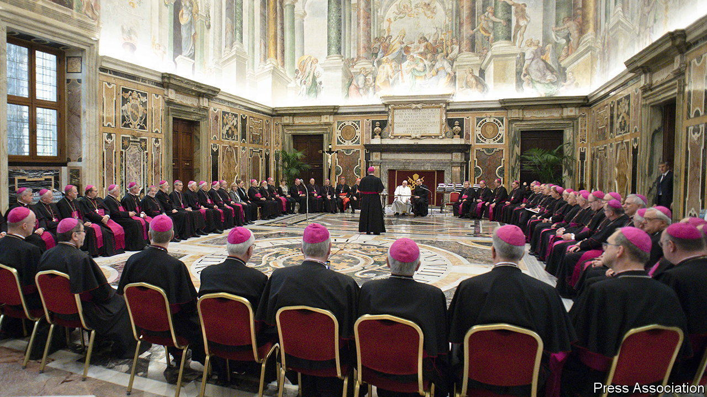

###### The Pope’s nein

# Reformist German Catholic bishops get a dusty response from the Vatican 

##### They want to move with the times 

 

> Nov 24th 2022 

A while ago, when a disgruntled Catholic priest in Germany clashed with the pope in Rome, the result was a bloody schism that five centuries later still divides Christians. Current rumblings between German Catholics and the Vatican sound less ominous. Yet the thing that most bothered Martin Luther, the sale of “indulgences” to wash away sins, was arguably no bigger a scandal than the exposure of priestly sexual abuse that has racked the Catholic church in recent years.

As in the 16th century, anger with the priesthood has prompted introspection and calls for reform. These happen to be particularly noisy among German Catholics, who account for around half the country’s Christians (who in turn make up half of Germany’s population). Demand for changes such as letting women be priests, allowing the blessing of gay marriages and revising teachings on sexuality has grown so strong that much of Germany’s Catholic clergy now supports them. This includes a majority of the country’s bishops, 62 of whom travelled to Rome in mid-November for a five-yearly visit to the Holy See.

Given that the number of German faithful is shrinking fast—a fifth of members have left the church since 2000—the bishops’ worry is understandable. Yet their pleas in Rome seem to have fallen on deaf ears. Just before their visit, Pope Francis publicly quipped that having one Protestant church in Germany was quite enough. He then snubbed the German delegation, attending only one of two scheduled meetings. 

Speaking at the end of their visit, Georg Bätzing, bishop of Limburg and the head of the German Bishops’ Conference, described their talks with Vatican officials as “tough but civil”. He pledged that the German church would not go its own way, but also warned that it “wants to and must provide answers to the questions being asked by the faithful”. Back home, the German church fired what might be a warning shot, adopting a labour code for its own employees that is more accepting of divorced women and gay men, among other groups. 

Partly due to tax rules that see the state collect tithes for both Protestant and Catholic churches, the German branches of both are unusually rich. The 8-9% of their income tax that German Catholics automatically give to the church brought in an estimated €6.7bn ($7.0bn) in 2021. This is more than six times what Italians donate yearly to the church, reckons Carsten Frerk, author of two books on church finances in Germany. Little of the German church’s riches goes directly to the Vatican, he says, but a large part of the money is used to subsidise church activities worldwide. Pope Francis will not want to lose that. 

