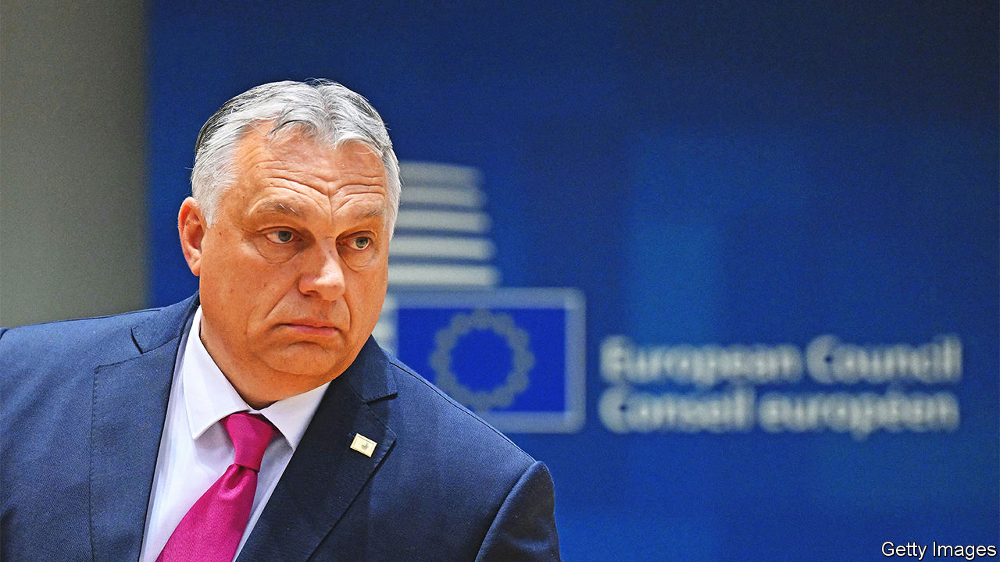

###### No reforms, no money

# The EU is withholding aid to press Hungary to reform 

##### Viktor Orban is using every trick he has to get the funds anyway 

 

> Nov 24th 2022 

THE European Union has struggled for years to cope with , where the ruling party has packed the courts, and state contracts tend to go to friends of Viktor Orban, the prime minister. It now looks to be getting serious. Since last year the bloc has two powerful new tools. The first is its €750bn ($750bn) covid-recovery fund, which requires each country’s spending plan to be certified by the European Commission. The second is a “conditionality mechanism” which lets it block EU aid and demand reforms.

Mr Orban usually denounces EU complaints as meddling by Brussels bureaucrats. But with billions of euros in the balance, Hungary suddenly became interested in co-operating. In August it proposed 17 reforms to comply with the conditionality mechanism. Nevertheless, in September the EU’s budget commissioner recommended that €7.5bn in aid be withheld until Hungary shows progress. Its €7.2bn request for covid-recovery grants has yet to be signed off. If it is not approved by the end of 2022, Hungary will lose 70% of that money. Both the plan and the conditionality-mechanism reforms will come up for a vote at a meeting of EU finance ministers (Ecofin) in December. 

Hungary desperately needs the money. The forint has fallen by 24% against the euro since 2018. Inflation stands at 21%; worse, core inflation (apart from fuel and food) has hit 22%. The government has resorted to freezing the prices of potatoes, eggs and fuel, leading to shortages. It is also capping the interest rate on deposits, to force depositors to buy the bonds it needs to finance its fiscal deficit of around 6% of gdp. With debt at over 75% of GDP, the government will need its transfers from the eu to avert the worst when, as is likely, the economy goes into recession.

Rule-of-law experts say the proposed reforms are full of holes. The government has set up a new body to monitor EU funds, but most of its members are close to the ruling party, Fidesz. Citizens will be able to appeal if prosecutors drop a corruption case, but they rarely bring such cases in the first place. The judges with whom Fidesz has stuffed the supreme court will remain there. The court’s president, nominated and approved by Fidesz, controls which judges get which cases, so government officials generally get a friendly hearing. Moritz Körner, a German mep who serves as one of the European Parliament’s rapporteurs on the issue, said letting the money flow could “irreversibly turn Hungary into a swamp of corruption”.

Hungary’s government retorts that the European Parliament “has been taken hostage by loud and aggressive far-left activists”. Meanwhile it is blocking the EU’s request to borrow €18bn to help Ukraine, which all member states must approve. The Hungarians say they oppose such loans because they haven’t received any themselves: the recovery fund involves joint borrowing, but “we have not seen a single penny.”

They may have to wait some time. Next week the commission is expected to tell Ecofin that Hungary has not met its terms. It will recommend freezing the €7.5bn under the conditionality mechanism, and approving the recovery funding only conditionally, with 27 milestones to meet before the cash can flow. Yet European leaders may soften these terms: they get the final vote at a summit on December 19th. ■

