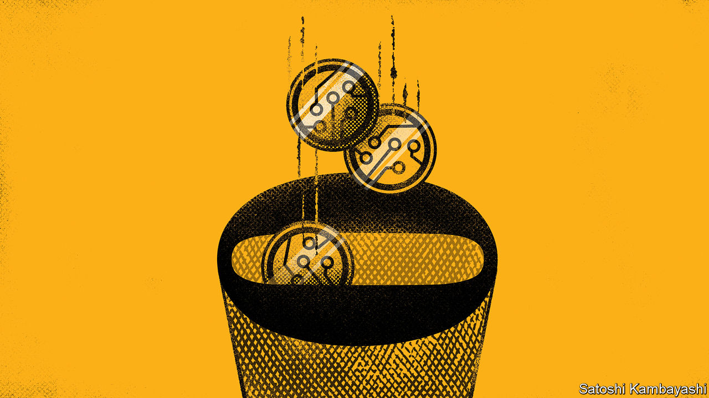

###### Buttonwood

# How crypto goes to zero 

##### The implosion of FTX has raised questions about the tech’s future 

 

> Nov 23rd 2022 

If everyone stopped using it. That, in five words, is how crypto would go to zero. Still, the journey is more interesting than the destination. The death of ftx, an exchange declared bankrupt on November 11th after a spectacular blow-up, will encourage some people to turn their attention elsewhere. What would have to happen for everyone to give up?

An answer requires a sense of how the industry works. At crypto’s base are blockchains, like Bitcoin and Ethereum, which record transactions verified by computers, a process incentivised by the issuance of new tokens. The Ethereum blockchain validates lines of code, which has made it possible for people to issue their own tokens or build applications. These include stablecoins, which are pegged to real-world currencies, and tokens like Uniswap, which manage decentralised-finance (DeFi) protocols. Major chains and a handful of Ethereum-based tokens, like stablecoins, account for about 90% of cryptocurrency value. Big businesses have been built on top of this world, including exchanges, investment funds and lending platforms. 

To take out crypto entirely would require killing the underlying blockchain layers. They could either give way first, kicking the stool out from underneath everything else. Or the industry could unravel from the top down, layer by layer like a knitted scarf. 

Knocking the stool out is extraordinarily hard, and the current high value of bitcoin and ether makes it even harder. To attack a blockchain and shut it down requires gaining 51% control of the computational power or value of tokens staked to verify transactions. The more valuable the tokens, the more energy it takes to attack a proof-of-work chain, like Bitcoin, and the more money to attack a proof-of-stake chain, like Ethereum. The security of these chains—as measured by the amount someone would have to spend to attack them—is now in the region of $10bn to $15bn. It would require either a government or an extraordinarily rich individual to mount such an attack. And even if Elon Musk was so inclined, he seems a little busy at present.

Unravelling is therefore the more conceivable path. The events of this year have revealed just how prone to this sort of thing crypto is. The implosion that seems to have set the chaos in motion was that of Terra-Luna, a decentralised stablecoin system, worth around $40bn at its peak. It collapsed in May, wiping $200bn off the market capitalisation of crypto. That led a few weeks later to the demise of several lending platforms and a hedge fund, events which wiped another $200bn off the market cap. The margin calls these platforms faced appear to have imperilled Alameda, the trading firm owned by Sam Bankman-Fried, and prompted the decision to use ftx customer funds to plug the gap. When ftx failed, it wiped another $200bn off crypto’s market cap. Now other exchanges and lending platforms look to be in trouble.

Beady-eyed readers will note that most of this stuff, apart from Terra-Luna, is in the “on top of” category and not actually on-chain tech. DeFi exchanges and lending protocols have continued to whirr even as the enterprises more akin to normal businesses have imploded one by one. But the collapse of these enterprises could imperil the underlying tech by taking out chunks of its value, making the chains more exposed to would-be attackers and pushing miners or stakers to switch off their machines. The value of on-chain activity and tokens is self-reinforcing. The more people that use DeFi, the more valuable Ethereum becomes. The higher the price of ether, the higher the hurdle to attack the blockchain and the more confidence people will have that blockchains will endure. This also works in reverse. The more people shy away from crypto out of fear, the less secure it becomes. 

The total market cap of cryptocurrencies is currently $820bn. That is 70% below the peak a year ago, but still high compared with most of crypto’s history. It is higher than at the start of last year, for instance, and any point before then, including the peak of the bull market in 2017. Many more layers—such as a major stablecoin, big businesses or perhaps other on-chain protocols—would have to unravel to take crypto’s value back to the levels at which it traded just three or four years ago. Crypto’s reputation has been undermined before. It has collapsed in value repeatedly throughout its lifetime. Although fewer people will use crypto as a result of the ftx collapse, it is very hard to imagine the number will be small enough to take its value to zero. 


