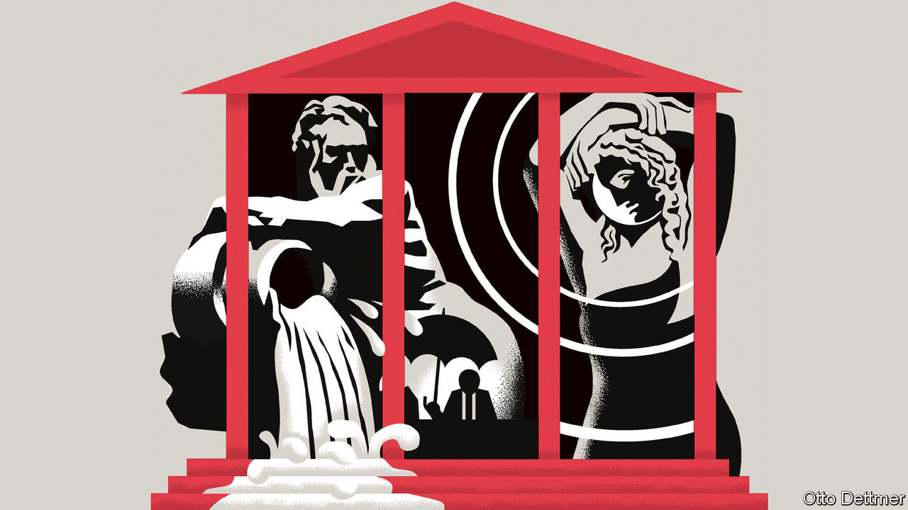

###### Free exchange

# Weather is again determining economic outcomes 

##### Soon it will be even more important 

 

> Nov 24th 2022 

“Now the rains had really come,” writes Chinua Achebe, in “Things Fall Apart, a novel set in 19th-century Nigeria, “so heavy and persistent that even the village rainmaker no longer claimed to be able to intervene. He could not stop the rain now, just as he would not attempt to start it in the heart of the dry season, without serious danger to his own health.” In agrarian economies, of the sort depicted in Achebe’s novel, the economic cycle and weather move in tandem. When the rains arrive at the right time, the harvest is bountiful and prosperity follows. In contrast, drought brings the risk of starvation and death. The rainmaker—much like the modern-day central banker—may attempt to smooth out the business cycle, literally dampening things down when they get too hot. Ultimately, though, it is the power of nature that decides the outcome.

Europe’s energy crisis has brought the return of weather-based economics. The crisis is a reminder that, for all their technological sophistication, even rich-world economies must rely on the munificence of nature. European economists, financiers and policymakers are watching forecasts closely: a balmy winter will bring relief, requiring less gas to be burned in order to keep houses warm. If temperatures are not too punishing, energy prices will fall and growth be given a boost. A frosty winter, on the other hand, will bring misery: pushing millions into poverty, increasing inflationary pressures and keeping industries shuttered.

Fossil fuels originally promised to free economies from the vagaries of the seasons. Instead of relying on ambient solar power—captured in grain, preserved in livestock or photosynthesised into biomass and then consumed as firewood—humanity could burn coal, releasing the prehistoric solar power contained within. The use of fossil fuels allowed energy to be stored, transported and released exactly when required. They placed the power of the sun at the beck and call of mankind, rather than the other way around. 

Ann Kussmaul, an economic historian, tracked the spread of the Industrial Revolution through England by assessing when regions moved beyond seasonal economics. Parish marriage certificates measured the point at which fossil fuels freed workers from the rhythms of nature and instead tied them to the factory whistle. Before industrialisation, marriages in low-lying areas would often be in winter after the harvest was taken; in hilly areas, they would be during summer, once the lambing season had come to an end. After industrialisation, such regional and seasonal marriage patterns disappeared, providing a clue as to which parts of England first adopted fossil-fuel-based production techniques.

Hundred of years later, seasonality is returning to Britain and other parts of Europe, as the continent weans itself from Russian gas. Part of the reason for this return is physical. Natural gas is much harder to transport and store than coal or liquid oil. In the past, Europe benefited from abundant piped gas provided by Russia, as well as the option of top-ups of liquefied natural gas shipped from abroad. Now supplies are tight and Europeans must mostly rely on the shipped stuff. The continent’s storage facilities are already more than 90% full, and filling the last bits of available space is expensive, since the contents must be kept under high pressure. Constrained supply means that changes in demand determine the price of energy—and the weather is the most uncertain determinant of demand.

Autumn spared Europe the worst: the continent enjoyed the hottest October on record. As a result, the price for a unit of gas on the Dutch title transfer facility, which provides the benchmark for the continent, fell to around €100 per megawatt hour, half the rate in September. But now winter is starting to make itself felt. Germany’s first snows have arrived. Historically there has been a relatively linear relationship between gas demand and the temperature: the colder it gets, the more gas is needed. This year things are a little more complicated. Home-heating systems have been left dormant for longer than usual. Blanket sales are on the rise. People are willing to wrap up warm to resist Vladimir Putin. 

The gas crisis is not the only reason for a greater focus on the weather. Renewables now supply much more energy to Europe than even a few years ago, leading to problems if the wind does not blow or the sun does not shine. Indeed, hydropower has also been an issue for Europe this year, after a hot summer dried out the reservoirs and rivers on which dams depend. Improving and investing in ways to store electricity, whether batteries, hydrogen or other techniques, could in future smooth out such variability. The continent nonetheless faces years, or even decades, of nervously watching the skies as it adjusts.

Yet in the absence of a transition to green forms of energy the weather would begin to play an even bigger role in economics. A warmer planet is already leading to more frequent and extreme events, such as Europe’s summer heatwaves or the devastating floods endured by Pakistan. These events amount to so-called real shocks to an economy: external changes that lower productive capacity, and so cause both higher inflation and unemployment.

Head in the clouds

This dual threat is harder for central bankers to deal with than downturns that arise from changes in business confidence or a financial crisis. Tighten policy too much in response and it will exacerbate the downturn; too little and inflation may get out of hand. According to analysis by the imf of Pacific and Caribbean islands, natural-disaster-prone countries grow by around one percentage point less a year and have considerably higher debt stocks than those less at risk. Climate change will only exacerbate these differences. Thus a return to weather-dependent economics will leave some central bankers looking even more like rainmakers: attempting to perform the old rituals or demanding more sacrifices, without much capacity to affect the economic weather. ■


