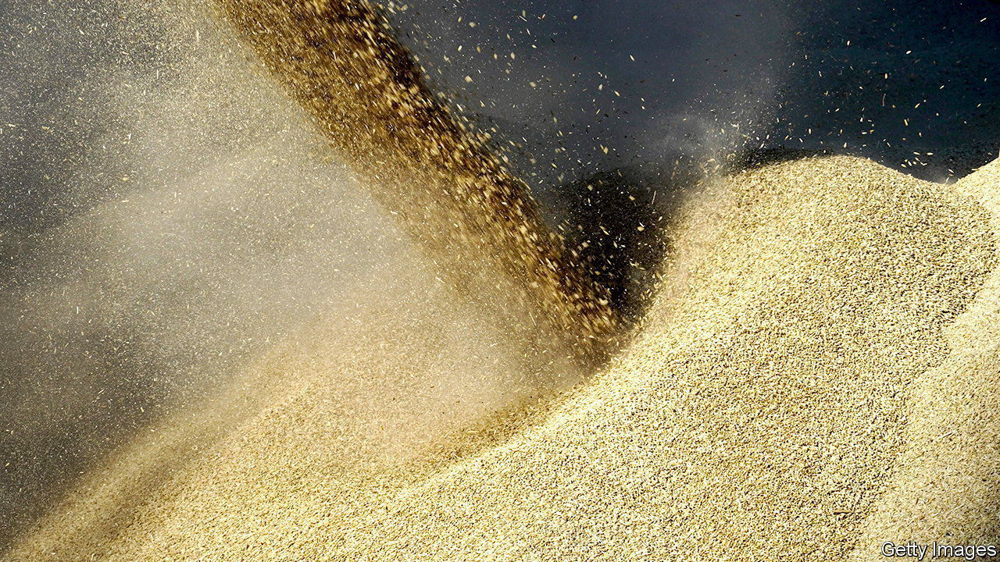

###### Banking on them

# Western officials need banks’ help to keep money flowing to Russia 

##### Or at least to certain parts of its economy 

 

> Nov 24th 2022 

When western firms fled Russia after its invasion of Ukraine, banks and insurers joined the exodus. They feared prosecution in the criminal courts for sanctions violations and in the court of public opinion for filling Vladimir Putin’s war chest. The West’s economic shock-and-awe campaign has largely isolated Russia from the international financial system.

But recently Western officials have emphasised they want to see money flowing into parts of Russia’s economy, and financial firms to enable this. On November 14th America, Britain and the eu issued a statement making clear that sanctions target Russia’s war machine, not its food or fertiliser industries. Diplomats have reiterated the message in the days since, seeking to ensure sanctions do not work too well.

Western governments have a needle to thread. They want to starve Russia of war funds and prove their anti-Putin chops, but also to minimise collateral damage. “When you’re ramping up sanctions, ambiguity is your best friend. It is your biggest enemy when trying to...calibrate them to the needs of the global economy,” says Adam Smith of Gibson Dunn, a law firm. 

The renewal of a grain deal between Russia and Ukraine, which allows food out of Ukrainian ports, explains the recent push. To get Moscow to sign, officials sought to show they were not blocking Russia’s food and fertiliser exports, which comprise 14% and 18% of global volumes. America does not want “to impede the ability of developing countries” to buy these goods, says a State Department official.

The problem is that politicians and campaigners have not got the message. In September members of Congress excoriated the bosses of JPMorgan Chase and Citibank, two American banks, for doing business with Russian oil and gas firms, despite guidance from the Treasury permitting it. As Juan Zarate, the architect of America’s sanctions after the September 11th attacks, notes: “Corporate concerns regarding transparency, accountability and integrity have increased exponentially.” esg requirements only add to the burden.

Even before esg, financiers were supremely reputation-conscious. They are also aware politics can shift. In 2016 John Kerry, then secretary of state, criss-crossed Europe to prod banks to do business in Iran after America had lifted sanctions. Bankers, spooked by Republican opposition, balked at the roadshow. This was wise: Donald Trump later reimposed sanctions.

So far Western efforts to keep cash flowing into Russian agriculture and parts of its energy sector appear to be working reasonably well. Officials have provided guidelines laying out exemptions. They also have been in touch with compliance teams about which industries remain fair game and have written “comfort letters” when required. Russian wheat exports are now almost back to normal levels, and global food prices are at a nine-month low.

But fertiliser costs remain high, meaning more reassurance will probably be needed in the future. Rebeca Grynspan of the un’s trade arm has warned that bankers’ fears of “reputation risks” are still causing elevated export costs. On November 21st the Netherlands finally released 20,000 tonnes of Russian fertiliser that had been stuck in Rotterdam owing to sanctions-related confusion. It is an oddity of modern sanctions regimes that officials must spend time helping money flow into their enemy’s economy. ■


