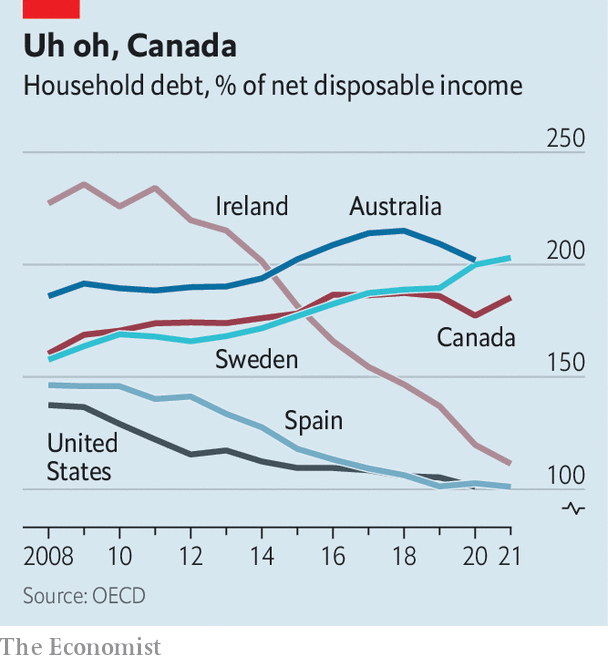

###### Spendthrift nations

# Where the coming housing crunch will be most painful 

##### Global property’s goody-two-shoes are in trouble 

 

> Nov 24th 2022 

A housing crash sent the global economy into recession between 2007 and 2009. But three countries—Australia, Canada and Sweden—cruised through the commotion. Even as property prices plummeted elsewhere, all three recorded double-digit growth. Some of this was good fortune. A commodities boom propped up the economies of Australia and Canada, for instance. But smart policy helped. Each country was held up as a shining example to other crisis-stricken places, their officials effusively praised. Mark Carney, then Canada’s central-bank governor, was dubbed by one British newspaper as the “biggest babe in banking”.

 


Across the rich world, house prices are now  after years of vertiginous growth. And it is overheated markets, like those in Australia, Canada and Sweden, that are facing some of the sharpest drops. A mortgage binge fuelled by rock-bottom interest rates has left each country with enormous quantities of household debt. As a share of disposable income, such debt sits at 185% in Canada, 202% in Australia and 203% in Sweden. By contrast, debt levels have shrunk in countries that bore the brunt of the last crash, including America, Ireland and Spain (see chart). 

Housing busts and recessions that are preceded by this sort of debt build-up tend to be more severe. Excessive leverage makes people more vulnerable to job losses, interest-rate rises and falling house prices, as was demonstrated by America during the Depression and the more recent financial crisis. With central banks now raising rates at the fastest pace in more than four decades, countries drowning in mortgage debt will once again be exposed to nasty consequences. 

In Australia, Canada and Sweden home prices have more than doubled since 2007, compared with rises of 50% in Britain and 61% in America. High levels of immigration in all three countries mean that, since the turn of the millennium, population growth has exceeded the average in the oecd, a club of mostly rich countries. In Australia, the population has grown by a third; in Canada, by a quarter; in Sweden, by a sixth. Shrinking households are also pushing up prices. According to the Royal Bank of Canada, a rise in the number of people living alone or with smaller families has increased the number of households in Canada by around 30,000 a year since 2016. Nearly 30% of Canadians now live by themselves. 

As a result of skyrocketing prices, Canadian households added a record C$190bn ($150bn) in new mortgage debt last year, more than double the amount in 2019. Meanwhile, Swedes took on an additional 370bn kronor ($40bn) of such debt in June, compared with the same month three years before. Easy credit has also attracted speculators, and inspired people to look for holiday homes. One in six homeowners in Ontario—which includes Toronto, Canada’s most expensive market—now has at least two properties. One in five Swedes owns a summer cabin. 

It is thus no surprise that the riskiness of loans has risen, despite efforts by lenders and regulators to tighten credit standards. Australia’s financial regulator estimates that 22% of mortgages taken out in the second quarter of this year put the holder in a vulnerable financial position, based on them having a debt-to-income ratio of six or greater. In Canada, mortgages with a debt-to-income ratio of four-and-a-half times or greater—the measure Canada’s central bank employs to assess risk—made up 27% of new mortgage lending at the start of this year. In Sweden, such loans rose to more than 14% of new mortgage lending in 2021. Stefan Ingves, governor of Sweden’s central bank, has described this build up of debt as being “like sitting on top of a volcano”.

Rising interest rates or falling property prices may prompt the volcano to explode. Australia’s central bank forecasts a 20% fall in house prices, which would be the biggest decline in four decades. Prices in Canada could plunge by as much as 14% from their peak, according to the Royal Bank of Canada. Lots of the debt in the three countries is held by richer households and, for now, unemployment remains relatively low. But if job losses begin to mount, as seems likely, the situation could rapidly deteriorate. After the global financial crisis, Australia, Canada and Sweden were hailed as examples for countries the world over. This time round, they look rather more likely to serve as a cautionary tale. ■


