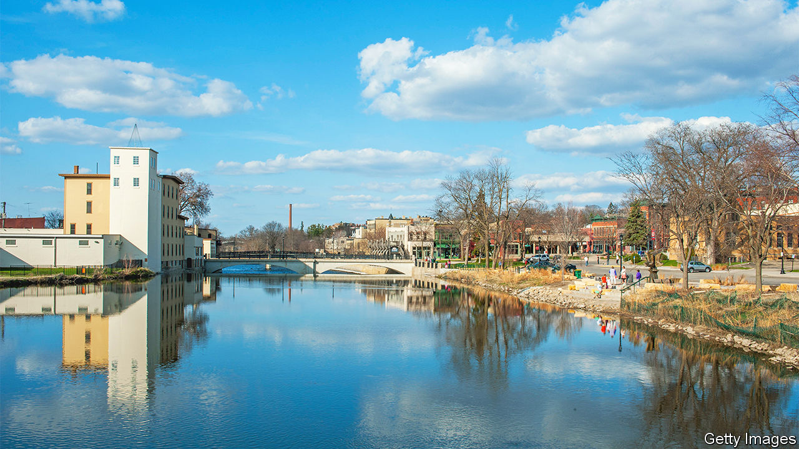
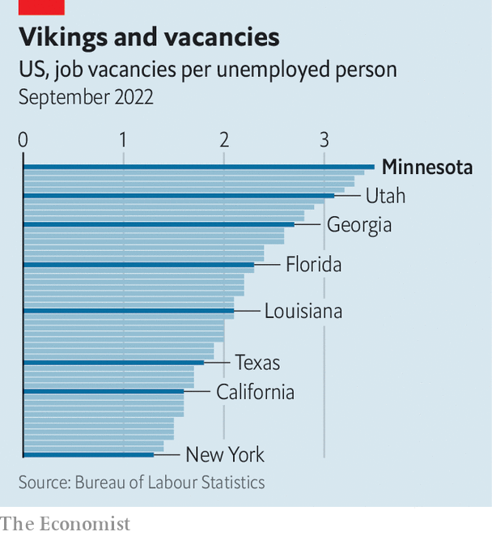

###### Hot like Minnesota

# Why American unemployment needs to rise 

##### Lessons from the tightest corner of the country’s ultra-tight labour market 

 

> Nov 24th 2022 

An unemployment problem, as normally understood, occurs when lots of people cannot find work. Northfield, a city in Minnesota with a population of 20,000, exemplifies the troubles that arise at the opposite end of the spectrum: when unemployment is so low that lots of businesses and organisations cannot find workers. Along with Utah, Minnesota has the lowest unemployment rate of any state in America at 2.1%. And in Minnesota, Northfield has just about the lowest unemployment rate of any city, a mere 1.2%.

If an authoritarian regime were to report such a figure, it would elicit groans of disbelief. In Northfield the groans are of inconvenience. Police officers, teachers and factory workers are all in short supply. The local hospital needs nursing assistants and surgical technicians. The city’s main retirement home has empty units but not enough employees, resulting in a long waiting list. Unable to hire enough servers, a popular restaurant closed this summer and a favourite café has slashed its hours. The local newspaper, meanwhile, just lost its one sports reporter, who took a better-paid job as a forklift operator.

Minnesota, and this corner of it in particular, might sound like an outlier. They are, in fact, extreme cases of a dynamic now common throughout . Nationally, there are nearly two job vacancies for every unemployed person, just shy of a record high hit a few months earlier. In Minnesota, the ratio is an eye-popping 3.5 vacancies per unemployed person, also just shy of a recent record and higher than any other state. Minnesota’s ultra-tight labour market sheds light on three questions for the country as a whole. How did things get so overstretched? What are the consequences of this degree of tightness? And will balance ever be restored?

 


Employers big and small in Northfield, which is a picturesque settlement straddling a river, agree that the covid-19 pandemic was the dividing line. With about 700 employees, Post Consumer Brands, a cereal maker, is one of the biggest manufacturers in town. Before the pandemic struck, it regularly had a vacancy rate of 1% or less. Now the rate is more like 5%. At Minnesota Soulstice, a clothing boutique, the owner has been so short-staffed that at one point she had to personally work 18 straight days. Even when positions are filled, candidate numbers are way down. When the city advertised for a police job in 2017, it received 55 applications. In September it advertised for three positions and received 15 applications.

Just as elsewhere in America, there is a litany of explanations for the shortfall of workers. Older residents left the labour force in 2020, preferring early retirement to the dangers and hassle of work at the height of the pandemic. Cancellation of school meant many parents, most often women, had to look after children. With two liberal-arts colleges in town, Northfield usually has lots of part-time student workers. But many are now less keen on off-campus jobs. Personal savings have soared over the past few years, owing to a combination of stimulus cheques and reduced spending on things like concerts and travel. This has given some students a useful financial buffer.

Sandwiched between Minnesota’s biggest cities—Minneapolis and Rochester are an hour’s drive in either direction—Northfield can tap into a big labour pool. But the pool is smaller than it was. In the early 2010s the state received more than 15,000 immigrants a year. Over the past five years inflows have slowed to a trickle, under the weight of pandemic border closures and Donald Trump’s anti-immigration stance. Minnesota was also one of the states that lost residents to other parts of the country during covid. About 13,500 left between April 2020 and July 2021, many lured by opportunities in warmer climes. “It used to be that workers were out there and we just had to figure out how to recruit them into manufacturing,” says Bob Kill, president of Enterprise Minnesota, a consultancy. “The difference this time is that the bodies don’t exist to fill the jobs.”

For those job hunting, the going is good. Not only is employment plentiful, but wages are increasing. Private-sector pay in Minnesota’s main metropolitan cluster, which includes Northfield, rose 5.7% year-on-year in September in nominal terms, ranking third in the country. Firms have also become more attentive. Mr Kill says that the old manufacturing schedule of eight hours a day, five days a week is all but gone. Companies now let workers opt for four ten-hour days. At the Post factory, bosses recently encouraged a worker on the cusp of retirement to stay for two days a week—an arrangement rarely seen in the past. “We got to retain a very highly skilled person doing a job that we need fulfilled,” says Henry Albers, a manager.

Employers have also succeeded in eking out slightly more output from their limited resources. This can be seen in Minnesota’s statewide data. Overall, its labour force is 3% smaller compared with the eve of the pandemic, but its gdp is nearly 2% bigger. At the Post factory, the production lines churning out such delights as Marshmallow Fruity Pebbles have long been automated, with workers  rather than doing heavy lifting. But there is always scope for more. Mr Albers hopes to use high-tech tools to cut training times for new employees. In schools, meanwhile, changes in licensing requirements have made it a little easier to recruit people without full qualifications. Northfield has its high-school kitchen manager leading the consumer-science course. “We would have never done that five years ago,” says Matt Hillmann, superintendent of Northfield public schools.

At the state level, officials are also thinking about how to attract more workers. The Democrats swept Minnesota’s elections earlier this month, holding onto its governorship and state house, and adding the state senate. This places them in a position to consider more ambitious legislation. One idea is to introduce publicly paid leave for illness and caring for family members—something no state in the Midwest offers. “This could be a differentiator, saying: ‘Hey, if you work in Minnesota, we’ll take care of you’,” reckons Steve Grove, head of the state’s economic-development department. The Democrats have also vowed to fund the construction of more affordable housing, a necessity for younger workers. Indeed, one reason Northfield’s unemployment rate is lower than nearby areas is that, at an average price of about $350,000, its homes are expensive for a town of its size, making it hard to live there without a job.

Minnesota’s labour market may be able to find balance in a few ways. Techno-optimists think a rise in automation will help firms get by with fewer workers. Some managers themselves are sceptical, noting that many processes are already automated. “You can’t automate thinking,” quips one manufacturing veteran. Northfield Hospital and Clinics, the leading health-care provider for the area, has adopted a handful of labour-saving technologies, from automated screening at entrances to greater use of telemedicine. “These are all Johnny Appleseed techniques,” says Steve Underdahl, president of Northfield Hospital and Clinics. In other words, it will take time to reap benefits.

Expanding the pool of workers would help. Perhaps Minnesota will succeed in enticing more Americans to its friendly, if occasionally frigid, embrace. Along with plenty of job vacancies, Northfield boasts an appealing motto. Who doesn’t like “Cows, colleges and contentment”? If Minnesota is successful, however, it would export some of its labour headache to other parts of the country. More arrivals from abroad would be a much bigger help, but it is hard to imagine the floodgates opening, given the toxic national politics around immigration. And Minnesota, like much of America, faces a demographic crunch. “It’s a math problem. We know that baby boomers are continuing to leave the workforce,” says Mr Hillmann, the school superintendent. Five of the city’s 25 police officers are set to retire in the next two years.

That leaves another, less pleasant solution: an economic slowdown that brings some slack back to the labour market. The Federal Reserve has jacked up interest rates. Virtually all economists think that slower growth is inevitable next year, though they debate whether it will amount to a recession. One critical variable is the extent to which companies are able to reduce their demand for new workers without firing existing ones.

As the tightest corner of the ultra-taut American labour market, Minnesota bears watching. Its unemployment rate has started to tick up, rising from 1.8% in June to 2.1% last month. It might seem perverse to call that good news, but one lesson from the past year is that excessively low unemployment really does hurt: it constrains and corrodes the services offered by hospitals, schools, restaurants and more. In Northfield there is at least one tiny hint that relief might be at hand. After a difficult dry spell, the HideAway, a downtown café, received four job applications over the past two weeks. From those it hired two sorely needed baristas. “We just got lucky,” reckons Joan Spaulding, its owner. Or was it a new trend? ■


