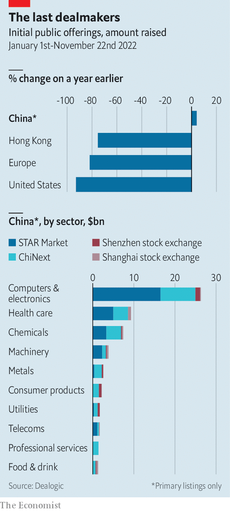

###### Chinese capitalism

# Xi Jinping’s big bang for Chinese stockmarkets 

##### China’s capital markets are complying with the Communist Party’s vision 

 

> Nov 22nd 2022 

In a parallel universe CloudWalk might have raised hundreds of millions of dollars in Hong Kong or New York. The firm is one of the world’s leading facial-recognition outfits: its technology can recognise people in milliseconds with astonishing accuracy. But modern geopolitics pushed it in another direction. America has imposed sanctions on the firm for alleged human-rights violations, owing to reputed links with China’s military. So instead of listing on the nasdaq in New York, CloudWalk chose Shanghai’s star Market, a bourse set up in 2019 to attract China’s rising tech companies. The company’s share price is up by a fifth since its debut in May.

 


CloudWalk’s listing is one of hundreds that have put Shanghai’s star and Shenzhen’s ChiNext, another tech-focused market, at the heart of global initial public offerings (ipos) this year. Firms have raised $63bn on Chinese exchanges, compared with just $21bn in New York and $6bn in Hong Kong. The vast majority of proceeds has been raised by semiconductor makers, artificial-intelligence and business-software startups, robotics firms and other companies developing high-end technology. A flurry of smaller telecommunications firms have flocked to the Beijing Stock Exchange, which launched last year under the guidance of , China’s leader. 

At first glance, this suggests Mr Xi’s plan to match a burgeoning tech industry with effervescent capital markets—part of a grander effort to make China a leader in next-generation technologies—is proceeding to perfection. Look a little deeper, however, and the picture is murkier. State capital, or “guidance capital” in Communist Party parlance, is flooding into stockmarkets. Our analysis of the 38 largest ipos in Chinese markets in the first three quarters this year, which together account for 242bn yuan ($34bn), or about 50% of cash raised, finds that state entities put up 22% of funding. A review of a similar sample of ipos last year shows state capital providing a smaller 14%. The CloudWalk deal is typical. State investors, including the Shanghai city government, an arms manufacturer and local-government funds, stumped up more than 500m yuan for just under a third of the company’s shares. 

Although China’s capital markets are increasingly directed by the Communist Party, the boom has other causes, too. Some observers see merely a surge in innovative firms meeting demand from fluid capital markets. Nicolas Aguzin, chief executive of the Hong Kong Stock Exchange, has called the flurry of tech ipos a “big bang of finance”. State media in China also highlight tensions with America. Several Chinese tech firms in addition to CloudWalk have been sanctioned. This year markets in New York have all but closed to Chinese companies (even if there are some signs the situation is starting to improve).

Meanwhile, China’s regulatory regime has become more friendly. Not long ago, onerous reviews were required for new listings. This led to a backlog, sometimes stretching to thousands of firms, and prevented private-equity investors from exiting investments. A new system, trialled in the star and ChiNext exchanges, is currently being rolled out to others. It is more in line with international standards, setting requirements for listings, but dropping the arduous inspections. Liquidity and stability have also improved. Over the past five years, reforms have encouraged the professionalisation of investment. Volatile retail trading has been reduced. All this fits with Mr Xi’s publicly outlined vision for Chinese finance, in which markets are freer from meddling, operating more like ones in America. 

Yet the rush of state money can hardly be ignored. Although some of the cash comes from insurers and pension funds, most comes from government-backed funds tasked with investing across public and private markets, often with a remit to support certain industries, such as semiconductor or industrial-robot makers. As Ngor Luong of the Centre for Security and Emerging Technology, a think-tank, notes, this money signals to other investors which firms are worthy of funding, meaning it carries additional weight. 

The use of state money to direct private investment is an approach that has spread from private to public markets. Between 2015 and 2021 government-backed private-equity outfits raised more than 7trn yuan. A company that takes state cash in its early stages becomes more attractive to private investors later on, since it indicates the firm fits with the official vision of innovation. These companies often benefit from other government help, including tax breaks, cheaper rents and less red tape. In the same way, securing state-backed investors in an ipo can now make or break deals. According to a banker working on Chinese ipos, this means policymakers are increasingly successful at directing private capital to the industries they wish to prioritise. 

Companies involved in technologies judged important by policymakers may now receive state capital throughout their life cycle. Take Loongson, a semiconductor firm in Beijing that designs central processing units. Most shares in the company are held by Hu Weiwu, its founder. But the firm was set up in 2008 with capital from the Chinese Academy of Sciences and the Beijing city government. State funds, including a semiconductor backer which has invested 200bn yuan, have subsidised Loongson in recent years, despite its privately owned status. When the firm went public on star this year, state investors piled in, buying at least 10% of the offering.

This sort of investment is not only about boosting favoured industries. Officials have been sending a message about the importance of state capital in the market for some time, notes Pan Fenghua of Beijing Normal University. Last year regulators began talking of a “disorderly expansion of capital” that supposedly had led to economic imbalances. Free-market capital has brought many ailments, argued a recent editorial in a state newspaper. These include a widening wealth gap, environmental problems, financial risks and monopolies. In a socialist market economy such as China’s, the editorial states, capital must be guided by the Communist Party.

Because so many firms have taken state investment, investors must now either buy the Party plan or stay out, says an investment manager in Shanghai. Buying the Party’s plan may be an unattractive proposition. Even before the government began to play a greater role, . Aside from a few rapid booms and busts, China’s main stock indices have hardly gained in value over the past decade. Some 27% of companies that went public on star between 2019 and 2021 now trade below their ipo price. That figure rises to 44% among those that listed more recently, as state capital has poured into the market. On the Beijing Stock Exchange, Mr Xi’s brainchild, it hits a dismal 60%.

Shanghai and Shenzhen may have become the leading global destination for tech ipos, but they have done so with remarkably little global capital. Because of concerns about China’s draconian covid-19 rules and , foreign investors have been quitting the country in droves. According to the Institute of International Finance, a trade association, a net $7.6bn of international capital flowed out of the country’s stockmarkets in October alone. Market booms in New York and Hong Kong typically draw smart capital from a wide range of global investors. In contrast, Mr Xi’s big bang appears painfully insular. He believes the state can fill the role played by foreign financiers. It is, to say the least, a bold experiment. ■


