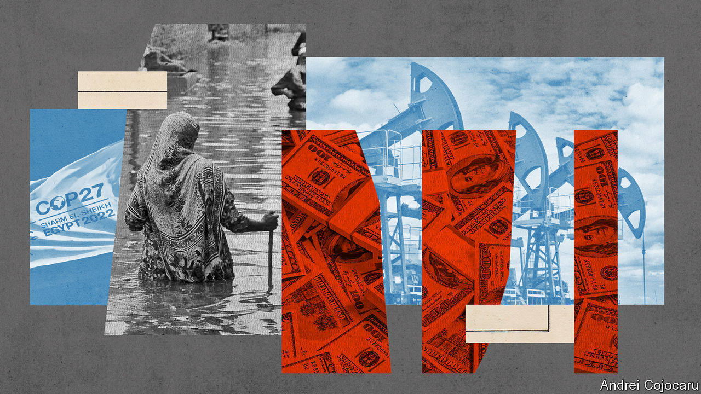
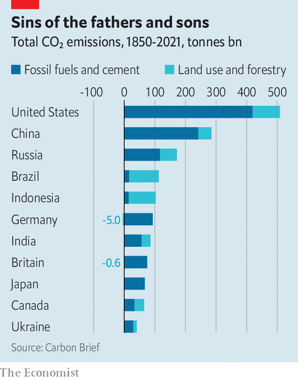
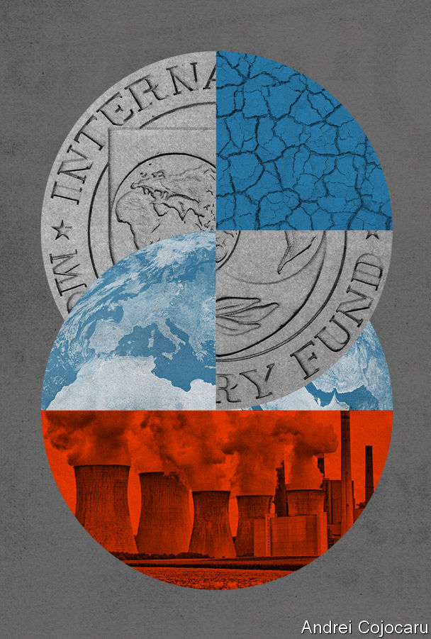

###### Loss and damage

# Should rich countries pay for climate damage in poor ones? 

##### That question dominated this year’s big climate summit 

 

> Nov 24th 2022 

The annual un climate talks are sometimes compared to a circus, or a battleground. This year’s summit, held at the Egyptian resort of Sharm el-Sheikh, and known in the jargon as COP27, was an appropriate mix of comedy and rancour. Problems with the catering left many delegates scrounging for sandwiches and bananas in between meetings and group calls. John Kerry, America’s chief negotiator, was stricken with covid-19 and was forced to negotiate from the isolation of his hotel room. 

The talks had been due to finish on November 18th. By the wee hours of November 20th, they were still going. In the end, it was sleep deprivation and weariness, more than any , that forced a result. The outcome was a text that ducked the biggest challenge, with countries refusing to promise to stop burning fossil fuels. Instead they repeated earlier pledges to “phase down unabated coal” and to get rid of “inefficient” fossil-fuel subsidies—phrases that leave plenty of useful wiggle room for the unmotivated. 

But COP27 may have tipped the balance of debate on two other points. The first is “”. This is, essentially, the “polluter pays” principle of environmental regulation applied to the entire world. The idea is that  to help them deal with damage caused by immediate climate-related disasters, such as floods, and creeping ones, like desertification. The second is that fixing climate change will require tinkering with the fundamentals of the global financial system. Once a niche idea, it too is gathering momentum.

Warm words

Loss and damage generated the most headlines. The idea dates back to 1991 when Vanuatu, an island nation in the Pacific, suggested an insurance scheme to help pay for the consequences of rising sea levels. For 30 years such demands were rebuffed. Leaders of big carbon-emitting countries—and their lawyers—would not give any airtime to anything that might suggest financial liability for climate change.

But last year, at the previous COP summit in Scotland, that country’s first minister promised £2m ($2.4m) to the cause. Against the scale of the problem, of course, that is an invisibly tiny sum. But it was a first hint that the tide might be turning. Earlier this year, heavy monsoon rains caused more than $30bn of damage and financial losses in Pakistan, nearly 9% of the country’s gdp. Natural climatic variations, notably an ocean-cooling phenomenon known as “La Niña”, were partly responsible. But the rains were very likely made heavier by the effects of greenhouse gases.

The floods were seized upon at COP27 as demonstrating the need for rich countries to loosen their purse-strings. A scattering of promises made by other European governments brought the total pledged to €255m ($262m), with the bulk of the money—€170m—coming from Germany. Bolstered by support from the European Union, the G77, a group of poor and middle-income nations, obtained a promise to set up a new fund under the auspices of the un, the details of which will be agreed by November next year. 

The summit, in other words, created a coffer. But how much money will end up inside it is unclear. Persuading the citizens of industrialised nations to pay up for sins committed at least partly by their grandfathers will be tricky, to put it mildly. And history suggests poor countries would be unwise to hope for too much. One common complaint at COP27 concerned the developed world’s failure to honour promises made at the Copenhagen climate summit in 2009. That had promised to raise $100bn a year to help poor countries adapt to a warmer world by building flood defences, heat-proofing homes and the like. That amounted to an “egregious and unexplained default”, said William Ruto, Kenya’s president. (No more than $83bn has arrived in any single year.)

 


Even if the idea of a separate loss-and-damage fund does catch on, there is still plenty to argue about when it comes to the question of who, exactly, should pay. There are many ways to estimate a country’s historic emissions, for instance (and therefore the amount of warming they have caused). One analysis compiled by Carbon Brief, a specialist website, and based on a variety of scientific papers and official sources, includes both industrial emissions and those from changes in land use, such as cutting down forests. Unsurprisingly, it puts America at the top of the list. But it is followed not by other rich countries, but by big, middle-income places such as China (now the world’s biggest greenhouse-gas polluter), Russia, Brazil and Indonesia (see chart). 

There is likely to be squabbling over who might benefit, too. The eu wants the money to go mostly to “particularly vulnerable” countries rather than “developing” ones. Under the outdated definitions of the un Climate Convention, the latter category includes places such as middle-income China and super-rich Singapore, whose citizens these days earn more than twice as much as those of the eu. Decisions “must take into account the economic situation of countries in 2022 and not in 1992”, said Frans Timmermans, the eu’s chief negotiator.

The conference also looked into more technocratic ways to raise cash for poorer nations. The “Bridgetown Initiative”, named after the capital city of Barbados, was championed by Mia Mottley, that country’s prime minister. It proposes overhauling international financial institutions such as the imf and the World Bank. 

Such ideas were starting to gain traction before they popped up in Sharm El-Sheikh. In July a report commissioned by the G20, a club of rich-ish countries, recommended changing the rules governing multilateral development banks, such as allowing them to pay less attention to the opinions of credit-rating agencies when assessing loans. Advocates such as Avinash Persaud, an adviser to Mrs Mottley, say that allowing the world’s various development banks to engage in riskier lending could unlock around $1trn of extra cash without their shareholders having to put in any more money. In October Janet Yellen, America’s treasury secretary, said the World Bank in particular should try to find ways to “stretch” its balance sheet. 

More controversial is a proposal to set up a new “Global Climate Mitigation Trust” at the IMF, the international lender of last resort. Ms Mottley suggested a $500bn issue of special drawing rights (sdrs), a kind of quasi-currency created by the fund, to capitalise this new operation, alongside money from private investors. The trust would then lend at below-market interest rates to projects in poor countries that aim to cut carbon emissions. The IMF’s rules mean that the sdrs could simply be created at the stroke of a bureaucrat’s pen, without any further commitments from the fund’s shareholders. 

Ms Mottley’s initiative has won support from France’s president, Emmanuel Macron, who told the delegates at Sharm El-Sheikh that the World Bank and imf needed new rules and new thinking to grapple with climate change. Mr Macron was particularly keen on the idea that, in the aftermath of a climate-related natural disaster, poor countries could have their debt repayments temporarily suspended. But not all Western leaders sounded as approving of the new thinking. Issuing sdrs has been historically rare, reserved for moments of acute financial crisis. America’s share of voting rights gives it a veto at the imf. In October Ms Yellen said she thought now was not the time for issuing more. 

 


Rows between rich countries and poor ones are a standard feature of climate summits. Poor countries ask rich ones for money; rich countries chide poor-country governments for failing to pay debts or mismanaging funds. (Mr Ruto’s words over the missing billions from Copenhagen were a deliberate inversion of the trope.) 

This time, though, both rich and poor countries were feeling more squeezed than usual. National debt burdens ballooned during the covid-19 pandemic. The rising cost of food and energy, a consequence of Russia’s invasion of Ukraine, is causing belt-tightening in rich countries—especially in Europe—and havoc in poor ones, whose suffering is further compounded by the strength of the dollar. The world’s economic outlook is gloomier than it has been in recent years. All of that makes it even harder to scrounge up the money needed to deal properly with climate change. 

The climes, they are a-changin’

The bill keeps rising. Weaning entire economies off fossil fuels will be enormously expensive. At the same time, a hefty dose of climate change is already inevitable. Adapting to a warmer planet—more flood defences, heat-proofing buildings and the like—will require vast sums of its own. One un estimate puts the cost at over $200bn a year by 2030. 

Those at the highest risk will struggle most. Without affordable insurance, Caribbean and Pacific island states have to borrow when a natural disaster hits and repay the money when times are good. By one estimate, countries at higher risk of natural disasters have debt-to-national income ratios that are already 1.5 percentage points higher than others, a number that could rise in future. 

Cutting emissions, adapting to a warmer climate, and paying for climate-caused damage are all linked. Faster decarbonisation means a lower bill for adaptation, and less spent on rebuilding after disasters. But one lesson from COP27 is that the world has not yet worked out how to do all three simultaneously. As the delegates staggered to their beds, Alok Sharma, a British politician who presided over last year’s talks, hailed the creation of a loss and damage fund. But he regretted that more had not been done: “Emissions peaking before 2025…Not in this text. Clear follow-through on the phase down of coal: not in this text. A clear commitment to phase out all fossil fuels: not in this text.” ■


