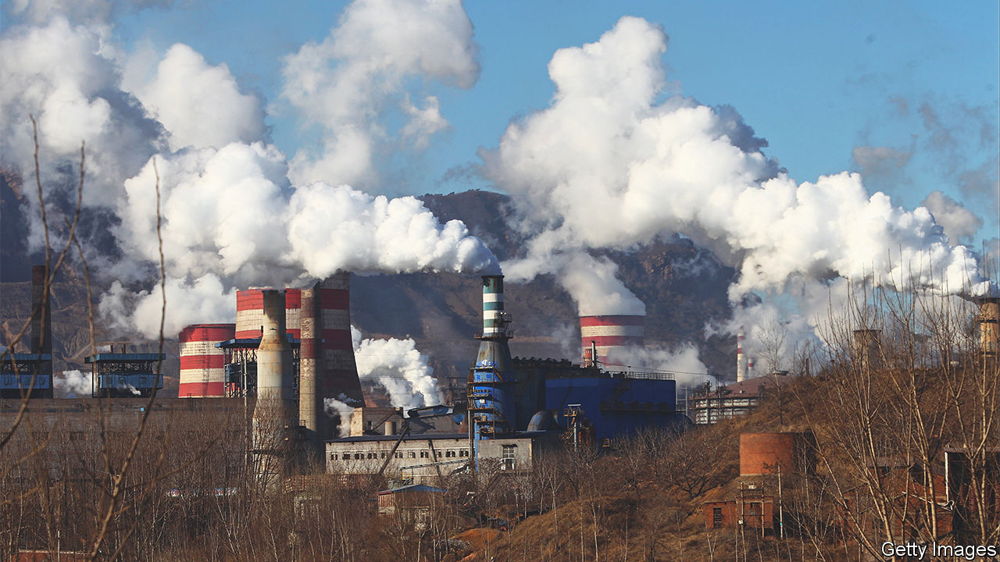

###### Green competition

# COP27 was disappointing, but US-China climate diplomacy is thawing 

##### Great-power rivalry will shape the world’s response to the crisis 

 

> Nov 24th 2022 

“We rose to the occasion,” crowed Egypt’s foreign minister after COP27, the global climate summit that ended on November 20th. Hardly. The delegates failed to make a clear commitment to phase out the use of fossil fuels. The best they could produce was a vague agreement that rich countries should pay poor ones for climate-related “loss and damage”. 

To the extent that this gesture may help keep the COP process on the road, it was worthwhile. But the money that has been pledged is paltry: about $260m. And countries have yet to agree on who should pay and who should receive the cash. Under the bizarre terms of the , China—after America, the second-largest total emitter in history—would count as a “developing country” and so be a suitable recipient. Rich countries say, correctly, that China is far from poor and ought to be a donor. But try squaring that with President Xi Jinping.

And it is hard persuading voters in rich countries to bankroll efforts to curb climate change (which is in their self-interest), let alone to hand over vast sums to politicians in poorer countries. In theory this would compensate them for damage. But this is difficult to measure, blame is tricky to apportion and those occasionally corrupt politicians can spend the cash as they choose. 

Yet more hopefully, as delegates from across the world wrangled in Egypt, there was a modest breakthrough between two superpowers. China agreed to  about climate change with America (see China section). It is astonishing that these talks were ever suspended, given that the two countries create about 40% of global annual carbon emissions. 

Alas, China’s regime was so offended when Nancy Pelosi, the Speaker of America’s House of Representatives, visited Taiwan in August that it broke them off, in effect putting its territorial claims above the planet’s future. Happily, about halfway through COP27, Mr Xi relented. At a G20 meeting in Indonesia with President Joe Biden, he said talks could resume. 

Acting together, China and America can make a huge difference. In 2014 Mr Xi and America’s then president, Barack Obama, issued a statement calling climate change “one of the greatest threats facing humanity” and setting goals for curbing it. This laid the groundwork for the Paris accord of 2015, a UN agreement to limit global warming to “well below” 2°C. Were the two countries now to agree on, say, ways of financing projects to help countries adapt to climate change, or promoting global trade in green technologies, then the rewards could be immense. 

But climate-change diplomacy is shackled by geopolitics. Last year China’s foreign minister, Wang Yi, told America’s climate-change envoy, John Kerry, that co-operation on climate matters could not be ring-fenced from the two countries’ political relationship. “If the oasis is all surrounded by deserts, then sooner or later, the oasis will be desertified,” he said. Menacing dunes, indeed, loom large. 

In January Ms Pelosi will be succeeded by a Republican, who may find some new way to scupper Sino-American climate talks. In the longer term Mr Xi’s aim is to hobble American power, and he seems unjustifiably dismissive of the idea that climate change will unleash more and nastier natural disasters on China (his government rarely blames it for the country’s devastating floods and droughts). 

More co-operation to fight climate change is needed. But even in its absence, great-power competition can help in some ways. In the cold war American-Soviet rivalry spurred research into technologies such as nuclear power and solar panels. Today America and China both want to dominate clean-energy technologies, and are pouring money into developing them. The rest of the world has already benefited from Chinese solar cells and American electric vehicles; more breakthroughs may follow. 

Both powers are also trying to buy influence by supporting green projects in poorer countries, from flood defences to renewable fuels. Even if this is for geopolitical reasons, the results are often benign. cop27 may have been a disappointment, but the fight against climate change will be waged on many fronts. ■


