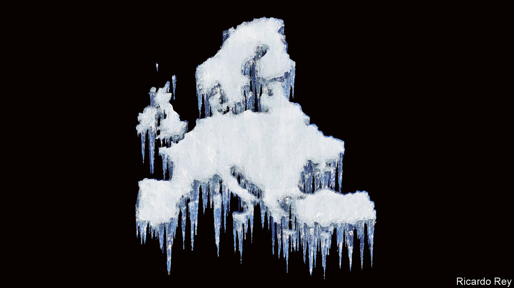

###### Frozen out

# Europe faces an enduring crisis of energy and geopolitics 

##### This will weaken it and threaten its global position 

 

> Nov 24th 2022 

If you ask Europe’s friends around the world what they think of the old continent’s prospects they often respond with two emotions. One is admiration. In the struggle to help Ukraine and resist Russian aggression, Europe has displayed unity, grit and a principled willingness to bear enormous costs. But the second is alarm. A brutal economic squeeze will pose a test of Europe’s resilience in 2023 and beyond. There is a growing fear that the recasting of the global energy system, American economic populism and geopolitical rifts threaten the long-run competitiveness of the European Union and non-members, including Britain. It is not just the continent’s prosperity that is at risk, the health of the transatlantic alliance is, too.

Don’t be fooled by the rush of good news from Europe in the past few weeks. Energy prices are down from the summer and a run of good weather means that gas storage is nearly full. But the energy crisis still poses dangers. Gas prices are six times higher than their long-run average. On November 22nd Russia threatened to throttle the last operational pipeline to Europe, even as missile attacks caused emergency power cuts across Ukraine. Europe’s gas storage will need to be refilled once again in 2023, this time without any piped Russian gas whatsoever. 

Vladimir Putin’s energy weapon will exact a toll beyond Ukraine. Our modelling suggests that, in a normal winter, a 10% rise in real energy prices is associated with a 0.6% increase in deaths. Hence the energy crunch this year  of elderly people across Europe. If so, Mr Putin’s energy weapon could take more lives outside Ukraine than his artillery, missiles and drones do directly within it. That is one more reason why Ukraine’s resistance to Russia is Europe’s fight, too. 

The war is also creating financial vulnerabilities. Energy inflation is spilling over into the rest of Europe’s economy, creating an acute dilemma for the European Central Bank. It needs to raise interest rates to control prices. But if it  it could destabilise the euro zone’s weaker members, not least indebted Italy.

Even as the energy crisis rages, the war has exposed a vulnerability in Europe’s business model. Too many of Europe’s industrial firms, especially German ones, have relied on abundant energy inputs from Russia. Plenty of companies have also become more dependent on another autocracy, China, . The prospect of severed relations with Russia, structurally higher costs and a decoupling of the West and China has meant a reckoning in many boardrooms. 

That fear has been amplified by America’s economic nationalism which threatens to draw activity across the Atlantic in a whirlwind of subsidies and protectionism. President Joe Biden’s Inflation Reduction Act involves $400bn of handouts for energy, manufacturing and transport and includes make-in-America provisions. In many ways the scheme resembles the industrial policies that China has pursued for decades. As the other two pillars of the world economy become more interventionist and protectionist, Europe, with its quaint insistence on upholding World Trade Organisation rules on free trade, looks like a sucker. 

Already, companies are reacting to the subsidies. Northvolt, a prized Swedish battery startup, has said that it wants to expand production in America. Iberdrola, a Spanish energy company, is investing twice as much in America as in the European Union. Many bosses warn that the combination of expensive energy and American subsidies leaves Europe at risk of mass deindustrialisation. BASF, a German chemicals giant, recently unveiled plans to shrink its European operations “permanently”. It does not help that Europe is ageing faster than America, too.

Losing investment makes Europe poorer and feeds into a sense of declining economic vigour. Compared with its pre-covid gdp trajectory, Europe has done worse than any other economic bloc. Of the world’s 100 most valuable firms, only 14 are European. Politicians will be tempted to chuck out the rule book and respond with subsidies of their own in an escalating arms race of corporate goodies. Germany’s economy minister has accused America of “hoovering up investments”. President Emmanuel Macron of France has called for “a European wake-up”. 

Thus the subsidy row is also feeding tensions between America and Europe. America’s financial and military support for Ukraine vastly exceeds Europe’s, and as it pivots to Asia to meet the challenge from China, America resents the eu’s failure to pay for its own security. Most members of nato have failed to meet the goal of spending 2% of gdp on defence. The eu was staggeringly naive about Russian aggression. Although the war caused America and Europe to unite after the ruptures of the Trump years, the danger is that a long conflict and economic tensions will gradually pull them apart again. Mr Putin and China’s president, Xi Jinping, would love that. 

To avoid a dangerous rift, America must see the bigger picture. Mr Biden’s protectionism threatens to drain Europe of vitality even as America props up Ukraine’s army, and armadas of tankers cross the Atlantic to supply Europe’s energy. The chief aim of Bidenomics is to stop China dominating key industries: America has no strategic interest in siphoning European investment. It should make European firms eligible for its energy subsidies, and integrate transatlantic energy markets more deeply.

Europe, meanwhile, needs to protect its economy against the energy squeeze. Schemes that rightly aim to subsidise consumers and firms for their basic energy needs should curb demand by charging higher prices at the margin, as in . To lower long-run energy prices Europe should accelerate the renewables revolution, while keeping energy markets open to competition. It also needs to adapt to a new security reality. That means spending more on defence so that it can take up the burden as America shifts its gaze towards Asia. 

Besides admiration and alarm, the other emotion governing transatlantic relations is frustration. America is irritated by Europe’s economic torpor and its failure to defend itself; Europe is outraged by America’s economic populism. But just as Europe must not be divided by the war, so it is vital that the most powerful democratic alliance in history adapts—and endures. ■


.

