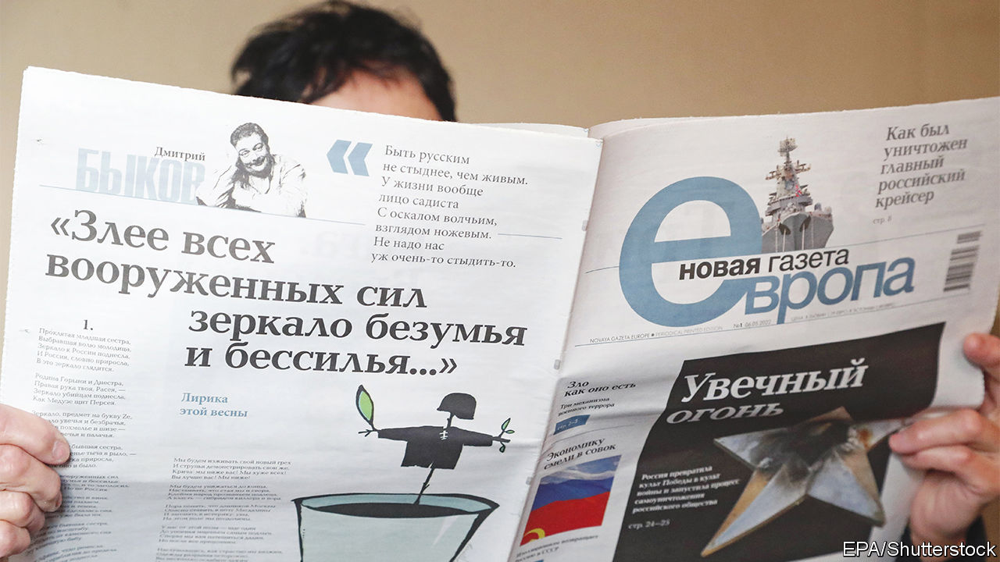

###### Speaking truth to Putin

# Russian “offshore journalists” need help, not hindrance 

##### Europe should let them do their jobs 

 

> Nov 24th 2022 

Most wars are accompanied by propaganda, aimed at breaking the enemy’s will to fight. Much of Vladimir Putin’s propaganda is targeted at his own people. As well as mobilising supporters, its purpose is to demoralise opponents of the war and break their will. Mr Putin’s assault on Ukraine would have been impossible without years of sustained assault on the minds of the Russian public, many of whom have swallowed his story that he is defending Russia from Western aggression, rather than invading a neighbour without provocation. 

Mr Putin’s falsehoods, like his tanks, do not stop at Russia’s borders. Ever since he decided that liberal democracy was his enemy, liberal democracies have been under attack. Russian trolls and foreign-language state media have pumped out a flood of outrageous and contradictory lies to Western audiences, hoping to undermine public confidence that anyone is telling the truth. Russia has meddled in America’s elections, stoked the  discord in France in 2018, fuelled racial hatred in Germany and amplified Catalan separatism in Spain. In the Baltic states, pro-Kremlin TV channels have long tried to stir up Russian-speaking minorities.

Countering Mr Putin’s propaganda in the West is hard enough. In Russia, where censors and jailers enforce the Kremlin line, it is even harder. But now Russian “” are helping. Legions of independent reporters, editors and broadcasters have been forced into exile. From havens in Europe, they are pumping real news back into Russia. Perhaps 10-15% of the population follow them. What is more, most of this audience is young and active and will play a part when Russian politics starts to change.

Some European countries are wary of these offshore journalists. For example, TV Rain, an independent Russian channel, operates from Latvia. As well as lambasting the Kremlin, it often chides its host country, too, for policies such as closing its borders to Russian citizens. Some Latvian politicians grumble that tv Rain is sticking its nose into local politics. Such nervousness is misplaced. Free countries should welcome free debate—and welcome independent Russian voices, too. 

At present many such journalists and anti-war activists find it hard to enter Europe legally or remain there. Many Russian exiles therefore congregate in countries such as Georgia and Armenia, which do not require them to have visas. Russian activists who manage to enter Europe are typically treated as asylum-seekers, and have their freedom to move and work restricted. The Baltic countries are particularly stringent, while Germany and France offer humanitarian visas with different strings attached.

This is daft. The European Union has a common interest in countering the Kremlin’s disinformation. It should adopt a common policy giving exiled Russian activists permission to remain, freedom to travel and peace of mind to concentrate on their work, demand for which has never been more intense. For years, the Russian public showed little interest in independent journalism, leaving unrebutted Kremlin claptrap as by far the dominant source of news. Now, as the realisation spreads that the war is going badly and legions of young Russian men are being called up, only 22% of Russians entirely trust and follow Russian propaganda, according to a poll conducted by the team of Alexei Navalny, a jailed opposition leader. More are starting to look for alternative sources of information. Let them have some. 

The Russian media-in-exile are, unsurprisingly, short of cash. This is not just because of Kremlin crackdowns; it is also because of Western actions. Tech platforms like YouTube andFacebook do not allow advertising in Russia. As about two-thirds of their audiences are there, this deprives dissident media of critical revenue (and makes reaching new viewers harder). Pro-Kremlin media are backed by the regime and use Russian platforms that censor independent news. At the same time, because Visa and MasterCard have stopped offering services inside Russia, readers and viewers of independent news cannot easily subscribe or donate money to the courageous folk who produce it. Firms should find ways to make such payments possible. And charities and wealthy Russians who want to take a stand against Mr Putin should offer their financial support. 

The struggle to help Ukraine defend itself and Russia to reform itself will be long and hard. Independent Russian journalists have an essential role to play, and supporting them is ridiculously cheap. They need only a haven, Wi-Fi and a thirst to tell the truth. Let them do their jobs. ■

