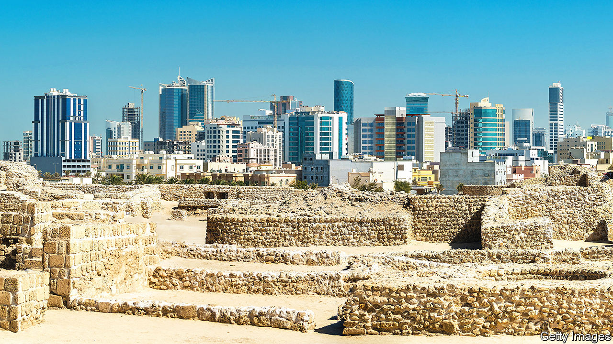

###### Sects in the city

# Can Bahrain’s division between Sunnis and Shias be healed? 

##### Strife across the Gulf in Iran makes Bahrainis nervous but also hopeful 

 

> Nov 24th 2022 

For the first time since her childhood, Mariam recently went back to the shrine of Nabi Saleh, a tiny island off the shore of Bahrain’s capital, Manama. She reverentially held green drapes over the tomb of the 14th-century holy man whose name was given to the island. She stopped near the spring where her family used to barbecue a sacrificial goat. She remembered tasting the sweet dates from the orchards and looked at the waves lapping the island where she once swam. So much had gone. The sea is sullied with sewage. The spring is a dry hole. A car park has replaced most of the orchard. And Sunni families, like hers, gave up visiting the shrine decades ago. “Why did we stop?” she asked the custodian of the shrine, a Shia. “We were together. It was such a beautiful age.”

Since the Islamic revolution of 1979 that convulsed Iran and threatened the thrones of Sunni Arab monarchs across the Gulf, Bahrain has been on the fault line of the Sunni-Shia division. It is the only country in the six-member Gulf Co-operation Council where the indigenous majority is Shia; most of the people in the other five are staunchly Sunni. And it lies awkwardly squeezed between two large ideological foes, Iran and Saudi Arabia. After the ayatollahs took over Iran, Bahrain’s two sects sought succour from those bigger brothers, sometimes accusing each other of unbelief. Narrow-minded Sunni clerics denounced shrines, like those of Nabi Saleh, as insults to monotheism.

Yet sectarian feeling may be softening. Saudi Arabia has muzzled its more extreme Islamists and embarked on a more secular drive. The United Arab Emirates, Bahrain’s other big patron, has banned Sunni Islamist parties and encouraged other Gulf governments to follow suit. Sunni Islamist parties did badly in Bahrain’s recent election to choose members of an assembly that advises the all-powerful monarch, Hamad al-Khalifa. Bahrain’s Sunni clergy may be shedding its sectarianism too. 

Younger Shias may want their own clergy to reciprocate. The cries of protesters seeking to topple the Shia theocracy in Iran are being heard in Bahrain. Some Bahraini Shias are annoyed by the support their theologians are giving to the Iranian ayatollahs. “It’s hypocrisy,” says a Shia activist. “They have slogans for human rights here, but they’re very conservative and don’t want women to have better chances.” So Bahrain’s Shia religious establishment is also under pressure to be more liberal and less in thrall to their counterparts in Iran. 

Social harmony between Shias and Sunnis in Bahrain would be enhanced still more if the ruling family bestowed equal political rights on the Shia majority. The main Shia party, al-Wefaq, is banned, so the recent election took place without its participation. Moreover, the ruling family grants most of the top army and security posts to Sunnis. Radio and television are broadcast in a Sunni dialect. The Sunni version of Islam is the one taught in schools. The names of Shia villages are often erased from signposts; medieval Shia mosques are unmarked on maps. 

Maryam wants Sunnis and Shias to worship together at the island shrine. That may not be to the taste of the Khalifas. If the sects co-operated in politics as well as in religion, the people of Bahrain would find it easier to hold their ruling family to account. They might even demand a constitutional monarchy. The recent election is a long way from allowing that. ■

