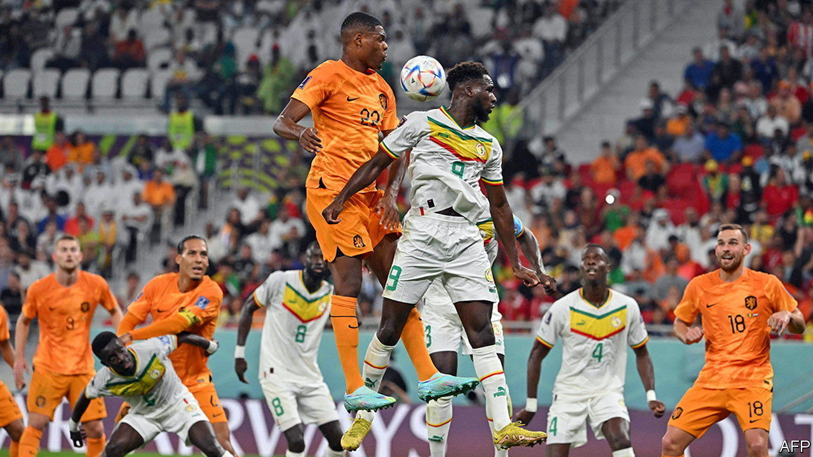

###### Kicking ahead

# How do budding African footballers make it to the top? 

##### A Senegalese academy shows how African football is changing 

 

> Nov 24th 2022 

“All of Senegal wants to come here,” smiles Bassouaré Diaby, the head trainer at Génération Foot, a football academy a few hours out of Dakar, the capital. It is easy to see why. Three verdant training pitches abut a small stadium complete with corporate boxes, a video-analysis suite and a briefing room for press conferences. Players as young as 12 live on the site, which also has a gym, a lycée to make sure aspiring footballers complete their schooling, and a barbershop. The players should all “be well groomed and in the same way”, says Talla Fall, who shows your football-mad correspondent around. “That’s part of discipline,” he says, adding: “We have put in place everything to give the boys the best chance to perform.” 

It is working. More than 15 current players, who joined the academy after extensive scouting and trials, represent Senegal in youth teams. This year Senegal’s national team, the Teranga Lions, won the Africa Cup of Nations for the first time thanks to a penalty kick from Sadio Mané, Senegal’s global superstar, who was trained at Génération Foot. That prompted a joyous countrywide street party featuring lamp-post-climbing and flame-throwing. 

Three players trained at Génération Foot were named in Senegal’s World Cup squad, including Mr Mané, who was recently voted the second-best player in the world. Alas, Mr Mané was crocked just before the World Cup, sending Senegal into a period of anxious prayer. On November 21st the national team lost its first game to the Netherlands, which sits ten places above Senegal in the rankings of FIFA, world football’s governing body. 

African football is changing. For the first time all the coaches of the African teams at the World Cup are African. Women’s football is on the rise after the biggest-ever women’s Africa Cup of Nations this year. And African academies like Génération Foot and Diambars, which has trained a host of players in the Teranga Lions, are better than many before them. 

Previously, many academies would be no more than “a small house next to a pitch”, says Mr Fall. Others were like failed aid projects. In 2010 Craig Bellamy, a former striker for Wales and Liverpool, set up a academy in Sierra Leone. But it was marred by poor book-keeping and affected by Ebola. As Mr Bellamy’s income as a footballer dried up, so did the funds for the academy. It closed its doors in 2016. 

Génération Foot, by contrast, has been running successfully since 2000. One reason for its strength is connections with FC Metz, a club in the French second division, which partly funds the academy and gets first pick of its talent. It usually takes two players a year to play in France. That was Mr Mané’s path. If those players are then sold on to bigger clubs, as Mr Mané was, Génération Foot gets a share of the profits. Other successful African academies often have links to European clubs or backing from big business. One, Brasseries Football School in Cameroon, is backed by Castel, a French drinks firm. 

Yet even at Génération Foot Mr Diaby, who was preparing to jet out to Qatar to help scout the opposition for the Teranga Lions, sees room for improvement. The gap with the best European academies has shrunk but not disappeared: nine of Senegal’s squad of 26 for the World Cup are of Senegalese heritage but were born and largely trained in France. 

Another problem is that there are not enough high-quality facilities to turn the country’s vast pool of talent into world-class players. Right outside Génération Foot’s compound, local youngsters play on a sloping and sandy pitch with rickety goalposts. “Senegal is a football country,” says Mr Diaby. “From a young age everyone plays.” Every year more than 1,000 local teams compete in the Nawetaan, a popular national championship for neighbourhood teams. Yet there are only two top-level academies. “If Senegal had six or seven academies,” says Mr Diaby wistfully, “the results would be much better.” ■

