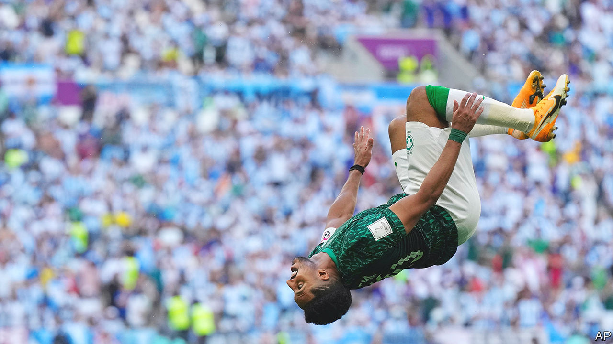

###### Of players and politics

# What Saudi Arabia’s football victory means for the Middle East 

##### Its win earned an outpouring of Arab goodwill, while Iran’s silence was divisive 

 

> Nov 23rd 2022 

LAST MONTH Muhammad bin Salman, the Saudi crown prince, summoned the national football team to deliver an odd pep talk: no one expects much from you. The Green Falcons were preparing for their sixth World Cup appearance. The past four ended in the group stage, with just a single win in 2018. This year they drew a tough bracket that included Argentina, a favourite to hoist the golden trophy.

Prince Muhammad told the squad to “play without pressure”. The setting may have undermined the message; meeting a monarch with a ruthless reputation is not a low-pressure situation. Still, he sought to reassure. The kingdom had long-term hopes for its football programme, he said, but for now simply qualifying was victory enough. “We hope the future is better,” he concluded.

The future came sooner than expected. On November 22nd the Saudis beat Argentina 2-1, among the greatest upsets in World Cup history. Saudi fans reacted as if they had just won the trophy itself. One widely shared video showed a Saudi man tearing the door off his home in joy (which perhaps later turned to regret). King Salman announced a national holiday on November 23rd.

This year’s World Cup, in Qatar, is the first in the Middle East, a football-mad region where the local teams are often underdogs and a fractured region where rivalries too often play out on battlefields. At least for a brief period, the tournament has brought a dollop of goodwill.

Since Prince Muhammad became heir-apparent in 2017, Saudi Arabia has spent hundreds of millions of dollars on sport. Some of that has gone to glitzy events, like a Formula 1 race in Jeddah and an upstart golf tour meant to compete with the PGA, that appeal to the rich and to foreigners. But the kingdom is also spending to build a pipeline of local athletes, particularly in football.

For decades the Saudi royal family kept power through a Faustian pact with dour conservative clerics. Prince Muhammad has sought to sideline them, fashioning a Saudi identity that is more nationalistic and less religious. He was surely pleased to see Saudis of all stripes celebrating a national achievement. There were celebrations elsewhere, too, from Cairo to Amman to Fallujah in western Iraq. Even many Arabs who loathe Saudi Arabia’s foreign policy celebrated the win.

The unlikeliest cheers came from the Houthis, the Shia rebel group in Yemen that has fought an almost eight-year war against a Saudi-led coalition. Several Houthi officials tweeted their congratulations. Though the praise was later deleted, it was perhaps a bit of football diplomacy: the Saudis are desperate to end a war that has become an expensive quagmire, and there is talk that they may begin direct talks with the Houthis.

When the World Cup began, on November 20th, Prince Muhammad was meant to be in Japan, the second-largest buyer of Saudi oil. Officials from both countries had worked for months to arrange the visit, which featured a meeting with the prime minister and a high-profile business forum. Days before he was to arrive, though, Prince Muhammad abruptly cancelled. Instead he flew to Doha to attend the World Cup’s opening ceremony.

Five years ago Saudi Arabia led a group of four Arab countries in imposing a blockade on Qatar, long the  of the Gulf over its support for Islamists and its patronage of Al Jazeera, a satellite news channel that often criticises Arab regimes (other than Qatar’s). In the early days of the embargo, there was talk of a possible Saudi invasion. State-linked newspapers in Riyadh ran lurid claims that the kingdom might dig a canal on the border, turning Qatar into an island, and perhaps build a nuclear-waste dump there to boot.

All that seemed forgotten as Prince Muhammad sat smiling in the ruler’s box in Doha, two seats away from the emir of Qatar, Tamim bin Hamad al-Thani. The emir returned the gesture during the Saudi-Argentina match, waving a Saudi flag from the stands and draping it around his neck.

One day before the Saudi match, Iran faced off against England. Many Iranians were anxious to see if the team would make a gesture towards months of protests at home, which began in September after Mahsa Amini, a young woman, died in the custody of Iran’s “morality” police. Ehsan Hajsafi, the squad’s captain, had already said that he “sympathised” with protesters.

The gesture, when it came, was a simple one: when Iran’s national anthem was played in the stadium, the players stood silent rather than sing. In the hothouse environment of today’s Iran, even that proved divisive. Some thought it brave. Others saw it as a middling gesture and chanted insults at the players. The controversy overshadowed the match itself (perhaps a good thing, since Team Melli lost 6-2).

Fans are fickle; monarchs are mercurial. Euphoria over Saudi Arabia’s win will not end the war in Yemen, nor will silence during Iran’s anthem topple a rotten regime. The bonhomie between the crown prince and the emir could end as abruptly as it began. It is true that small gestures matter. That they matter so much in the Middle East, though, is a reminder of how divided the region is. ■

