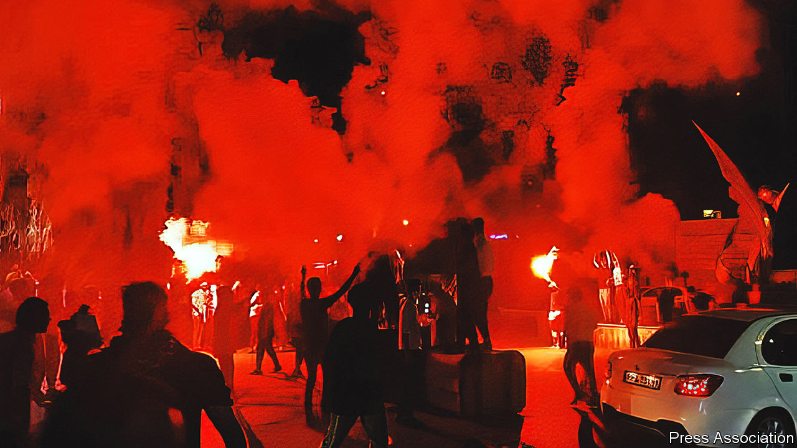

###### We won’t stop

# While Iran’s turmoil persists, jitters spread through the region 

##### But the ayatollahs’ foreign friends sound loth to come to their aid 

 

> Nov 24th 2022 

In most revolutions there comes a point when the regime under threat moves from trying to control the crowd without spilling too much blood to sending in the army to crush the revolt. Iran may be nearing that point. Swathes of the country already look like a war zone. Armoured-car columns of the Islamic Revolutionary Guard Corps (IRGC), the regime’s praetorian guard, roll into cities including Mahabad and Javanroud in Iran’s Kurdish north-west, firing with machineguns on protesters. Helicopters fly overhead. Circling drones broadcast martial songs.

The death toll across the country is rising sharply. Iran Human Rights, a watchdog based in Norway, reckons its tally of 342 dead in the first two months has jumped to at least 416 in the past week. The true figure could be much higher, it says, because internet blockages have interrupted the flow of information.

Protesters are fighting back. “You can’t ask a brutal dictator for your rights peacefully,” says a Kurd, echoing the intensifying militancy. Street-fighting manuals have begun to circulate. There are increasing reports of security forces being stabbed and shot at. Supporters of the Kurdistan Free Life Party (PJAK), based in neighbouring Iraq, say they are smuggling weapons and protective gear across the mountains into Iran. Some 60 Iranian soldiers and police have been killed, according to Iran’s state media and outside monitors.

While turmoil spreads at home, Iran’s rulers are hitting back—and trying to stir up trouble—abroad. The IRGC is regularly firing missiles and drones at armed camps manned by Iranian exiles in Iraq’s Kurdish north. Its commanders have threatened a ground invasion. They may be signalling to other governments in the region that, were the regime to totter, it could still lash out against its enemies across the Middle East. Visitors to Kurdistan say its leaders fear that their Western allies are too preoccupied with the economic crisis and the war in Ukraine to come to their rescue.

Elsewhere Iran is trying to show it can still make trouble for those who are taking cheer from its current discomfiture. It has hit an Israeli-owned tanker near the Strait of Hormuz. It has shipped parts for missiles to its Houthi allies in Yemen, who have previously struck the capitals of Saudi Arabia and the United Arab Emirates. The IRGC has posted a video showing how its drones could attack Saudi oil installations. 

Iran has also brazenly announced that it is enriching uranium at close to weapons-grade and is spinning more advanced centrifuges. “The more the regime in Tehran is under pressure, the more it’ll lash out,” says Christian Koch of the Gulf Research Centre Foundation in Switzerland. “It will do whatever it takes. It’s a survival game.” Armageddon, some fear, could beckon.

Yet Iranians are also signalling to foreigners the benefits of keeping the regime on their side. The militias they have long sponsored in Iraq used to fire at the American “occupiers”. But now that they are ensconced in the government in Baghdad, the militias are courting them. Iraq’s new prime minister, Muhammad al-Sudani, is said to have had several productive meetings with the American ambassador. 

Iran’s proxy in Lebanon, Hizbullah, has also tacitly engaged with America, which recently mediated an agreement between Lebanon and Israel over their maritime border. “Iran is telling the Americans: don’t miss the opportunity...to reach agreements you could never have dreamt of,” says a former senior Iraqi official. Several of his colleagues think Iran is hoping that America’s deteriorating relations with Saudi Arabia’s de facto ruler, Prince Muhammad bin Salman, may make it more open to engaging with Iran.

Some hardliners in Iran’s government, including Ali Shamkhani, the national-security chief, have sought to bring reformers back into government. Official media have been quoting Muhammad Khatami, the most moderate of past presidents, after censoring him for almost a decade. A few reformers have proposed a referendum on the future type of government. Others suggest snap elections. A number of analysts think the IRGC will waive some Islamist requirements, such as women having to wear the veil, as the price for staying in power. But protesters say the regime must go, hardliners and reformers alike. 

Western governments are anyway unlikely to re-engage with Iran while turmoil rages within it. Technical differences between America and Europeans over nuclear negotiations have all but disappeared. Both have tired of Iran’s foot-dragging and are angered by Iran’s supply of drones to Russia for use in Ukraine. 

Some also question whether Iran has the ability to make good on its threats to wreak havoc abroad. Since the assassination in 2020 of Qassim Suleimani, the powerful long-serving commander of the IRGC’s foreign strike force, many of Iran’s satellites have anyway concentrated on their own affairs rather than act as a cat’s paw for Iran’s ayatollahs. “Even if the regime recovers, [Ali] Khamenei is no longer the linchpin,” says an Iranian analyst, referring to Iran’s supreme leader. 

Hizbullah, too, may be constrained by Lebanon’s deal with Israel. Another Iranian protégé, Hamas, the Islamist Palestinian faction running the Gaza Strip, has been relatively quiescent. The IRGC is struggling to maintain its leading position in Syria, where it is often pummelled by Israel. Now that the fighting has subsided, Syria increasingly favours ties with Arab Gulf countries that have deeper pockets. Iran is also struggling to rouse its Shia brethren in Gulf states, such as . To the IRGC’s ire, they mutter against the normalisation of relations with Israel under the Abraham accords, but rarely take to the streets. “Shias no longer chant ‘Death to America and Israel’ in Friday prayers,” says a Shia Bahraini politician.

In sum, Iran’s ayatollahs are facing an increasingly daring enemy within. Yet their friends in the region are displaying a growing reluctance to come to their aid. The Iranian regime’s struggle to survive may be becoming a lonely affair.■

