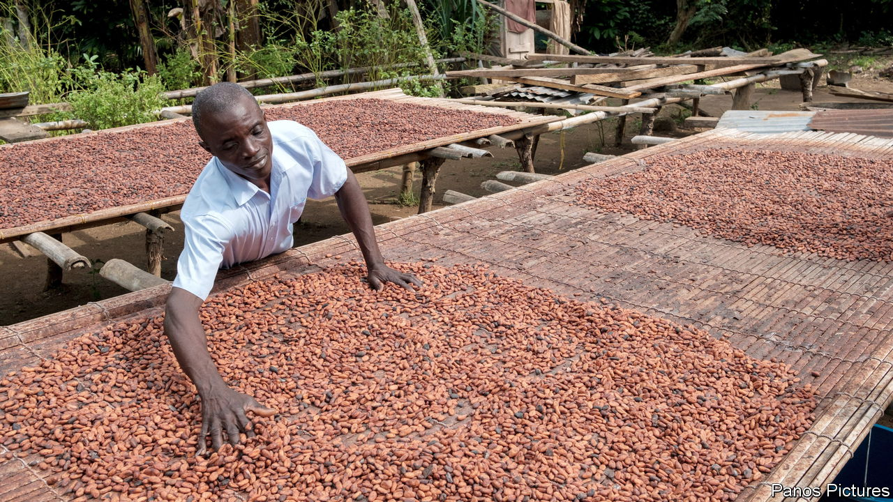
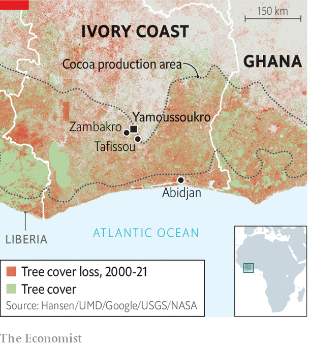

###### Chocolate wars

# Why the African cocoa cartel is a bad idea 

##### An obsession with cocoa prices overlooks better ways to help the poor 

 

> Nov 21st 2022 

Big commodity buyers do not usually pay their suppliers to produce something that they will never buy. Yet Nestlé, one of the world’s biggest chocolate-makers, is paying 10,000 cocoa farmers in Ivory Coast to do exactly that. Among them is Tanoh Kouadio, a 45-year-old cocoa farmer whom Nestlé will pay about 67,000 west African francs ($106) to raise chickens.

Eating chocolate is one of life’s greatest pleasures. Selling it can be . Alas, growing the beans that go into it is neither particularly profitable nor pleasurable. Most cocoa farmers are poor; many of those who work for them are children. The reason that Nestlé is moonlighting as a pro-poultry NGO is because it worries its customers may see chocolate as a guilty pleasure in more ways than one. 

 


Cocoa farmers’ woes are painfully clear in Ivory Coast, the world’s biggest producer. The country has roughly 1m cocoa farmers, who support about 5m people, or one-fifth of the population. More than half of Ivorian cocoa farmers and their families subsist on less than $1.20 a day. In Ivory Coast and Ghana, which between them grow about 60% of the world’s cocoa, some 1.5m in cocoa-growing areas. Many of Ivory Coast’s forests have been destroyed to make way for cocoa trees (see map).

Bars on chocolate

In 2018 Ivory Coast and Ghana agreed to set up a cartel, dubbed coPEC after the Organisation of the Petroleum Exporting Countries (OPEC), in a bid to push up prices. They later demanded that buyers pay a premium of $400 a tonne over the going rate (about 16% at current prices). They recently turned up the heat, saying that unless buyers began paying the higher price by November 20th, they would halt the sustainability programmes that chocolate companies run. They hope this will shame the firms in the eyes of their consumers. 

This is not the first time cocoa-producers have banded together. Attempts to form cartels and other price schemes began as early as 1945. Not one has worked. copec’s recent effort is true to form. When it was first announced most big chocolate outfits, including Mars, Hershey and Mondelez (which owns Cadbury and Toblerone), loudly praised the plan.

However, most big firms have subverted its spirit by paying the COPEC premium while also trimming a separate payment. This is known as the country or “origin” premium that goes to Ivory Coast and Ghana, ostensibly to reward their growers for reliability and quality. These cuts have largely cancelled out the feel-good copec premium. “They say, yes, they will pay,” fumes Yves Brahima Koné, the head of the Coffee and Cocoa Council (CCC), the Ivorian regulator. “But they don’t tell the truth.”

Ivory Coast and Ghana hope that by enlisting other producers they will get more sway over the market. Nigeria and Cameroon are talking of joining coPEC, which would raise its share of production to 75%. 

Yet even if this time is different and copec manages to push up prices, it could struggle to sustain them. Higher prices would probably encourage more farmers to plant cocoa, further oversupplying the market. Even firms buying fair-trade cocoa at higher prices have had to stop taking on new farmers because demand for these pricier beans has lagged behind supply.

Chocolate is not like oil, and not just in the sense that it tastes nicer. Saudi Arabia, the world’s swing producer of oil, can simply turn off the taps if it wants higher prices. Oil can remain underground, and does not rot. Cocoa trees, by contrast, cannot be turned off. If COPEC governments try to squeeze the market by banning exports, they will probably still have to keep buying and stockpiling beans to keep their farmers happy. Doing so could quickly overwhelm their budgets. 

As it is, cocoa prices are weak because there is an abundant supply. And cocoa buyers have proved adept at sidestepping the new cartel by buying beans elsewhere or running down their own stocks, according to the International Cocoa Organisation, an intergovernmental outfit. As a result, last year Ivory Coast sold its cocoa at a heavy discount. Ivorian civil-society groups say big chocolate “made the Ivorian government bend”. 

Big chocolate and cocoa processors pay lip service to the premium, but prefer to publicise their own charitable programmes to help farmers. Nestlé’s programme, one of many, pays farmers like Mr Kouadio not only for diversifying but also for three other worthy activities, including pruning to improve cocoa yields and sending their kids to school. 

Making the bitter sweet

Such programmes make for good press releases, but do not get to grips with the scale of the problem. Nestlé’s project has 10,000 farmers and it plans to expand to 160,000 globally by 2030. Yet Alex Assanvo, the head of COPEC’s secretariat, claims such programmes reach a mere 15% of its farmers. (Other estimates are higher.) “Sustainability programmes cannot be the answer,” says Francesca Di Mauro, the European Union ambassador in Ivory Coast, “they’re welcome, but they’re not systemic.” 

The grim truth is that small farmers will never grow rich selling unprocessed beans. In most countries where rural folk have dramatically improved their lives, they have done so by moving to cities and finding better-paid jobs there. Encouraging them to remain in the countryside and grow more cocoa than people want to eat is an unlikely path to prosperity.

Ivory Coast is hoping to move up the chocolate value chain. It is now one of the world’s two largest cocoa grinders (the other is the Netherlands). Yet grinding adds only a little of the value in a bar of chocolate. And in any case, there is little reason to think that because the country is good for growing cocoa it is also going to be better at making chocolate than, say, Belgium (which grows none). In focusing so doggedly on cocoa, Ivorians may be overlooking other industries where its firms and people might be more competitive. 

Farms can generate wealth, but they typically do so by becoming bigger, more efficient and more mechanised. This means having fewer farmers. Mr Koné of the Ivorian regulator thinks this is a bad idea. “We must not change our economic model,” he insists.

After meetings this week, Mr Assanvo of COPEC is claiming victory, mostly. He says the companies have agreed to pay the premium properly, at least until an expert group on pricing reports early next year. This looks like a rather unappetising fudge with a short shelf-life that will do little to eliminate poverty—or end the long-running chocolate wars. ■

