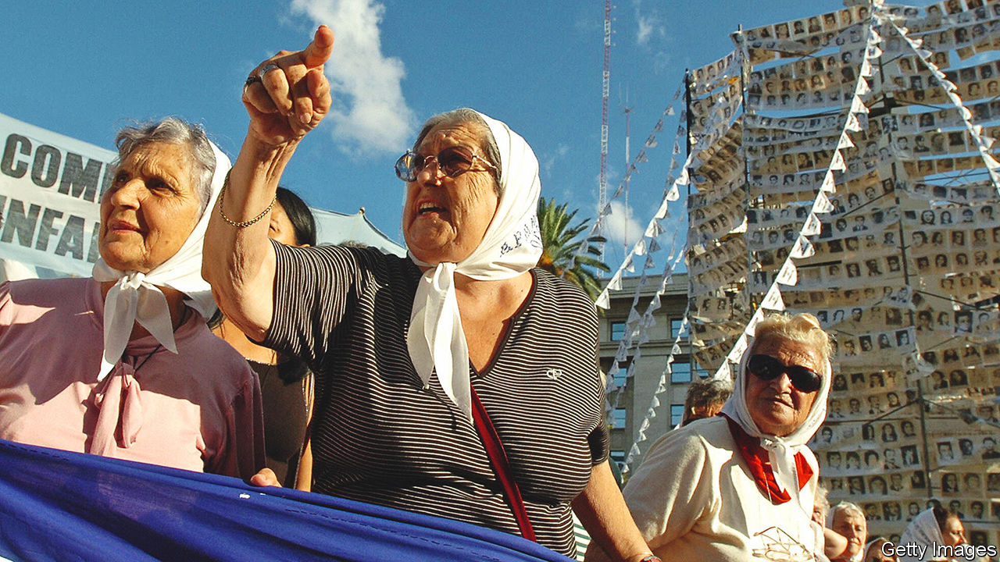

###### A mother’s rage

# Hebe de Bonafini lived through the lives of her sons 

##### The figurehead of the Madres de Plaza de Mayo died on November 20th, aged 93 

 

> Nov 24th 2022 

She didn’t see it, but neighbours did. On February 8th 1977 her elder son, Jorge Omar, aged 26, was carried from his house in La Plata hooded and unconscious. The men who had tortured and beaten him there thrust him into a car. Then he disappeared.

Ten months later, on December 6th, men came for her son Raúl Alfredo. They seized him at a union meeting in Berazategui. Like his brother, Raúl belonged to the militant Marxist-Leninist Communist Party. He dreamed of toppling by force the hard-right junta which, since 1976, had ruled Argentina. So he, too, disappeared. Two sons gone, only her daughter Alejandra left. Two among thousands of opponents of the regime who were mown down in shootings or thrown semi-conscious from helicopters into the ocean. No word of them afterwards, and usually no sign. 

She had lived through those boys. In interviews she described herself, proudly, as a mother first. Jorge was a maths teacher, and had studied physics at university. Raúl worked at the La Plata refinery but had been to university too, studying zoology. She herself hadn’t even finished primary school, because her parents were too poor to pay the bus fare. Though she buzzed with chatter and questions about the world, her mother made her learn sewing and weaving, suitable girls’ things. At 14 she was married. She chafed to go to high school, even later in life, but her husband refused. So she had read almost nothing—and certainly not Marx, though people later thought she had swallowed him whole. 

Her politics, like most other subjects, she learned from the boys. Jorge showed her how to read a newspaper: not from the comics backwards, as she liked to, but from the front page, the politics, first. He taught her, too, how to listen to the radio seriously. When Jorge was taken, she told Raúl to leave the country. He replied that he would rather die standing than live on his knees. The boys filled her house after 1976 with fugitives who needed somewhere to sleep, eat or hide. She helped as she could. 

When the boys disappeared, therefore, she did not sit and cry. Instead, lions grew inside her. Furious, tireless, she went round morgues, hospitals and police stations to search for her sons. Nothing doing. She and her husband wrote and delivered petitions of habeas corpus. No one responded. Officials brushed her off; priests told her to pray. She sat for hours alone in the corridor of the Ministry of Interior. No one noticed her. She spoke mostly to the women she met who were like herself, mothers of the missing, with their tragic faces. Gradually they joined forces. The result was the formation in April 1977 of the Madres de Plaza de Mayo, a group that became world-famous for its open defiance of the junta and its defence of human rights. 

Every Thursday at 3.30pm the mothers would meet in the Plaza, in front of the president’s palace. At first they wore white terry nappies on their heads, then white headscarves, to symbolise motherhood. That scarf made her feel taller, like her sons’ embrace. Meetings of more than three people were banned; but two by two, arms linked, they would walk silently round the square. The police beat them, dispersed them, sometimes arrested them; their first leader was drugged and drowned. But they kept on, with a kind of blind and desperate love. Grief became struggle. Her slogan was  Make them appear alive! 

Little by little, she gave up hope of that. The mothers’ task became to track down the killers and see justice done. Under her leadership they dared in 1981 to stage a March of Resistance, parading round the square largely barefoot for 24 hours. That became an annual event. By 1986, however, with the junta three years gone, the mothers split apart. They all still wanted to work for the missing and the marginalised. But their tactics differed widely. One group preferred to work through legislation and the courts and, later, through DNA testing, to trace the children of the disappeared. Hebe’s group, however, the Madres de Plaza de Mayo Association, had no faith in judges and no patience. The mothers she led were not, she said, a human-rights organisation. They were political, and refused government funding because the whole system had to be swept away. 

She did not mince words. Fascism was intolerable, but social democracy and neo-liberalism were both worthless, too. Argentina’s Congress was a nest of rats and vipers. She utterly opposed not only the army and the Catholic church but also capitalism, globalisation and the IMF. The attacks on the Twin Towers made her happy, because the United States had killed more people, through proxy wars, than any other country. Rightist politicians were , but Néstor Kirchner, a left-winger who made prosecutions easier (and whose funding she would accept), became her friend. Others were Fidel Castro, Hugo Chávez and the FARC guerrillas of Colombia. As she got older, still going on the Thursday marches and brewing up soup in the Casa de las Madres, she shouted louder. She remained, to many, an icon of resistance, no matter what she was resisting. When she got entangled in 2017 in the embezzlement of funds from an Association scheme for the homeless, she refused at first to appear in a courtroom. 

And why not? Being independent was the most beautiful thing she knew. Her own mother had over-protected her, always fussing that she should wrap up warm for her asthma. Her husband, a good person, had still kept her locked to the washing and ironing. It was Jorge and Raúl, her brilliant, incredible, warrior children, who had begun to set her free. Both of them had campaigned for armed revolution. Now they were dead, she was their voice and breath. She would do their work for them. 

In 2015 she went to the newly opened Museum of Memory in Buenos Aires, dedicated to the victims of the junta’s Dirty War. She was disappointed to find no FAL automatic rifles there, the weapons her sons had been preparing to use. If the museum did not show how revolution could be made, what was the point of it? She was not only the seeker of her children’s missing bodies. She was also the dogged promoter of their missing dreams. ■

