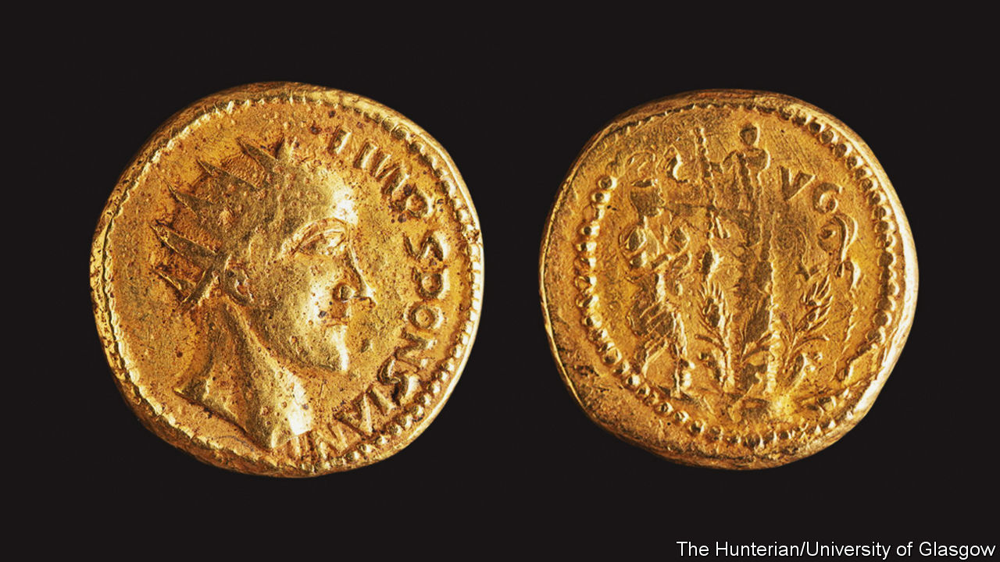

###### A new Roman “emperor”

# A name may be missing from the annals of imperial Rome 

##### Analysis of a coin suggests there was, at least in his own eyes, an Emperor Sponsian 

 

> Nov 23rd 2022 

Time and chance may erase all trace of even those who have been great in their day. And there were many opportunities for greatness, albeit fleeting, in the Roman empire of the third century AD. Between the reigns of Septimius Severus, who died in 211, and Diocletian, who came to power in 284, 33 men are known to have had their claim to rule—and with that, the title “Imperator”—recognised by the Senate of Rome. On top of those, a further 18 individuals (one was a woman) awarded themselves this title, set themselves up as local rulers, and coined money to prove the point, without engaging in the dangerous business of marching on the capital itself. 

Or was it 19? In 1713 a hoard of gold and silver coins was allegedly found in Transylvania—now in Romania, then part of Habsburg-ruled Hungary, and also overlapping what was once Dacia, a province of the Roman empire. Many bore portraits of well-attested emperors, Gordian III and Philip the Arab (or possibly his son, Philip II). Some, however, carried a likeness of one “Sponsian”, a man otherwise unknown to history, who nevertheless claimed in the coins’ legends to be “IMP”, as well.

All the recorded coins from the hoard, which has been dispersed among many collections and from which several items have been lost, were crudely made. Some experts have thus written them off as forgeries intended to exploit the 18th-century fashion for cabinets of curiosities. One such cabinet, assembled by William Hunter, a Scottish surgeon, went on to form the nucleus of the Hunterian Museum, in Glasgow University. It held four representatives of the Transylvanian hoard—including a Sponsian aureus (pictured).

Forgery or not? Paul Pearson of University College, London and four colleagues from Glasgow, took on the case. They examined the coin microscopically in visible and ultraviolet light. They scanned its surface with electrons. And they also subjected it to a technique called reflection-mode Fourier-transform infrared spectroscopy.

As they report in , their conclusion, from the random pattern of the scratches on it, was that this was an object which had indeed been in circulation, rather than something decked up to look worn by a forger. From infrared spectroscopy of minerals deposited on its surface they determined that, yes, it had been buried at some point. But from another spectroscopic analysis, based on the electrons, they showed that its gold was an impure alloy, in contrast to the near 24-carat version of the metal used for coins made in Rome. Also, unlike coins from the established Imperial mint, it was cast, not struck. 

Given that the other Hunterian specimens from the hoard, which bear images of whichever Philip it was, and Gordian, proved likewise worn, impure and cast, all were probably part of an off-the-books operation trying to keep money in circulation, using imperfectly refined metal from a local gold mine (of which Dacia boasted several, including what was then Europe’s largest), in difficult times—so difficult that their being buried for safe keeping by a nervous owner is perfectly plausible.

These findings, plus the fact that it would have been impossible for a forger to know that Sponsian was a real Roman name, because the only other record of its use is on a funerary inscription discovered in the 1720s, strongly suggests the coin is not a forgery. A forger might well have made a name up, to add mystery. But to have imagined one which subsequently turned out to be real stretches coincidence. 

Sponsian, then, was probably a general in Dacia who may have wanted the imperial purple, or been pushed by his troops into wanting it (for they would have done well, too, had he succeeded), but more probably sought only to rule locally. He certainly never made it to supreme power in Rome, or even into the history books. But the Hunterian aureus is enough to memorialise his existence. ■


