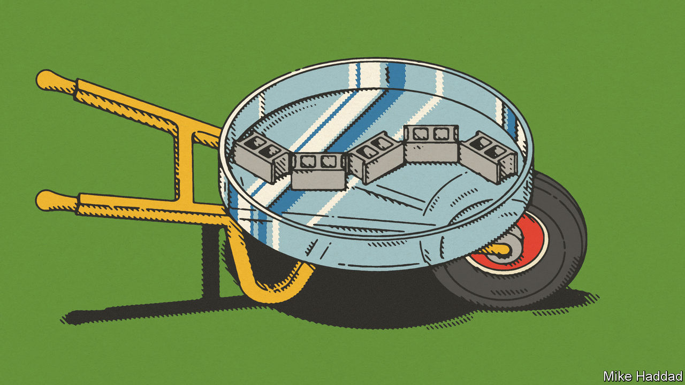

###### Biocement

# Adding bacteria can make concrete greener 

##### They offer ways to produce cement without releasing carbon dioxide 

 

> Nov 23rd 2022 

Concrete is one of the world’s most important materials. But making the cement that binds it generates about 8% of anthropogenic carbon-dioxide emissions. 

This is not just because of the heat involved. That could, in principle, be supplied in environmentally friendly ways. It is, rather, embedded in the very chemistry of the process. The heat is applied to limestone, to break up its principal constituent, calcium carbonate, into calcium oxide (cement’s crucial ingredient) and CO. 

In a warming world, this CO should be disposed of in a manner which keeps it out of the atmosphere. That is tricky. Better, then, not to generate it in the first place, by remodelling the way the aggregates that are concrete’s other ingredient are bound together. Intriguingly, this may be an area where microbes can come to the rescue.

One proposal, literally as well as metaphorically green, is to recruit the services of chlorophyll-laden, photosynthesising organisms called cyanobacteria. That has allowed Prometheus Materials, a firm in Colorado, to develop a cement-making process in which the energy comes not from heat but light—something easily generated from electricity that has, in turn, been provided by renewable sources. Moreover, and perhaps more importantly, photosynthesis subtracts CO from the atmosphere rather than adding it.

Grow-your-own concrete

Prometheus raises its bacteria in water-filled “bioreactors” surrounded by light-emitting diodes, to allow the bugs to photosynthesise. The water contains inorganic nutrients the bacteria need, and is perfused by streams of air bubbles which provide the CO. It also has calcium ions dissolved in it—for the purpose of the exercise is to encourage the bacteria to generate from the ingredients provided crystals of calcium carbonate a few microns across—a process called biomineralisation.

The number of bacteria in the bioreactors would double every four to six hours if permitted to do so. Instead, quantities of them are transferred regularly to another tank. Here, they are plied with a proprietary stimulant that accelerates biomineralisation and then allowed to sit for an hour or so to mature. When the crystal-rich gloop that results is mixed with an aggregate, the product is “bioconcrete”. 

Bioconcrete actually comes in many varieties, depending on the aggregate employed. For the moment, Prometheus is pinning its hopes on mixing the gloop with sand, together with a so-called hydrogel (think jelly deserts for children’s parties, only more industrial), which further helps to bind the sand grains together. 

To reduce the space between the grains in the mixture, and thereby strengthen the resulting material, the company first pours the mix into casts that will shape it into breeze blocks, and then uses machinery which compresses and, for about ten seconds, “vibrates the heck out of it”, says Loren Burnett, Prometheus’s boss. The resulting blocks then take about eight days to cure, compared with 28 days for conventionally produced breeze blocks.

Prometheus says making concrete this way emits a tenth of the CO generated by conventional concrete-making. Mr Burnett hopes that will permit the firm to charge a “green premium”—because one thing which the new blocks are not, is cheaper than the conventional variety. He will not, though, be relying on the construction industry’s goodwill for this to happen. Many jurisdictions, including the states of California, Oregon and Washington, are bringing forward regulations that will favour “reduced-carbon” concrete.

How much the premium will need to be to permit a profit is not yet clear, but it should be once Prometheus has shifted production from its laboratory to a pilot manufacturing facility nearby—a move it expects to complete early next year. That said, the firm does hope to bring costs down eventually to a point where it competes with conventional cement-makers on price as well.

One unknown is how permeable to water the new material will prove. But the stuff is certainly strong. Recent batches have withstood pressures of 380kg per square centimetre—more than some conventional concretes can tolerate. Sales of breeze blocks, and also of bricks for sound barriers to dampen traffic noise (an application based on the belief that the hydrogel will dissipate sound better than conventional concrete) should start early next year. Bringing precast bridge segments to market will take a bit longer, as more rigorous certification is involved. 

Prometheus says its new plant will be able to turn out nearly 21,000 breeze blocks a month. But, because shipping heavy products long distances is expensive, it is also working on a process that air-dries both the bacteria and the crystals. The idea, says Mr Burnett, is to produce a “just-add-water” biocement mixture that would be lighter than a conventional cement mix, and could thus be shipped more cheaply. 

Building on organic growth

Another biocement firm, Biomason, of Research Triangle Park in North Carolina, uses a similar approach, except that its bacteria, , do not photosynthesise, so have to be fed organic nutrients, in the form of sugar and amino acids, as well as inorganic ones. According to Ginger Krieg Dosier, the firm’s boss, the result is better than conventional cement at binding fine particles together. This lets Biomason substitute things like mine tailings for part of the sand that would otherwise be used. Biomason’s first products are wall and floor tiles branded “Biolith”.

Applications for biocement extend beyond conventional construction, too. America’s Department of Defence, for one, has shown interest. Its aim is to be able to build things in remote areas without having to hump in cement and other materials. That would be doubly valuable if the territory through which the humping would otherwise be happening were hostile. Indeed, it was the defence department that catalysed the formation of Prometheus, by awarding the team at the University of Colorado which later founded the firm a grant of $1.8m back in 2017.

The department is also, in the guise of the Defence Advanced Research Projects Agency (DARPA) and the Air Force Research Laboratory, collaborating with Biomason to develop biocement sprays that can turn sand or loose soil into runways. Michael Dosier, Biomason’s chief technologist (and the boss’s husband), says the hardening involved could require less than 72 hours.

Even wilder uses are on the cards. In a talk given in August to DARPA Forward, a technology conference in Fort Collins, Colorado, Kathleen Hicks, America’s deputy secretary of defence, outlined a goal that is literally out of this world: an ability to spray a bacterial liquid on lunar or Martian regolith, in order to “grow a landing pad”. 

Back on Earth, biocements are already being used to consolidate loose ground for reasons other than runway-making. Some concocted in Singapore by researchers at Nanyang Technological University (NTU) are intended to slow coastal erosion. 

To do this, NTU’s civil and environmental engineering department is formulating recipes that mix seawater, calcium chloride, urea and an enzyme from soyabeans. For some batches, the calcium chloride and urea have been successfully substituted, respectively, by carbide sludge, an industrial waste, and human urine. 

NTU’s biocements are conveniently watery and, once set in concrete as it were, colourless. This means, says Chu Jian, the department’s chairman, that, “you just need to pour the solution on top of the beach”. Singapore’s National Parks Board is testing NTU’s biocements at two beaches that are being worn away by the waves—one fringing the island state’s south coast, the other in a group of offshore islets.

Filling in the cracks

Another ingenious bacterial concoction intended for the construction industry is produced by Basilisk, a firm in the Netherlands. In 2017 it launched a product that heals cracks in concrete. 

Basilisk Healing Agent consists of tiny pellets that hold dried spores from a range of bacteria belonging to the genera ,  and , together with nutrients including polylactic acid. Construction workers pour the pellets into conventional cement when mixing it with water and aggregate. The high alkalinity of uncured cement stops the moisture activating the spores. That alkalinity drops, however, as the concrete cures. This means that, if a crack appears and water gets in, the spores in the embedded pellets are primed to spring into action and generate calcium carbonate. This fills in fissures up to a millimetre across, nipping potentially dangerous cracks in the bud.

Not only does that lower maintenance costs, it also means the concrete concerned need contain less reinforcing steel, since the quantity of such “rebar” used in conventional concrete anticipates the extra strength which will be needed as cracks inevitably form. A cubic metre of typical concrete thus requires 100-120kg of rebar, at a cost of around a dollar a kilogram. According to Bart van der Woerd, Basilisk’s boss, adding 5kg of Basilisk’s pellets can halve that requirement for some projects, and will set you back only €37 ($37). 

Not only does that save money, it also saves CO emissions—because making steel from iron ore is another process that releases this gas for fundamental-chemical rather than mere energy-generating reasons. (The ore is iron oxide, and the oxygen is plucked from this to leave metallic iron by its reaction with the carbon in coke.) Less steel equals less CO. Sometimes then, and luckily, it is the road to heaven, not that to hell, which is paved with good intentions. ■


