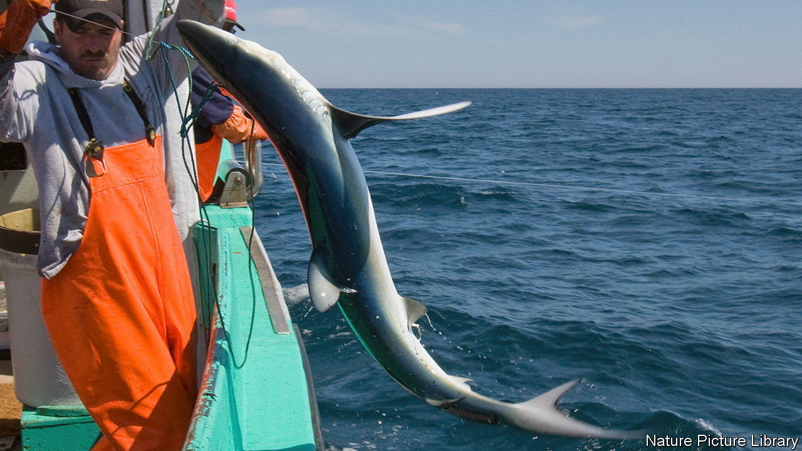

###### Fishing and conservation

# An electrical device on a fishing line repels sharks and rays 

##### It acts as a sort of “antibait” 

 

> Nov 23rd 2022 

Longlines, bearing hundreds, sometimes thousands, of baited hooks, catch commercially valuable fish. But they also catch sharks and rays, turtles and birds. This harms ecosystems. And removing the unwanted creatures takes time, can be dangerous, and may damage the gear.

The size of the world’s bycatch, as such unwanted captures are called, is hard to measure. The fishing industry is huge, and much activity is unreported, unregulated and sometimes illegal. But a pertinent study published last year in  estimated that only half of the animals hooked by a longlining fleet in the Pacific Ocean near Palau were tuna (the intended target). The rest were bycatch. 

Sharks and rays, known collectively as elasmobranchs, seem particularly vulnerable. Some are sought deliberately, but a lot die as bycatch. Since 1970, numbers have crashed by more than 70%, according to a paper, also published last year, in .

Part of the answer to that might be to discourage elasmobranchs from taking the bait without simultaneously discouraging target species such as tuna. Research carried out recently by a group at Exeter University, in England, suggests a small British company called FishTek Marine may have devised a way of doing just that.

The work in question, just published in  by Phillip Doherty and his colleagues, tested small cylindrical devices the company calls SharkGuards, which fit just above the hooks on long lines. Every two seconds they generate a strong electrical pulse. Elasmobranchs detect these via organs called the ampullae of Lorenzini, which are jelly-filled receptors scattered around their noses and mouths that serve to sense the electrical fields generated by potential prey’s muscles. If, however, its ampullae are overstimulated by a strong enough field, a shark is repelled, rather than attracted.

The team tested FishTek’s device in 2021 on two fishing boats in southern France. They put SharkGuards on half of the 900 hooks of each of 22 longlines deployed by these vessels, while leaving the other half as per normal. The hooks were sufficiently far apart on the lines that a device emitting a burst from one would not, they hoped, interfere with its neighbour. Then, once the lines had done their stuff, they analysed the resulting catches.

Line dancing

The results were impressive. Of the two predominant local elasmobranchs, hooks fitted with SharkGuards caught 91% fewer blue sharks and 71% fewer stingrays (pictured above) than did those without one. Why the device works better on blue sharks than stingrays Dr Doherty is not sure. One possibility he offers is that blue sharks have more ampullae of Lorenzini on their big, pointy noses than do stingrays on their smaller, less protuberant ones. This might make them more sensitive and therefore more easily repelled than stingrays. 

There was a wrinkle, which was that the number of tuna caught during the trials was unseasonably low. This was true both for test hooks and for controls, suggesting other factors were at play—but a second experiment comparing entire lines that were guarded and unguarded would be needed to prove the point securely.

Assuming that point is, indeed, proved, SharkGuards may offer a solution to the problem of elasmobranch bycatch. They should be cheap. The firm proposes to charge £8.50 ($10) a pop for a device that will last three to five years. And they are easy to recharge, since they do not have to be plugged in individually. Instead, if a line carrying them is coiled up and thrown into a specially designed bin, they can be charged up, en masse, by induction. 

One small trial does not, of course, a summer make. There will need to be others, in other stretches of water, with different elasmobranchs at risk. And there remains the question of the low tuna take in this experiment. But if those further trials do prove the point, then this approach may prove a good way of cutting the number of sharks and rays dying uselessly because they have been caught by lines set for other species. ■


