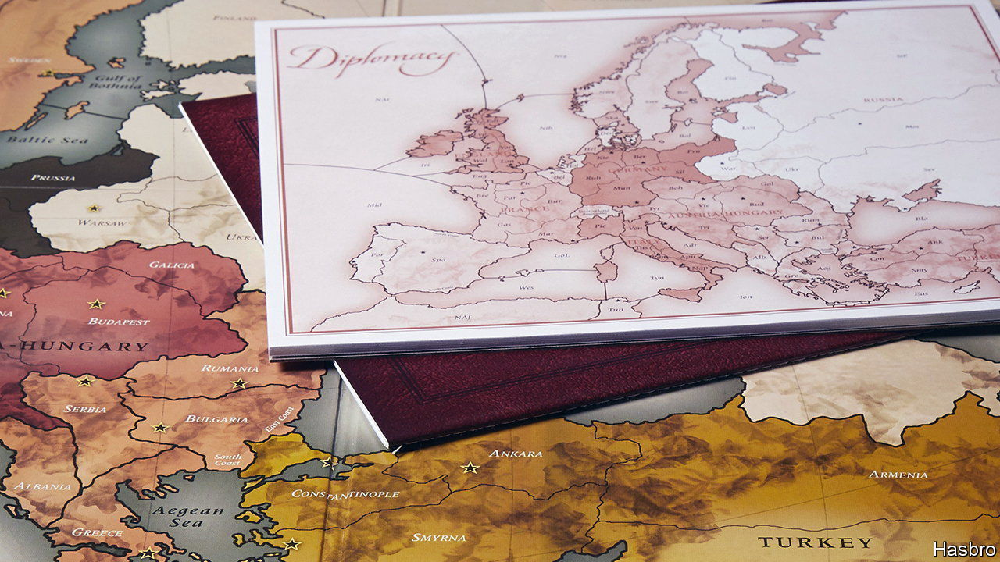

###### AI and Diplomacy

# Another game falls to an AI player 

##### This time it is one that involves negotiation and double-dealing 

 

> Nov 23rd 2022 

Backgammon was an easy win. Chess, harder. Go, harder still. But for some aficionados it is only now that artificial intelligence (AI) can truly say it has joined the game-playing club—for it has proved it can routinely beat humans at Diplomacy.

For those unfamiliar with the game, its board is a map of Europe just before the first world war (except that, for no readily apparent reason, Montenegro is missing). Participants, seven ideally, each take on the role of one of the Great Powers: Austria, England, France, Germany, Italy, Russia and Turkey. Each has armies and navies, and geographically based resources to support them, and can use its forces to capture the territory of neighbours, thus gaining the means to raise more forces while depriving others of the same. 

The trick is that, at least at the beginning, players will get nowhere without making agreements to collaborate—yet they are not bound by the game’s rules to keep to these agreements. Only when orders for the movement of troops and vessels, which have to be written down, are revealed, does a player discover who really is a friend, or an enemy.

Cicero, a program devised by a group of Mark Zuckerberg’s employees who dub themselves the Meta Fundamental AI Research Diplomacy Team, proved an adept pupil. As the team describe in , when they entered their creation into an online Diplomacy league, in which it played 40 games, it emerged as one of the top 10% of players—and no one rumbled that it was not human. 

In all past AI game-playing projects the program has learned by reinforcement. Playing repeatedly against itself or another version of itself, it acts first at random, then more selectively. Eventually, it learns how to achieve the desired goal. Cicero was taught this way, too. But that was only part of its training. Besides having the reasoning to plan a winning strategy, a successful Diplomacy player must also possess the communicative ability to implement it. 

The Meta team’s crucial contribution was therefore to augment reinforcement learning with natural-language processing. Large language models, trained on vast amounts of data to predict deleted words, have an uncanny ability to mimic the patterns of real language and say things that humans might. For Cicero, the team started with a pre-trained model with a baseline understanding of language, and fine-tuned this on dialogues from more than 40,000 past games, to teach it Diplomacy-specific patterns of speech.

To play the game, Cicero looks at the board, remembers past moves and makes an educated guess as to what everyone else will want to do next. Then it tries to work out what makes sense for its own move, by choosing different goals, simulating what might happen, and also simulating how all the other players will react to that. 

Once it has come up with a move, it must work out what words to say to the others. To that end, the language model spits out possible messages, throws away the bad ideas and anything that is actual gobbledygook, and chooses the ones, appropriate to the recipients concerned, that its experience and algorithms suggest will most persuasively further its agenda. 

Cicero, then, can negotiate, convince, co-operate and compete. Seasoned Diplomacy players will, though, want to know something else: has it learned how to stab? Stabbing—saying one thing and doing another (especially, attacking a current ally) is seen by many as Diplomacy’s defining feature. But, though Cicero did, “strategically withhold information from players in gameplay”, it did not actually stab any of its opponents. Perhaps it was this final lack of Machiavellian ruthlessness which explains why it was only in the top 10%, and not . ■


