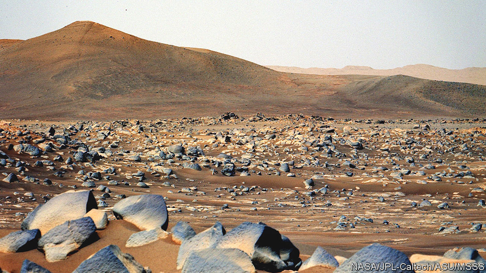

###### Areology

# The latest news from Mars 

##### NASA’s rover has imaged what could be the remnant of an ancient river delta 

 

> Nov 23rd 2022 

The hill in the distance, 50 metres high and known as Santa Cruz, is thought to be the remnant of an ancient river delta. The rounded boulders lying in front of it are a type named Ch’ał (a Navajo word for frog), and contain pyroxenes. These are minerals made from silicon, oxygen, aluminium and a smattering of calcium, sodium, iron, magnesium and other metals. The image itself was taken by Mastcam-Z, an instrument on NASA’s Mars rover, , near its landing site in Jezero crater. It was released this week as part of a trio of papers that detail the mission’s most comprehensive geological investigations yetFor more than 20 months,  has trundled around the Martian surface and, with its suite of spectrometers and cameras, has analysed the regolith and rocks in its immediate vicinity. If microbial life ever did exist on Mars, there could be clues to its nature hidden in the geology (or, strictly speaking, areology) of the regolith lying around in Jezero today.■


