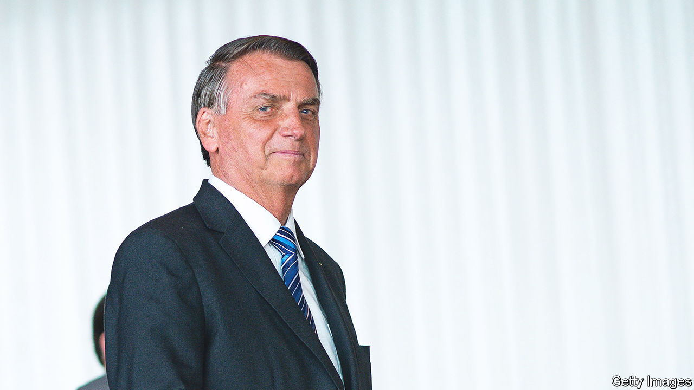

###### Crying foul

# Jair Bolsonaro’s challenge to Brazil’s election was rejected 

##### The claim came three weeks after he lost the presidential vote to Luiz Inácio Lula da Silva 

 

> Nov 23rd 2022 

When Jair Bolsonaro lost his bid for  on October 30th, he said nothing for 44 hours. Then, when he spoke, he did not explicitly reject the result, though he did not concede, either. Many saw this as a victory, of sorts, for democracy. Mr Bolsonaro, the right-wing populist president of Brazil, had spent years  on his country’s electoral system, which relies solely on electronic ballots. For months he had insinuated that Luiz Inácio Lula da Silva, his rival, could only win if it was rigged. When Lula, as he is known, won by a mere 1.8 percentage points, many people expected Mr Bolsonaro to contest the result. 

Three weeks later, he tried to do just that. On November 22nd Marcelo Bessa, a lawyer, submitted to the electoral tribunal a 33-page request on behalf of Mr Bolsonaro’s inaptly named Liberal Party. They claimed, as , that Brazil’s electronic voting machines are untrustworthy. They urged the electoral tribunal to annul all votes cast on machines dating from before 2020. They argue that these machines are insecure, as they do not have individual identification numbers. This would affect 280,000 machines, or 59% of the total. If this were to occur, Mr Bolsonaro would win with 51% of the vote, they say.

The tribunal gave his team 24 hours to provide a report to support their argument, which they did not do. As a result the court rejected the complaint and fined the party 23m reais ($4m) for acting in “bad faith”. 

Brazil’s voting machines have been used successfully since 1996. They do not need identification numbers: they can be identified by a unique digital certificate. The implication was that the machines could have been swapped for others with fake votes inside. But the machines’ security was never questioned before Mr Bolsonaro found it useful to do so. Experts agree that they tally votes quickly and fairly. 

Lula has been confirmed as Brazil’s next president by the electoral authority; he will come to power on January 1st. His victory was quickly recognised both by foreign governments and by many of Mr Bolsonaro’s supporters in Congress. The electoral tribunal’s president, Alexandre de Moraes, a Supreme Court justice whom  detest, argued that if the electoral tribunal considered Mr Bolsonaro’s claim, it would also have to investigate the results of the first round. This includes the vote for the lower house, in which Mr Bolsonaro’s party won 99 seats out of 513.

Mr Bolsonaro’s timing seems odd. Although immediately after the election there were large protests by his supporters, including lorry drivers who blocked roads, they were soon dispersed. The highway police—the head of which is being investigated for allegedly trying to interfere in the voting process in favour of Mr Bolsonaro—obeyed orders to shut down the lorry protests. But hundreds of  are still camping in front of army barracks in cities such as Brasília and São Paulo. They ask the armed forces to “save Brazil” by intervening and keeping Mr Bolsonaro in office. 

Earlier this month the armed forces issued an ambivalent statement in which they “neither noted nor excluded the possibility of fraud”. They had earlier taken part, at the electoral tribunal’s invitation, in a check on the voting machines. Many military officers admire Mr Bolsonaro. But the high command stressed that controversies should be settled through the law.

Mr Bolsonaro is a fan of Donald Trump; one of his sons supported the storming of the US Capitol by Trumpists on January 6th 2021. It seems unlikely that Brazil will suffer a similar upheaval next month. Even so, Mr Bolsonaro has laid down a worrying marker, suggesting to his supporters that Lula, whom he has previously accused of working for the devil, is not a legitimate president. Mr Bolsonaro does not have the support for a full-blown coup, thinks Marcos Nobre, a political scientist. “He’s trying to build strength for 2026,” he says. ■

