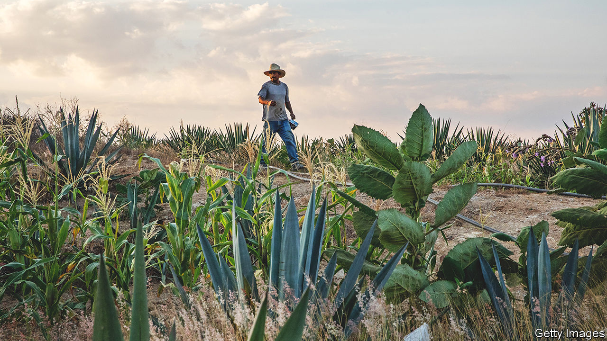
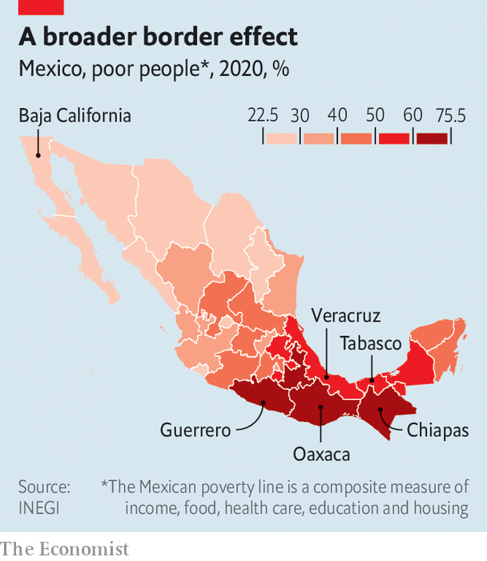

###### A divided country

# Mexico’s president wants to develop the poorer south 

##### But the area needs better education rather than boondoggles 

 

> Nov 24th 2022 

The verdant slopes of the Tacaná volcano in Chiapas, a state in Mexico’s south, produce delicious coffee, but growers have long struggled to turn a profit. In the past six years that has started to change, says Fernando Gamboa, a farmer. A group of his peers formed a branded co-operative in 2016, after getting advice from a charity. Since then they have produced more coffee and of better quality. They now sell it to Toks, a national chain, which paid 112 pesos ($5.80) per kilogram this year, up from 65 in 2017. “We have money not only to invest in the land but to buy more food and maybe a pair of shoes,” he says.

 


Mexico has become richer over the past three decades. Because of a free-trade pact with the United States and Canada, which came into force in 1994, the country’s exports have grown from 12% of GDP in 1993 to 40% in 2021. But progress was . Factories along the  and in central Mexico churn out cars, aerospace parts and medical devices. By contrast the south has yet to find a productive niche. Chiapas is among the country’s three least attractive states for investment, according to IMCO, a think-tank. The other two, Guerrero and Oaxaca, are also in the south. In Chiapas three-quarters of people are poor, according to a measure which takes into account access to services (see map). Its residents are the least educated of all Mexico’s 32 states, with just over seven and a half years of schooling on average. 

Mexican presidents have long promised grandiose plans for the south, only for little to change. In 2018 Andrés Manuel López Obrador, the first modern-day president to hail from the south, was propelled to power partly by promising to reduce poverty and inequality in the region. Many southerners receive monthly cash of around 5,000 pesos from the government for taking part in a programme that encourages rural folk to plant trees. The president is also building three of four big infrastructure projects in the region, including an oil refinery in Tabasco and the Maya train, a railway that will go through five southern states. He is upgrading roads, railways and ports along the Isthmus of Tehuantepec, the shortest route between the two coasts. The president also forced Constellation Brands, an American beermaker, to build a brewery in Veracruz instead of Baja California in the north after holding a dodgy plebiscite in the northern state.

At the same time, the United States government is investing in Central America and southern Mexico, in the hope that this might reduce emigration. Organisations funded by USAID, the government’s development arm, work with farmers such as Mr Gamboa to help them grow more and better crops, and to connect them to buyers. In July USAID began to spend $30m in southern Mexico on similar projects.

Southern discomfort

Mexico’s southern states suffer from many problems. For a start, they are farther from the United States, the main market for Mexican goods. The region is also full of small farmers using outdated techniques. Its infrastructure is shoddy. Mexico’s public investment accounts for just 2.5% of GDP, down from a high of 6% in 2009. Since the 1980s there has been no southern regional development plan, notes Guillermo Wo of Fidesur, a government body to boost southern investment. And its educational standards are often hindered by powerful teaching unions. For decades teachers in Oaxaca have gone on strike every year. In 2016 they sparked riots that led to half a dozen people dying and hundreds of people being injured. 

Nonetheless, southern states have opportunities to thrive, reckons Ana Gutiérrez of IMCO. Covid-19 and tensions with China have spurred American companies into nearshoring. Between 2020 and 2021 exports, mainly of food, grew by 65% in Oaxaca and 34% in Chiapas. Mexico itself, the world’s 15th-biggest economy, is a big market for the south’s produce. Although the country’s overall growth has been lacklustre compared with its peers, Mexican consumers are getting richer. Last year GDP per person was $9,255, up from $7,773 in 1993 (in 2015 prices). Many are willing to pay more for organic products. More high-value agricultural processing could also be done in the south. Tourism could be lucrative. Chiapas has Mayan ruins and a jungle. 

It makes sense for Mr López Obrador’s government to seek to boost industrial investment. But his boondoggles in the south are unlikely to do much to change the fortunes of its residents. He claims his pet oil refinery has generated around 35,000 direct jobs and a further 165,000 indirectly. However, many of these jobs, such as for building contracts, are short-term. And the oil project will slow Mexico’s transition to clean energy, which could discourage foreign investment. Companies such as General Motors, an American carmaker, say they may hold off investing more in Mexico because its dirty energy will cause them to miss their green targets.

Similarly the Maya train is opposed by many of the people whose fields or villages it will despoil. A better use of government funds would be to improve local infrastructure such as the electricity grid, to make sure people have a reliable and affordable energy supply. Mr Gamboa grumbles that his village only got power in 2019. 

Better education and training is also needed, not least as it would help southern Mexicans find better jobs, probably in the north. It would go some way to reducing the number of people working in the informal sector. Over 60% of Mexico’s workers do not have formal jobs, and so do not pay taxes or receive benefits.

Southern Mexico has a better chance of getting richer than much of Central America, where there are smaller domestic markets, says Marco Gonzalez-Navarro of the University of California, Berkeley. But in order to do so, the president needs to improve the  in the country as a whole. Southerners are free to move to other parts of Mexico to improve their lives, and should not be dissuaded from doing so. But a broader problem is that Mexico is no safer since Mr López Obrador took power. Corruption and crime remain rampant. And the climate for foreign investment in the country still depends on the president’s whims. ■

