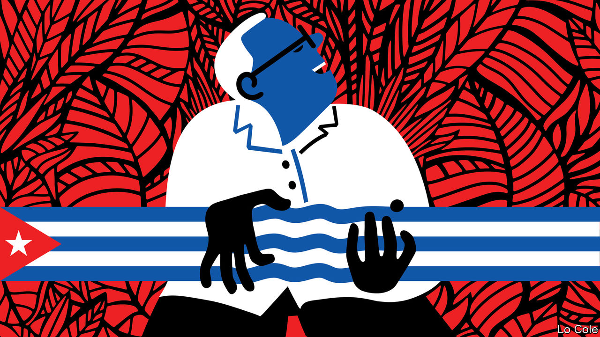

###### Bello

# Pablo Milanés, a great musician and a critic of Cuba’s regime, has died 

##### He was the bard of the Caribbean, with a voice as smooth and rich as 20-year-old rum 

 

> Nov 24th 2022 

The first time this columnist heard Pablo Milanés perform it was at an improvised Saturday afternoon concert in a shantytown on the desert outskirts of Lima in 1986. He was accompanied on that and many other occasions by Silvio Rodríguez. They were the tireless musical ambassadors of the Cuban revolution when, despite its police state, it still inspired some respect for having expelled the  and for its achievements in health care and education. Over the following decades the revolution shrivelled into a repressive pastiche. But Mr Milanés, who died of cancer in a hospital in Madrid on November 22nd, grew and grew. He was a voice, a musician and a poet, a transcendent Cuban who was critical of his country’s regime but loyal to its people. His death, in voluntary exile, comes as the island plumbs new depths of desperation.

Born in Bayamo in Oriente, the heartland of Fidel Castro’s revolution, the young Mr Milanés soon got into trouble with the new authorities. He was sent to do military service in one of Castro’s work camps for “anti-socials”, escaped, and was imprisoned again before eventually finding a niche in the government’s arts institute. There with Mr Rodríguez and others he founded the , the new song movement which married political commitment with folk music. But while Mr Rodríguez remained loyal to the genre and the government, Mr Milanés quickly outgrew both. The two eventually fell out.

His voice was melodious, as smooth and rich as 20-year-old rum. He was a musician of rare versatility, a guitarist, pianist, singer and composer who released 50 albums. His influences ranged from baroque and renaissance music to Afro-Cuban rhythms (he was black himself),  and the pre-revolutionary sounds that would find renewed fame in the Buena Vista Social Club. Early on he set to music verse by Cuban poets such as Nicolás Guillén. In an extraordinarily fertile period in the late 1970s and early 1980s he found his own poetic voice. 

In “Yo pisaré las calles nuevamente/de lo que fue Santiago ensangrentada” (“I will once again tread the streets of bloodstained Santiago”) he mourned the coup against Salvador Allende in Chile and those who died at the hands of General Augusto Pinochet. But it will be his love songs that will last. They are lyrical but taut, carnal, bittersweet, of loss as much as rapture. In “Para vivir” (“To live”) he urges his lover to abandon a relationship that “lacks flesh and desire too”. In “El Breve Espacio”, “todavía quedan restos de humedad/sus olores llenan ya mi soledad/en la cama su silueta/se dibjua cual promesa/de llenar el breve espacio/en que no está” (“Traces of dampness still linger/her smells now fill my solitude/her silhouette drawn on the bed/a promise of filling the brief space where she is not”).

Political disillusion crept into his work like a melancholy Havana morning. In “Días de Gloria” (“Days of Glory”), “I live with ghosts who feed [us] dreams and false promises.” He was critical of the survival of Stalinism in Cuba, of the lack of rights and freedoms, of the lack of reform. He thought, correctly as it turned out, that the regime’s rapprochement with the United States under Barack Obama would not lead to much. He remained of the left, true to the ideals of the revolution, he said, but “defrauded” by its leaders. He moved permanently to Spain for medical treatment. Last year protests broke out across Cuba, against privation, blackouts and the mismanagement of the pandemic. The government responded with mass arrests. Mr Milanés didn’t mince his words: “It’s irresponsible and absurd to blame and repress a people that has sacrificed and given everything for decades to sustain a regime that in the end imprisons them.”

Cuba’s ruling communist bureaucrats began to criticise Mr Milanés as a “counter-revolutionary”, but they feared him. He was far bigger than they were. Over the past year, on what became a farewell tour, he performed in both Havana and Miami, one of the few Cuban artists applauded in both places. His death comes as the country sinks ever deeper into demoralisation. Over the past 12 months more than 200,000 Cubans (or almost 2% of the population) have been stopped trying to enter the United States. Many younger artists have followed Mr Milanés to Spain, turning Madrid into a Cuban cultural capital in exile. “Where are the friends I had yesterday,” Mr Milanés sang in “Éxodo” (“Exodus”), released in 2000. “What happened to them? Where did they go? How sad I am.” Many Cubans would now say the same.


