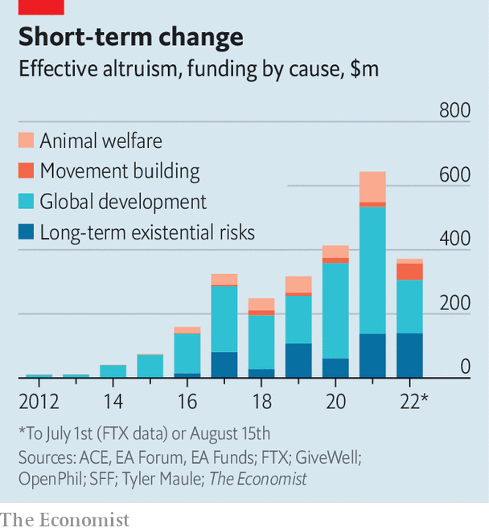

###### The Economist explains

# What is long-termism? 

##### It is an important component of “effective altruism”, a moral view most famously espoused by Sam Bankman-Fried 

 

> Nov 22nd 2022 

ON NOVEMBER 6TH Sam Bankman-Fried was king of crypto, worth $16bn. His fortune vanished a week later when FTX, the crypto exchange he headed, went bankrupt. FTX’s collapse has destabilised not just the crypto-sphere but also  (EA), the young and growing social movement to which Mr Bankman-Fried belongs. Effective altruists claim to use evidence and reason to maximise the good they do for others, no matter where the beneficiaries live or when they are born. Effective altruists give the bulk of their money to global health and development (think malaria nets), to animal welfare (many are vegans) and, more recently, to “long-termism”. What is it?

Long-termism is a moral view that puts great importance on the lives of future people. For long-termists like , a philosopher at Oxford University who provided EA with many of its founding ideas and helped turn it into a movement, “distance in time is like distance in space”. If people living thousands of miles away matter, so do those living thousands of years away, argues Mr MacAskill in his book “What We Owe The Future”. Long-termists advocate causes ranging from boosting economic growth to minimising the risk to humanity posed by rogue artificial intelligence. “Strong long-termism” posits that future people are just as important as those living today. People who take that view judge actions mainly on the basis of their impact in the years ahead. Mr MacAskill notes that if humanity lasts as long as the typical species of mammal (around 1m years), and our population size stays constant, future people would outnumber us by 10,000 to one.

 


Such philosophising affects a big chunk of money. In 2015 effective altruists spent $75m, almost all of it on global health and development, according to a member of the EA movement who keeps track of the numbers. By 2021 they spent more than $600m; around 20% went towards preventing long-term existential risks to humanity, such as future pandemics. This year long-termist causes, which, apart from dealing with climate change, often get little funding from other donors, have received roughly 38% of effective altruists’ money ().

With more funding has come increased criticism. One common objection is that long-termism provides little clarity on just how much to prioritise needs in the distant future relative to those of the present day. Derek Parfit, a British philosopher who died in 2017, raised the question of whether future generations can hold the current one responsible for their suffering: if our generation had acted differently those people would not have been born. 

Strong long-termism can also lead people to disregard common-sense moral commitments to living people. They might spend billions on artificial-intelligence safety research while ignoring homelessness today. Another criticism is that uncertainty about the future undermines the case for long-termism: how can we act sensibly when we cannot know what the consequences will be in the distant future? Perhaps it is better to focus on what we know will help people now. 

Mr Bankman-Fried’s downfall will hurt the finances of long-termist causes, if not the arguments for them. His defunct “FTX Future Fund” had committed $160m to long-termist projects. Other effective altruists are questioning long-termism as part of a  of the movement following FTX’s collapse. Even before it, some worried that effective altruists had become too focused on long-termism.

Still, the boss of Open Philanthropy, EA’s biggest charity, said recently that it “remains committed” to long-termist projects. And many long-termist causes, such as preventing pandemics, can easily be justified on short-termist grounds. Long-termists might well argue that Mr Bankman-Fried’s blow-up—the result of excessive risk-taking and shoddy accounting—shows more clearly the perils of short-term thinking than flaws in long-termism. Long-termism has suffered a setback, but it is not going away soon.■

