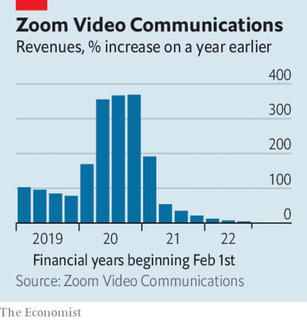

###### The world this week

# Business 

#####  

 

> Nov 24th 2022 

In a ,  ousted Bob Chapek as chief executive after just 33 months in the job, and brought back Bob Iger, the previous CEO, to replace him. Senior executives lost confidence in Mr Chapek’s leadership, which came to a head when the latest quarterly earnings revealed rising losses at Disney+, the company’s premium streaming service. Mr Chapek also earned the ire of the creators of Disney’s content when he restructured the business around a policy of streaming first, taking creative control out of their hands. Mr Iger led Disney for 15 years during a period of growth, when it took over Pixar, Lucasfilm and Marvel studios. 

Fried bankers is about right

 owes more than $3bn to its largest creditors, according to a list compiled for a court hearing on the crypto exchange’s . However, a lawyer for FTX’s new management team said that a large chunk of its assets are either missing or stolen. He described the firm as the “personal fiefdom” of Sam Bankman-Fried, one of the founders, and that it was run by “inexperienced and unsophisticated individuals”. 

Elon Musk indefinitely postponed the relaunch of  blue-tick verification scheme. Mr Musk introduced a charge for the service shortly after taking over the company, which has led to a large number of accounts impersonating celebrities and businesses, such as a fake Pepsi account which tweeted that Coca-Cola is the better drink. Meanwhile, hundreds more workers were reported to have left Twitter after Mr Musk imposed a deadline to sign up to “long hours at high intensity”. 

Mr Musk also faces problems at . The electric carmaker issued yet another recall, this time of 321,000 vehicles over a software glitch in their tail-lights. It is the 19th recall so far this year. Tesla’s stock has fallen by almost 55% since December, wiping some $90bn from Mr Musk’s fortune (he is still worth $180bn). 

 announced big job cuts, joining other tech companies that are reducing costs in a worsening post-pandemic environment. The computer- and printer-maker is slashing 10% of its workforce amid a slump in demand for PCs. Its chief executive said it would be “prudent” to assume that business will not pick up next year. , meanwhile, recorded a big drop in sales of PCs to consumers and companies. 

 


Another set of disappointing earnings from  sent its share price sliding again. The stock is down by more than 55% this year. The videoconferencing platform faces increasing competition for new customers amid signs that companies are curtailing spending on new IT. 

 was sentenced to 11 years in prison for defrauding investors in Theranos, a blood-testing startup that was once the darling of Silicon Valley. Ms Holmes, who is pregnant, was found guilty in January. She is due to start her sentence in April.

The sale of  to collapsed, following a judge’s decision in October to block the deal on antitrust grounds. Simon &amp; Schuster’s owner declined to join an appeal against the ruling.

 public sector net borrowing came in at £13.5bn ($16.1bn) in October, down from September’s figure but up sharply from the same month last year. The government’s mini-budget on November 17th increased the tax burden on workers and businesses and laid out a plan to cut spending in order to reduce public sector net debt as a share of GDP, but only after the next election, which is due to be held no later than January 2025. 

The OECD’s latest outlook said that  have intensified. It noted that higher interest rates were starting to pay off in some countries, notably the United States and Brazil, but warned that most big economies needed to continue tightening monetary policy to “lower inflation durably”. 

In  the government approved a number of measures to help low-income mortgage holders cope with soaring costs. The package includes a five-year grace period during which poorer households can pay lower interest on their home loan. One consumer group reckons this will mean homeowners who take up the offer will pay more interest in the long run. 

Sun, sea, and vodka

International  is on course to reach 65% of pre-pandemic levels in 2019 by the end of this year, according to the World Tourism Organisation. More than 700m people visited another country in the first nine months of 2022, up by 133% on the same period in 2021. Countries in Europe were the most visited; over the summer arrivals there reached 90% of pre-pandemic levels. Destinations with notable increases of tourists include Turkey (possibly because it is one of the few European countries that now welcomes Russians) and Serbia (ditto). 

