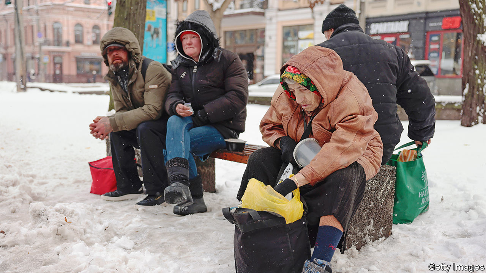
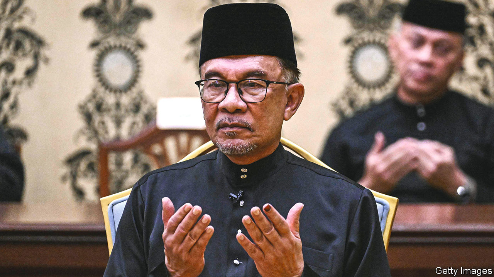

###### The world this week

# Politics 

#####  

 

> Nov 24th 2022 

Russian bombs and missiles have damaged half of , said the Ukrainian government. Widespread blackouts are likely in the coming months, it warned. Evacuations of civilians have begun from the recently liberated parts of the Kherson and Mykolaiv regions, where Russian attacks have been especially brutal. The who said millions of Ukrainians face a “life-threatening” winter. 

Russia’s state-owned gas company, Gazprom, threatened to curtail supplies in the last operational  connecting Russia with western Europe, which runs through Ukraine. The Russians claim that Ukraine is hoarding gas destined for Moldova; Ukraine denies this. 

Courting a disaster

The International Atomic Energy Agency, the UN nuclear watchdog, reported that recent intense shelling had caused widespread damage across the site of the , but that key equipment had not been affected. The head of the agency said that a major incident had been avoided by “metres, not kilometres”. 

Rishi Sunak,  new prime minister, visited Kyiv and met Volodymyr Zelensky. Mr Sunak stressed that although Britain has had three prime ministers in the past three months, there has been no change in the country’s solid commitment to Ukraine. 

Britain’s Supreme Court  that a referendum on independence for could only proceed with consent from the Westminster Parliament. The Scottish National Party, which governs Scotland, had hoped to hold a referendum in October next year. 

Democrats in America’s House of Representatives prepared to choose a new party leader, following  decision to step down after 20 years, eight of them as Speaker of the House. The favourite for Ms Pelosi’s job is Hakeem Jeffries of New York, who would be the first black person to head either party in Congress. A leadership election is scheduled for November 30th.

America’s Supreme Court decided that  tax records must be turned over to a committee in the House investigating his affairs, ending his battle to thwart the committee. Separately, the Department of Justice appointed a special counsel to oversee its investigations into Mr Trump. The former president called the move “a disgrace” that was only happening because he was so popular.

A manager at a  store in Virginia shot dead six of his colleagues and himself. In Colorado a gunman was arrested after killing five people at a . He might have murdered more, but a former soldier threw him to the floor, snatched away one of his guns and hit him with it. 

 electoral court  by Jair Bolsonaro, the right-wing populist president, to the result of an election three weeks ago, which he lost to Luiz Inácio Lula da Silva by 1.8 percentage points. Mr Bolsonaro’s Liberal Party wanted to annul votes cast on older electronic machines. The court said it was a “ludicrous” request, and fined the party. 

On November 23rd   of covid-19, a daily record. Areas responsible for a fifth of the country’s GDP are now under some form of lockdown, according to Nomura, a bank. 

An earthquake struck the West Java region of , killing at least 271 people. Scores were still missing. Cianjur, a town that lies 75km south of Jakarta, bore the brunt. Many of the dead were children buried under the rubble of collapsed schools. 

 


An election in  resulted in the country’s first-ever hung parliament. The king appointed  as prime minister after his reformist bloc won the most seats. Mr Anwar has sought the job for 30 years, serving as deputy prime minister in the 1990s, only to fall foul of the establishment. He was imprisoned on bogus charges of sodomy in 2015, but later pardoned. The United Malays National Organisation, which has dominated Malaysian politics since independence, won just 26 out of 222 seats.

 also held an election, with a hung parliament the probable outcome. Final results are still days away, but the ruling Nepali Congress party, which aligns with India, was in front, and its main rival, the UML, which favours China, was second. 

 president, Cyril Ramaphosa, took a clear lead in nominations to remain leader of the ruling party and, by extension, the country. He had faced opposition from a pro-corruption faction within the ruling African National Congress backed by Jacob Zuma, the previous (and scandal-prone) president. Separately, the Supreme Court ruled that Mr Zuma was to return to jail to serve a sentence after his unlawful parole on spurious medical grounds. 

The party of Teodoro Obiang, the autocrat who has ruled  for 43 years, claimed to have won 99% of votes in presidential and legislative elections. The tiny petrostate locks up and tortures opposition activists and has no free press.

 feared a new wave of  terrorism after two bombs exploded in separate incidents near bus stops on the outskirts of Jerusalem, killing at least one person and injuring more than a dozen others. Two days before, a young Palestinian was shot dead by Israeli soldiers during a raid on the restive West Bank town of Jenin. Meanwhile Binyamin Netanyahu continued to negotiate with far-right parties to form a coalition government. 

Islamist parties fared poorly in elections to  national assembly, which has an advisory role under the sway of the country’s monarch, Hamad al-Khalifa. 

Violence intensified and spread across , particularly in the Kurdish-populated west of the country, amid protests against Islamist rule that have persisted for the past two months. Human-rights groups said that 416 people, most of them protesters, have been killed across the country since the unrest began. 

A lot of upsets

Saudi Arabia’s footballers beat Argentina in the . In another shock, Japan beat Germany. Iran’s team refused to sing their national anthem, in solidarity with protesters against their piously despotic rulers back home. Some Iranian fans went further, booing their own anthem. FIFA, football’s governing body, barred players from wearing One Love armbands, which promote gay rights, for fear of upsetting the Qatari hosts, who don’t. Qatar banned beer from stadiums, irritating nearly everyone.

