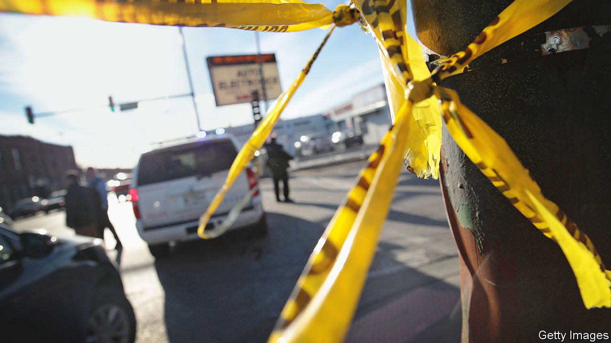

###### Anybody’s thing

# America’s federal government has ruthlessly crushed organised crime 

##### But there are some unintended consequences of this success 

 

> Nov 22nd 2022 

THE CORNER of Archer and Kedzie, on Chicago’s South West side, is far from being the city’s prettiest intersection. What it does have, however, is wide streets, which in the early hours of October 23rd made it a perfect place for a car meet. These, which are especially popular among young Mexican-American men, involve a caravan of fast cars and huge modified trucks known as “rammers” taking over a road junction to perform tricks. Mobile-phone footage shot by an attendee shows a sports car spinning doughnuts at high speed, tyres screeching, while onlookers hold up their phones to record it. And then the camera suddenly dips, as the sound of gunfire cracks out, followed by screaming. Five people were shot. Three died.

Finding out what happened that night is tricky. The police said only that the three who died, all boys and young men, aged from 15 to 21, were affiliated to gangs. Yet according to a community activist who has pieced together the details, the spark was a dispute between two street gangs attending. One was Two Six, a Latino street gang named after 26th Street in Little Village, the centre of Chicago’s Mexican community. The other was a “set” of the Almighty Latin King Nation, a group with origins as a Latino self-help organisation in the early 1950s that turned into a national (and indeed international) organised-crime group. “They got into a staring match, a bit ‘what are you looking at’,” says the activist. Soon they were shooting at each other. Now there are fears of escalation. “Thank God it’s not the summertime,” she says.

In the Chicago newspapers, the shooting was covered as just another tragic incident in the city’s more violent neighbourhoods. Over 600 people  so far this year—in fact a modest decrease from last year’s tally. Yet people in the neighbourhood say that this sort of sudden, spontaneous violence is new. And one of the reasons why is that youth gangs these days are much less organised than they were in the past. Instead of tightly knit, hierarchical organisations, most gangs these days are better described as “cliques” (and usually are by academics). They generally comprise as few as a dozen young men, who band together to protect themselves. Large mafias, with exclusive territory, political connections and extensive business interests, barely exist any more. The Latin Kings in particular are an example of a gang still in transition.

Even a few years ago, the Kings still had a sort of corporate structure, not unlike that of the Italian-American mafia. Members had to be of “Latin” descent (typically but not exclusively Puerto Rican or Mexican). To join, they had to go through an initiation ceremony in which they consented to being beaten up for a fixed amount of time. Members were expected to follow certain rules laid out in a secret “manifesto” apparently written in prison some time in the 1950s or 1960s—not taking hard drugs, for example, even if they sold them, and paying proper respect to family members. Violations were punished with “violations”—more ritualistic beatings. Each March, members would fast, perform community works and donate money for the families of killed or incarcerated colleagues, in a celebration known as “Kings Week”. Court documents depict an organisation with a strict hierarchy, with a “Corona”, or boss, at the top, and a collection of “Incas”, or captains, running sets, as well as enforcers maintaining loyalty.

At its peak, the organisation had chapters all over America, particularly in big cities with large Latino communities. It was heavily involved in the drugs trade, but also made money from extortion rackets and by protecting illegal businesses, such as those involved in the sale of fake Social Security numbers. Much of that still goes on. But these days the group is less vertically integrated. Gang members still buy drugs, guns and ammunition from leaders, and perhaps pay up some of their profits as “dues”, in exchange for using the title King. But they are not subject to as much of a command structure. The leaders stay further away from the street and increasingly sell their wares to non-members too. The rules and rituals—like the celebration of Kings Week—are disappearing. 

This deorganisation of crime is largely due to one of America’s most successful laws—, or rico, which was passed in 1970 to target the Italian American mafia, or  (“our thing”). Over the past five decades, that law has been deployed to target the leadership of hierarchical crime groups. In the 1980s and 1990s it crippled the mafia, as hundreds of its members were imprisoned. But it has since been used more widely. The Latin Kings have been among the groups hit hard. In 2012, Augustin Zambrano, the Chicago-based nationwide “Corona” of the Kings, who the fbi said at the time was in charge of 10,000 members in Illinois alone, was imprisoned for 60 years after an extensive rico investigation that also targeted 30 other members.

“These days, Americans don’t see in the news the violence of transnational organised crime but they’re actually threatened more,” says Joseph Gillespie of the fbi. There are still people committing damaging crimes—such as importing fentanyl, —or running big fraud operations. But according to Mr Gillespie, the groups behind this are more specialised, have fewer members and are far less territorially organised than in the past. Instead of having, in effect, a large permanent staff, they hire services as they need them. “It used to be easier for us, in decades past, when they wore their titles on their sleeves,” he sighs. 

What this adds up to in the United States is that the middle level of crime has been hollowed out. At the top of rackets like the drugs trade, there are importers, brokers and money launderers who stay away from violence. At the bottom are thousands of small street gangs which may carry out a lot of retail distribution of drugs, as well as other crimes, but which are only loosely affiliated to larger organisations. This, jokes Peter Reuter, a criminologist at the University of Maryland, mirrors changes in the legitimate economy. “Conglomerates were the darlings of the 20th century,” he says. Serious criminals are now specialised and outsource the low-skilled, risky stuff. “The gig economy is alive and well in the criminal world.”

Yet in America’s poorest neighbourhoods, as the shootings in October show, the sheer effectiveness of cracking down on organisation has unintended consequences. Freelance gang members who are not subject to command may in fact be proving more trigger-happy. A generation ago, for example, in rougher parts of Chicago, a young man could walk through a rival gang’s territory unmolested by showing a sign of respect—a “party sweater” worn over the shoulder. That no longer works. “You have even started having Latin Kings killing other Latin Kings. It doesn’t even make sense,” says one former member. When the government imprisoned the leadership, “they orphaned all of these warriors, and the warriors responded with violence”, this member says. Planned murders are now rare. But spontaneous shootings like the one in October are common. ■


