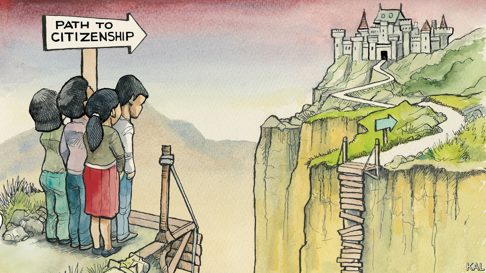

###### Lexington

# Congress should act now to protect Dreamers 

##### The lame-duck session is America’s best chance to honour its obligation to child immigrants 

 

> Nov 24th 2022 

The competition is admittedly not fierce. Yet in the long history of giving names to bills and executive orders, there has surely been none so packed with double meaning and poignant implication as “Deferred Action for Childhood Arrivals” (DACA). That was the name that President Barack Obama gave his order covering hundreds of thousands of people, known as Dreamers, who were brought to America illegally as children. They dreamed of becoming citizens but were at risk instead of being expelled, a danger stayed by Mr Obama’s order. 

Along with their deportation, their dream has been deferred for a decade now. It could come to an end unless Congress, which has deferred action for so long, does something at last to rationalise and humanise America’s immigration laws. The lame-duck session after Thanksgiving, the day Americans celebrate their welcome as immigrants by the continent’s natives, will not be the last chance to do this, but it is surely the best for a long time to come. Once Republicans take control of the House in January, the odds of progress on DACA, or anything else related to immigration, will grow long indeed. 

This is true even though immigration hardliners struggle to come up with a bad thing to say about Dreamers. For all his alarm over illegal immigration, Donald Trump found it difficult as president to argue that the Dreamers did not belong in America. 

Mr Obama’s initiative allowed “childhood arrivals” who had grown up among Americans to emerge from the shadows to pursue higher education and get permits to work. “You’re taking this group of people who would otherwise be working illegally as waiters and housekeepers and making them engineers and accountants,” says Ike Brannon, an economist with the Jack Kemp Foundation who has studied the economic effects of DACA. “It’s a pure increase in human capital.” A study he co-authored in 2019 found that eliminating DACA would cost its recipients $120bn and the federal government $72bn in tax revenue. “Those losses would come without any offsetting gains,” the paper drily concluded. 

To qualify, applicants for DACA status had to have come to America before the age of 16 and by June 15th 2007 (which leaves out the hundreds of thousands of children who have come since). They could not have serious criminal records, and they must have been in school, graduated high school or served in the armed forces. To keep their status they had to renew it every two years, at a cost of $495, and they had no opportunity to become citizens. As of June there were about 600,000 people in the programme, and the average participant was 28. A study last year by the Centre for American Progress found that 343,000 of them were in jobs deemed essential by the Department of Homeland Security. 

You may not have focused on DACA in some time. Matters became quite confusing during Mr Trump’s presidency. Mr Trump said he loved the Dreamers and had great compassion for them. Yet to fulfil a campaign promise and demonstrate his ferocity when it came to immigration, he ordered that the programme be ended. But he acted so clumsily in doing so that the Supreme Court blocked his order, saying it lacked a firm legal basis.

That did not end the Dreamers’ legal jeopardy, however, because Mr Obama’s original order, too, was challenged in the courts, also as being poorly constructed. In October a federal appeals court upheld a lower-court ruling that Mr Obama acted illegally because the programme was not subject to public comment and notice as required under the Administrative Procedure Act. The appeals court sent the case back down to the original judge, asking him to evaluate an order issued in August by President Joe Biden in an attempt to strengthen DACA’s legal foundation.

The upshot is that Mr Biden has managed to stall but not prevent the probable return of DACA to the Supreme Court. Chief Justice John Roberts sided with the court’s liberals to preserve DACA during the Trump years, but, since a sixth conservative subsequently joined the court, he is no longer the swing vote. Congress is the only sure route to protecting the Dreamers.

To grow up undocumented in America is to live with the fear that a misstep might bring immigration officials to the family’s door. It is to stifle ambitions for education and career. Mr Obama’s initiative has not erased such fears for its recipients, but it has allowed Dreamers to live fuller lives. “There’s not a day I don’t think about my status,” says Bruna Sollod, who came to America at the age of seven and now, as a DACA participant, is senior communications and political director for United We Dream, a pro-immigrant group. She sees a glimmer of hope in the lame-duck session. “What I’m pushing is citizenship,” she says. “As someone who lives in two-year increments, it’s not a way to live.”

Lame DACA session

The question, as so often, is whether ten Senate Republicans will join with the Democrats to break a filibuster. Negotiations are under way among a handful of senators. To have any hope of an agreement Democrats would need to disappoint some activists by yielding on questions of border enforcement or amnesty. Polling shows Republicans overwhelmingly support a pathway to citizenship for people brought to America as children. But Republican senators are far more fearful of their activist base voters, some of whom want to reduce not just illegal but legal immigration.

Yet it is to reach such difficult compromises on important matters that the Senate exists. If it cannot pull its act together during the lame-duck session on DACA, and on other critical questions like financing the federal government and defending Ukraine, the Senate might consider adopting the name of Mr Obama’s initiative as its slogan. After all, deferred action is becoming its stock in trade, and most Americans, whether they were delivered by a smuggler across the border or by an obstetrician in a maternity ward, were childhood arrivals. ■


 (Nov 17th)


